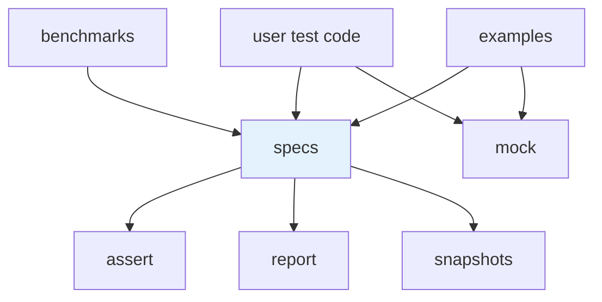
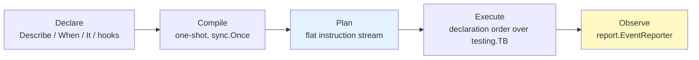

# 01 · Architecture

> **Audience:** architects, contributors · **Reading time:** ~12 minutes

## 1. Shape of the repository

One Go module. No `go.work`, no nested modules, no generated module graph.

```
github.com/getsyntegrity/go-specs
├── specs/              execution core — DSL, compiler, plan, runners, scheduler, sharding
├── assert/             matchers and equality primitives
├── mock/               spies and call recording
├── snapshots/          JSON snapshot storage and comparison
├── report/             event model, normalized report, renderers, coverage parsing
├── gen/generators/     adversarial value generators (not wired into the DSL)
├── tools/perfcheck/    benchmark regression CLI (package main)
├── benchmarks/         comparative benchmarks vs Testify and Gomega
├── examples/           executable documentation
├── scripts/            chart generation for benchmark results
└── docs/               this suite
```

There is no `internal/` directory and no CLI. Documentation that once described
`tools/specs-cli`, `internal/plan` or `internal/runner` described a layout that this branch never
had; see [ADR-0015](adr/0015-library-only-release-artifact.md).

## 2. The dependency rule



Two invariants hold, and both are checkable mechanically:

1. **No surface imports the core.** `assert`, `mock`, `snapshots`, `report` and `gen/generators`
   import nothing from `github.com/getsyntegrity/go-specs/specs`. The coupling is one-directional,
   so each surface is usable on its own and testable without booting a runner.
2. **No cycles, by construction.** Because rule 1 holds, no cycle is possible between the core and
   its surfaces, and the siblings do not import each other either.

`mock` is the strongest case: the core never imports it at all. Mocking is a leaf utility that user
test code pulls in directly, not a stage of the execution pipeline.

### What each surface owes the core

| Surface | Contract with `specs` |
| --- | --- |
| `assert` | `specs/matcher.go` type-aliases `specs.Matcher = assert.Matcher` and re-exports every constructor. The alias means a user matcher satisfies both names with one implementation. |
| `report` | `specs` accepts a `report.EventReporter` by constructor injection only. There is no global reporter registry ([ADR-0007](adr/0007-observational-constructor-injected-reporting.md)). |
| `snapshots` | `specs` calls `snapshots.Evaluate` to get a verdict, records failure state, and only then triggers the reporting path that may not return ([ADR-0010](adr/0010-snapshot-durability-and-semantics.md)). |
| `mock` | None. |

## 3. The pipeline

Everything the framework does is one of four stages, and each stage's output is immutable input to
the next.



- **Declare.** The user's callback tree records structure. Nothing runs.
- **Compile.** One-shot, guarded by `sync.Once`, producing a `*CompiledSuite`. Hook resolution,
  scope naming and focus filtering all happen here — never at run time
  ([ADR-0003](adr/0003-compiled-execution-plan.md)).
- **Plan.** A flat slice of instructions with index-based parent/child relationships. No pointer
  tree survives into execution, which is what makes the run loop a linear scan over contiguous
  memory.
- **Execute.** The runner iterates the plan in declaration order. Every spec runs in its own Go
  subtest where a real `*testing.T` is available ([ADR-0004](adr/0004-subtest-isolation-and-goexit-safe-hooks.md)).
- **Observe.** An optional reporter receives suite/spec start and finish events. It cannot influence
  what runs.

[03 · Execution model](03-EXECUTION-MODEL.md) covers each stage in detail.

## 4. Two build paths, one DSL

The same `Describe`/`When`/`It` callbacks compile down two different ways, and which one is used is
decided inside `Describe` itself:

| Condition | Path | Produces |
| --- | --- | --- |
| No active registry (the normal case) | **Bytecode compiler** | a flat instruction stream built straight from the callback tree |
| Called inside `Analyze(fn)` | **Arena** | an index-based `NodeArena` (flat `Nodes`/`Children`/`BeforeHooks`/`AfterHooks` slices) compiled once into the same plan shape |

The arena path exists so tooling can *inspect* a suite's structure without running it — that is the
extension surface described in [09 · Extending](09-EXTENDING.md). Both paths converge on the same
execution plan, so an inspected suite and a run suite cannot drift apart.

A third, lower-level surface — `Builder` → `Program` → `Runner` — is the same three verbs expressed
as explicit construction rather than nested callbacks. It is what the benchmarks drive, and what
`ItParallel` and sharding are built on.

## 5. State and concurrency boundaries

- **No package-level build state.** A `Spec`'s build target (`compiler` or `registry`) is threaded
  explicitly through every nested call. Two goroutines building unrelated suites — two
  `t.Parallel()` tests each calling `Describe` — never observe each other.
- **The registry is per-goroutine.** Registration is keyed by goroutine identity, so a goroutine
  spawned *inside* `Analyze`'s callback has no registry of its own and fails loudly rather than
  writing into a registry nobody will read ([ADR-0005](adr/0005-fail-closed-dsl-registration.md)).
- **Pooling is an implementation detail with a visible rule.** `Context`, `Expectation` and the
  test-backend wrapper are pooled via `sync.Pool`. The rule this imposes on users: do not retain a
  `*Context` past the end of the spec body that received it.
- **Parallel execution has a different backend.** In `ItParallel` and `RunParallel`, `ctx.T` is
  `nil` and `t.Run` is unavailable — a spec that needs a real subtest must run sequentially. The
  parallel backend fails loudly on that call rather than silently degrading.

## 6. Reported identity vs Go subtest identity

These are two deliberately separate namespaces, and conflating them is the single most common
misreading of the codebase.

| | Reported identity | Go subtest identity |
| --- | --- | --- |
| Source | the declared name, verbatim | `Describe/When/It` breadcrumb, `/`-joined |
| Consumer | `report.EventReporter`, all four renderers | `go test -run`, terminal output |
| Transformations | none | spaces to underscores, `testing`'s own `#01` disambiguation |

A report shows what the author wrote. `go test -run` filters on what the toolchain made of it. Both
are correct for their own consumer, and neither is derived from the other at run time.

## 7. Where the boundaries are enforced

| Boundary | Enforcement today |
| --- | --- |
| Standard-library-only core | `go.mod` has exactly two direct requirements, both reachable only from `benchmarks/` |
| No surface imports the core | convention, verifiable with `go list`; not yet a test |
| Declaration-order determinism | the run loop itself — a linear index scan |
| Fail-closed registration | panics in `requireRegistry` and `requireBuildTarget` |
| Module path correctness | a CI step asserting `go list -m` matches the repository |
| Go toolchain agreement | `.github/scripts/check-go-version.sh`, also `make check-go-version` |

The row without a test is stated as such. Turning the import rule into an executable architecture
test is open work, not a claim.
