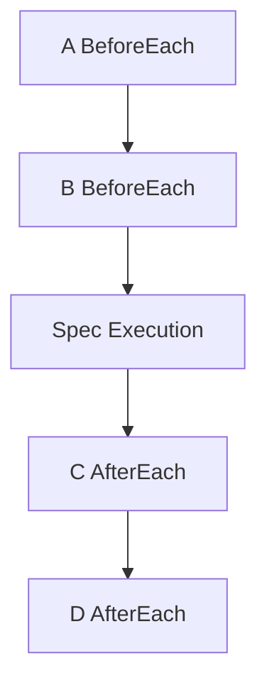

# 02 · The DSL

> **Audience:** users of the framework · **Reading time:** ~15 minutes

The DSL is the user-facing surface for declaring tests. The forms listed in
[ADR-0011](adr/0011-public-dsl-stability-contract.md) are held stable; the rest of this document
describes what exists today.

---

## 1. Entry points

Every construct below is a method on a `*Spec`, and a `*Spec` is only usable when it carries a
**build target** — the destination a registration is written to. These functions set that target:

| Entry point | Runs the suite? | Use when |
| --- | --- | --- |
| `Describe(tb, name, fn)` | yes | the default |
| `DescribeWithReporter(tb, name, rep, fn)` | yes | you want structured events ([07 · Reporting](07-REPORTING.md)) |
| `BuildSuite(tb, name, fn) *CompiledSuite` | no | compile now, run later (benchmarks, tooling) |
| `Analyze(fn) *SuiteTree` | no | inspect structure without running ([09 · Extending](09-EXTENDING.md)) |
| `BuildProgram(fn) *Program` | no | the explicit `Builder` surface |

`DescribeFlat`, `DescribeFlatWithReporter`, `DescribeFast` and `DescribeFastWithReporter` are
retained aliases. Prefer `Describe`.

---

## 2. Describe

`Describe` starts a suite or a nested block. It takes a test handle (`*testing.T` or `*testing.B`),
a name, and a callback that receives a `*Spec`.

```go
specs.Describe(t, "math", func(s *specs.Spec) {
    // register hooks and specs on s
})
```

Nested `Describe` creates nested scope; hooks from outer blocks run before and after inner specs.

## 3. When

`When` is `Describe` with a name that reads as a condition. It accepts either `func(*specs.Spec)`
(nested scope, preferred) or a legacy `func()`.

```go
specs.Describe(t, "Cart", func(s *specs.Spec) {
    s.When("empty", func(s *specs.Spec) {
        s.It("has no items", func(ctx *specs.Context) { /* ... */ })
    })
})
```

There is no separate `Given`/`Then` vocabulary. `Describe`, `When` and `It` are the whole nesting
language.

## 4. BeforeEach

`BeforeEach` registers a function that runs before every `It` in the current scope and nested
scopes.

```go
s.BeforeEach(func(ctx *specs.Context) {
    // reset state, create fixtures, etc.
})
```

Multiple `BeforeEach` calls in the same scope run in registration order (outer scope first, then
inner).

## 5. AfterEach

`AfterEach` registers a function that runs after every `It` in the current scope. Execution order is
**LIFO**: innermost after runs first, then outer.

```go
s.AfterEach(func(ctx *specs.Context) {
    // teardown, release resources
})
```

An `AfterEach` runs even when the spec body failed with a fatal error, and even when a before-hook
panicked. That guarantee is the subject of
[ADR-0004](adr/0004-subtest-isolation-and-goexit-safe-hooks.md).

## 6. It

`It` registers a single spec. The function receives the execution context.

```go
s.It("adds numbers", func(ctx *specs.Context) {
    ctx.Expect(1 + 1).ToEqual(2)
})
```

Each `It` compiles into a step sequence: before hooks (outer to inner), the spec body, then after
hooks (inner to outer).

## 7. Focus and skip

Both are **compile-time** decisions. The runner never branches on them.

```go
s.It("only this one", specs.Focus(func(ctx *specs.Context) { /* ... */ }))
s.It("not yet",       specs.Skip(func(ctx *specs.Context) { /* ... */ }))
```

| Form | Effect |
| --- | --- |
| `specs.Focus(fn)` / `Builder.FIt` | if **any** spec in the suite is focused, only focused specs are compiled into the plan. Non-focused specs are not run-and-ignored — they are absent. |
| `specs.Skip(fn)` / `Builder.SkipIt` | the body is never compiled into a step. Only the name survives, reported as `Skipped` with zero duration. |

A spec excluded by `go test -run` is reported as **`Filtered`**, not `Skipped`. The two are distinct
statuses with distinct meanings: `Skipped` is the suite author's decision, `Filtered` is the
invoker's. See [07 · Reporting](07-REPORTING.md).

## 8. ItParallel

`ItParallel` registers a spec that runs in parallel with adjacent `ItParallel` specs. It is available
on the **Builder** API, not on the top-level `Describe` path.

```go
b := specs.NewBuilder()
b.Describe("suite", func() {
    b.ItParallel("A", func(ctx *specs.Context) { ctx.Expect(add(1, 1)).ToEqual(2) })
    b.ItParallel("B", func(ctx *specs.Context) { ctx.Expect(add(2, 2)).ToEqual(4) })
})
specs.NewRunner(b.Build()).Run(t)
```

Consecutive `ItParallel` specs are grouped into one parallel step; they run concurrently, then
execution continues with the next sequential step.

Each `ItParallel` spec runs on its own `*specs.Context`. **`ctx.T` is `nil` inside these bodies** —
sharing the real `*testing.T` across goroutines is not safe, so use `ctx.Expect(...)` rather than
`ctx.T` directly. A spec that needs a real `t.Run` subtest must stay sequential; the parallel backend
fails loudly rather than degrading silently.

A failing assertion still stops the rest of that spec body, same as in a sequential `It`. Every spec
in the parallel group always runs to completion before the runner moves on; `Runner.FailFast` only
takes effect at the next group — it cannot cancel a sibling `ItParallel` spec mid-group.

---

## 9. Assertions

Three `ToEqual`-shaped APIs exist, and they deliberately do **not** all mean the same thing.

**`EqualTo`** — direct typed equality; zero allocations, no reflection.

```go
specs.EqualTo(ctx, actual, expected)
```

**`ExpectT`** — the fluent typed form; the preferred one for comparable types.

```go
specs.ExpectT(ctx, x).ToEqual(y)
```

**`Expect`** — the fluent untyped form, and the only one that accepts matchers.

```go
ctx.Expect(1 + 1).ToEqual(2)
ctx.Expect(value).To(specs.BeTrue())
ctx.Expect(value).To(specs.Equal(expected))
```

### Why the three differ — by design

| API | Constraint | Comparison |
| --- | --- | --- |
| `EqualTo(ctx, actual, expected)` | `T comparable` (compile-time) | Go's `==`, always. No reflection. |
| `ExpectT(ctx, x).ToEqual(y)` | `T comparable` (compile-time) | Go's `==`, always. No reflection. |
| `ctx.Expect(x).ToEqual(y)` | `any` | `==` for `int`/`string`/`bool`/`int64`/`float64`/`uint` (fast path), `reflect.DeepEqual` for everything else. |

The `comparable`-constrained pair cannot even be called with a slice or a map — that is a compile
error, not a runtime surprise. But for structs containing pointer fields, `==` compares the pointer
values themselves, while `reflect.DeepEqual` recursively compares what they point to:

```go
type withPtr struct{ N *int }
a, b := 5, 5
x, y := withPtr{&a}, withPtr{&b}

x == y                    // false — different pointers
reflect.DeepEqual(x, y)   // true  — same pointed-to value
```

So `EqualTo(ctx, x, y)` fails while `ctx.Expect(x).ToEqual(y)` passes, for the exact same `x` and
`y`. That is the trade-off: take `EqualTo`/`ExpectT` for the zero-allocation, no-reflection path
when your type's `==` already means what you want (primitives, or plain value structs with no
pointer fields); take `ctx.Expect(...).ToEqual(...)` when you need value-based deep equality for
structs, slices or maps.

The matcher catalogue lives in [04 · Assertions and matchers](04-ASSERTIONS.md).

---

## 10. Paths — combinatorial and property testing

`Paths` declares a set of input dimensions and generates specs across them.

```go
s.Paths(func(p *specs.PathBuilder) {
    p.Int("amount", 0, 1, 100)
    p.Bool("premium")
}).It("charges correctly")
```

| Method | Effect |
| --- | --- |
| `.It(name, args...)` | full Cartesian product |
| `.Sample(n)` | `n` random combinations |
| `.Seed(seed)` | fixes the generator seed for reproducibility |
| `.Explore(n)` | guided exploration |
| `.ExploreCoverage(n)` | coverage-guided exploration |
| `.ExploreSmart(n)` | mutation-and-corpus guided exploration |

`Spec.RandomSeed(seed)` is the **only** randomness in the framework, and it feeds these generators
alone. Nothing else in an execution is random ([ADR-0002](adr/0002-deterministic-execution.md)).

Working examples: `examples/paths/`, `examples/property_coverage_spy/`,
`examples/full_system_example/`.

## 11. Snapshots

```go
ctx.Snapshot("create-user", map[string]any{"id": 123, "name": "alice"})
```

Stored next to the test file under `__snapshots__/<testfile>.snap.json`. See
[06 · Snapshots](06-SNAPSHOTS.md).

---

## 12. Where a `*Spec` comes from

`Spec` is exported with unexported fields, so `&specs.Spec{}` compiles. It has no build target, and
there is nowhere for an `It`, a hook or a nested block to go. Rather than accept the registration and
drop it — which would let a suite declare specs, register none of them, and still report green —
each method panics:

```go
s := &specs.Spec{}            // compiles, but has no build target
s.It("adds", func(ctx *specs.Context) {})
// panic: specs: Spec.It called on a Spec with no build target;
//        obtain a *Spec from Describe/BuildSuite instead of constructing one
```

Take the `*Spec` the entry point gives you; never construct one. A `nil` `*Spec` is still a tolerated
no-op — there is no Spec there to have registered anything into. The reasoning is
[ADR-0005](adr/0005-fail-closed-dsl-registration.md).

---

## 13. Execution order of hooks

Before hooks run **outer to inner**; after hooks run **inner to outer** (LIFO).

Given `Describe("outer")` with `BeforeEach` A and `AfterEach` D, `Describe("inner")` with
`BeforeEach` B and `AfterEach` C, and one `It`:

**A → B → test → C → D**



This order is fixed at compile time, when the builder flattens hooks into the step list. Each hook
set runs **exactly once per spec** — never once per group, even though specs that share a hook layout
are coalesced into one group for memory locality. Coalescing is a memory-layout optimization with no
semantic effect ([ADR-0003](adr/0003-compiled-execution-plan.md)).

---

## 14. Full example

```go
package math_test

import (
    "testing"

    "github.com/getsyntegrity/go-specs/specs"
)

func setup(ctx *specs.Context) {
    // per-spec setup
}

func TestMath(t *testing.T) {
    specs.Describe(t, "math", func(s *specs.Spec) {
        s.BeforeEach(setup)

        s.It("adds numbers", func(ctx *specs.Context) {
            ctx.Expect(1 + 1).ToEqual(2)
        })

        s.When("the operand is negative", func(s *specs.Spec) {
            s.It("still adds", func(ctx *specs.Context) {
                specs.EqualTo(ctx, 1+(-1), 0)
            })
        })
    })
}
```
