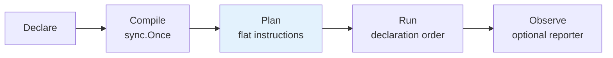
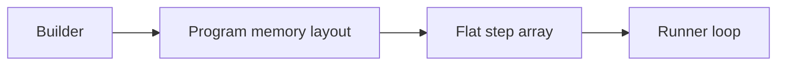
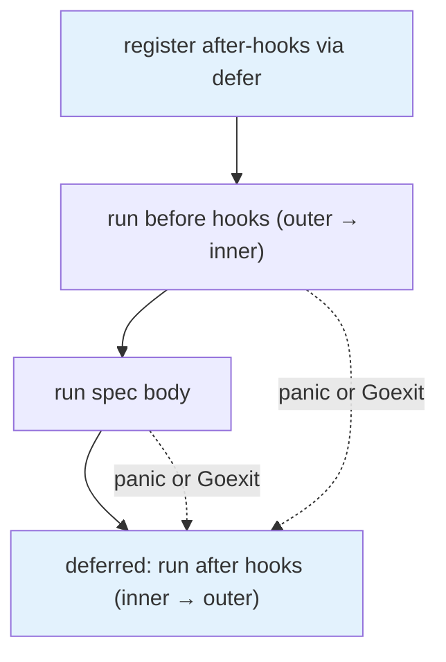

# 03 · Execution model

> **Audience:** contributors, advanced users · **Reading time:** ~20 minutes

This is how a declared suite becomes a running one. The short version: **nothing is decided at run
time that could have been decided at compile time.**

---

## 1. The pipeline

| Stage | What happens | What does **not** happen |
| --- | --- | --- |
| Declare | the callback tree records structure | no user code from an `It` body runs |
| Compile | hook flattening, scope naming, focus filtering, group coalescing | no I/O, no reflection over user types |
| Run | linear iteration over the plan | no tree walking, no hook resolution, no map lookups |
| Observe | reporter events emitted | no influence on control flow |

Compilation is one-shot and guarded by `sync.Once`. A `*CompiledSuite` is therefore safe to build
once and run many times — which is exactly what the benchmarks do with `BuildSuite`.

## 2. Two build paths, one plan

`Describe` chooses its build path by looking for an active registry on the calling goroutine:

| Condition | Path | Intermediate representation |
| --- | --- | --- |
| no active registry — the normal case | **bytecode compiler** | none; instructions are emitted directly |
| inside `Analyze(fn)` | **arena** | `NodeArena`: flat `Nodes`, `Children`, `BeforeHooks`, `AfterHooks` slices, parent/child by index |

Both converge on the same execution plan shape, so a suite inspected through `Analyze` and a suite
run through `Describe` cannot describe different things. The arena exists for inspection
([09 · Extending](09-EXTENDING.md)), not for execution speed.

Node kinds in the arena are `SuiteNode`, `DescribeNode`, `WhenNode` and `ItNode`. Root is always
index 0.

## 3. The plan

The compiled program is a **flat slice of instructions** — function pointers plus their index ranges.
No maps, no trees, no per-step metadata on the hot path.

Specs that share the same enclosing hook layout are coalesced into one **group** so they can share
one `before`/`after` slice. This is a memory-locality optimization and nothing else: every spec still
runs its own before hooks, its own body and its own after hooks. The invariant — one hook set
execution **per spec**, never per group — is the subject of issue #109 and is asserted in the runner
and the plan executor in lockstep.

> **Known divergence.** In the `Builder`/`Runner` model the group's hooks sit *outside* the `t.Run`
> call, so a `BeforeEach` runs once per group rather than once per spec. The `Describe`/`Spec` model
> compiles hooks into each spec's own instruction range and runs them once per spec. This is real,
> predates the current plan, and is tracked in #109. Full detail:
> [appendix · subtest identity](appendix/subtest-identity.md#hooks-the-two-models-disagree-with-or-without--run).

## 4. Ordering

Specs run in **declaration order**, always. The run loop is an index scan over the plan:

- no map iteration anywhere in the ordering path,
- no goroutine scheduling in the sequential path,
- no ambient randomness — the framework's only RNG is the one `Spec.RandomSeed` feeds to `Paths`
  generators ([ADR-0002](adr/0002-deterministic-execution.md)).

Two runs of the same suite on the same input execute the same specs in the same order. That is a
contract, not an observation.

## 5. Isolation and failure handling

This is the part that earns the framework its keep, and it is more subtle than it looks.

### Per-spec subtests

When the backend is a real `*testing.T`, each sequential spec runs inside its own `t.Run`. That is
what confines a `Fatalf` to one spec: `Fatal`/`FailNow` call `runtime.Goexit`, which unwinds only the
calling goroutine — and `t.Run` gives each spec its own.

`*testing.B` backends create no subtests, which is what keeps benchmarks allocation-free.

### Panics

Every spec, hook and step runs behind a `recover()`. A panic inside one spec:

1. is recorded as that spec's failure, with the message and `debug.Stack()`,
2. does **not** crash the process,
3. does **not** stop the next spec from running.

### The Goexit problem, and the fix

`recover()` cannot observe `runtime.Goexit`. So a `t.Fatal` in a spec body would, naively, skip
everything after it — including that spec's `AfterEach` hooks, which is exactly when cleanup matters
most.

The runner therefore registers the after-hook run in a `defer` **before** the before-hooks or the
body ever execute. A `defer` survives `Goexit`; a straight-line call does not.

Consequences, all deliberate:

- After-hooks run on success, on failure, on panic and on fatal. They are never gated by `FailFast`.
- Each after-hook is recovered **individually**, so one panicking hook does not stop its siblings.
- Failure messages are **first-write-wins**: a body failure's message beats an after-hook's, because
  the first cause is more useful than the last symptom.

This is [ADR-0004](adr/0004-subtest-isolation-and-goexit-safe-hooks.md).

### FailFast

`FailFast` stops the runner from starting further specs after one fails. It never truncates the
failed spec's own cleanup, and in a parallel group it cannot cancel a sibling mid-flight — it takes
effect at the next group boundary.

## 6. Status vocabulary

Five statuses, and the distinctions between them carry information:

| Status | Meaning | Body ran? |
| --- | --- | --- |
| `passed` | ran, no failure | yes |
| `failed` | ran, an assertion failed | yes |
| `error` | failed with infrastructure output — a panic, not an assertion | partially |
| `skipped` | the suite author excluded it (`Skip`, `SkipIt`) | no |
| `filtered` | the invoker excluded it (`go test -run`) | no |

`skipped` and `filtered` are deliberately separate. Collapsing them would erase who made the
decision. Detecting `filtered` requires threading a flag out of the `t.Run` closure, because
`t.Run`'s own boolean return is `true` even for a subtest the filter discarded (#111).

## 7. Timeouts and retries

- **Timeouts are inherited, not invented.** The execution context derives from `tb.Context()` when
  available and wraps `tb.Deadline()` when set — so `go test -timeout` governs, and there is no
  competing per-spec timeout API.
- **There are no retries.** Nothing in the package re-runs a failed spec. A flaky spec is a bug to
  fix, not a knob to turn.

## 8. Parallel execution

Two distinct mechanisms, often confused:

| Mechanism | Granularity | `ctx.T` | `t.Run` available |
| --- | --- | --- | --- |
| `ItParallel` (Builder DSL) | adjacent parallel specs coalesced into one step | `nil` | no |
| `RunParallel(tb, workers)` (Minimal/Bytecode runners) | whole program across a worker pool | `nil` | no |

Worker count defaults to `runtime.GOMAXPROCS(0)`, clamped to the number of specs. Workers claim spec
indices through an atomic counter; each carries its own backend and records failures **by spec
index** into a shared slice.

**Reporting stays deterministic under parallelism.** After the wait group drains, failures are
reported in spec order and the *first* failing index is the one surfaced — never "whichever
goroutine finished first". Concurrency changes the timing, not the output.

A parallel backend has no `*testing.TB`, so a spec that calls `t.Run` fails loudly with a message
naming the spec and telling you to use the sequential runner. Silent degradation was not an option
considered.

## 9. CI sharding

`ShardSpecs`, `ShardBCProgram`, `RunShard` and `RunShardWithReporter` split a program across CI
machines by index modulo count (`i % total == shard`). Filtering happens **before** execution, so the
run loop itself is unchanged and a shard behaves exactly like a smaller suite.

Shard selection can come from a flag or an environment variable via `ParseShardFlag`, `ParseShardEnv`
and `ShardFromArgsOrEnv`.

Because assignment is a pure function of index, sharding is reproducible: shard 2 of 5 contains the
same specs on every machine and every run.

## 10. Identity — two namespaces

A spec has a **reported** identity and a **Go subtest** identity, and they are not derived from each
other at run time.

| | Reported | Go subtest |
| --- | --- | --- |
| Value | the declared name, verbatim | the `Describe/When/It` breadcrumb, `/`-joined |
| Consumer | reporters and renderers | `go test -run`, terminal output |
| Rewrites | none | spaces to underscores, `testing`'s `#01` disambiguation |

The mapping has real, documented edge cases — colliding breadcrumbs, `/` inside a declared name,
and the interaction between a narrowed `-run` and adaptive path strategies. Those are documented at
length, with the reasoning intact, in
[appendix · subtest identity](appendix/subtest-identity.md).

## 11. Pooling and the one rule it imposes

`Context`, `Expectation` and the test-backend wrapper are pooled with `sync.Pool` to keep the hot
path free of allocation. The single rule this places on user code:

> Do not retain a `*specs.Context` past the end of the spec body that received it.

Everything else about pooling is invisible.

## 12. Observation never changes execution

Attaching a `report.EventReporter` adds events and changes nothing else. Failure state is reset per
spec whether or not an observer is attached, and no control-flow branch reads the reporter. This is
[ADR-0007](adr/0007-observational-constructor-injected-reporting.md), and it is the property that
makes a reported run trustworthy as evidence of an unreported one.
