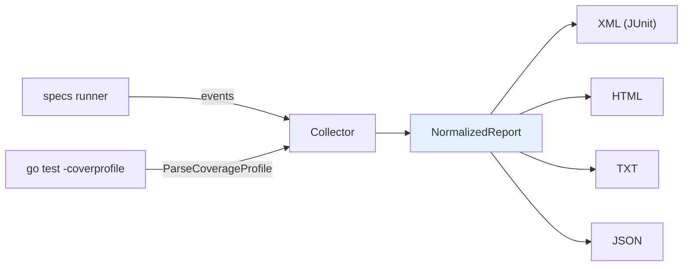
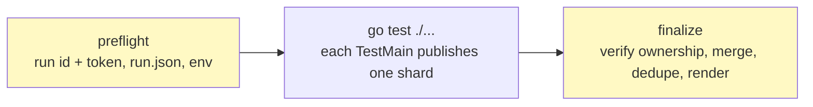

# 07 · Reporting

> **Audience:** CI owners, tooling authors · **Reading time:** ~12 minutes

The `report` package turns a run into a structured artifact: one normalized model, four renderers.
It imports nothing from `specs`; `specs` accepts a reporter by constructor injection.

---

## 1. The pipeline



Four events, in order, define the whole contract between the runner and any reporter:

```go
type EventReporter interface {
    SuiteStarted(SuiteStartEvent)
    SpecStarted(SpecStartEvent)
    SpecFinished(SpecResultEvent)
    SuiteFinished(SuiteEndEvent)
}
```

**Observation never changes execution.** No control-flow branch in the runner reads the reporter,
and failure state is reset per spec whether or not one is attached
([ADR-0007](adr/0007-observational-constructor-injected-reporting.md)). A reported run is therefore
valid evidence about an unreported one.

## 2. Attaching a reporter

There is no global registry. You pass the reporter in:

```go
rep := report.NewMultiFormat(
    report.Target{Format: report.FormatJSON, Path: "reports/report.json"},
    report.Target{Format: report.FormatXML,  Path: "reports/junit.xml"},
)

specs.DescribeWithReporter(t, "payments", rep, func(s *specs.Spec) {
    // ...
})

if err := rep.Flush(); err != nil {
    t.Fatalf("writing reports: %v", err)
}
```

Parallel and sharded runs take the same reporter through the same contract:

| Entry point | Use |
| --- | --- |
| `specs.DescribeWithReporter(tb, name, rep, fn)` | the `Describe` DSL |
| `specs.NewRunnerWithReporter(prog, name, rep)` | the `Builder`/`Program` DSL |
| `specs.RunShardWithReporter(prog, tb, rep, i, n)` | CI sharding |

A target can also be parsed from a string, which is what makes it configurable from a flag or an
environment variable:

```go
target, err := report.ParseTarget("json:reports/report.json")
```

`Flush` creates parent directories, renders every target, and stops at the first error.

## 3. The normalized model

```go
type NormalizedReport struct {
    SchemaVersion string
    Execution     time.Time
    Duration      time.Duration
    Suites        []Suite
    Coverage      Coverage
}
```

`SchemaVersion` is `"1"`. It is emitted in the JSON output so a consumer can detect a change rather
than guess.

Status classification happens in exactly one place, `classifyStatus`, so no renderer recomputes it:

| Status | Assigned when |
| --- | --- |
| `passed` | the spec ran and did not fail |
| `failed` | an assertion failed |
| `error` | the spec failed **and** carried infrastructure output — a panic, not an assertion |
| `skipped` | the suite author excluded it |
| `filtered` | `go test -run` excluded it |

`Totals` always satisfies `Total == Passed + Failed + Error + Skipped + Filtered`.

`Collector.Report()` deep-copies every slice, so a caller cannot mutate collector state through the
returned report.

> **`Collector` is not safe for concurrent use** and is not suite-interleaving aware. The runner
> serializes calls on its behalf. If you write your own reporter and drive it from several
> goroutines, that is your synchronization to provide.

## 4. The four renderers

| Format | Function | Shape | Consumer |
| --- | --- | --- | --- |
| XML | `RenderXML` | JUnit-compatible `<testsuites>`; coverage as `<properties>` | CI test-report UIs |
| HTML | `RenderHTML` | one self-contained file, context-escaped via `html/template` | humans, build artifacts |
| TXT | `RenderTXT` | plain, no ANSI | CI logs, `grep` |
| JSON | `RenderJSON` | schema-versioned, arrays never `null`, percentages rounded to 2dp | tooling |

There is **no TAP renderer**.

Each renderer has its own DTO, separate from `NormalizedReport`, so that a wire-format change never
forces an internal-model change and vice versa. Numeric formatting is shared, so the four outputs
never disagree about the same number.

All four are pinned by golden files in `report/testdata/golden/`, rendered from one canonical
fixture. Regenerate with:

```bash
UPDATE_GOLDEN=1 go test ./report/...
```

## 5. Coverage

```go
f, _ := os.Open("coverage.out")
cov, err := report.ParseCoverageProfile(f)
collector.SetCoverage(cov)
```

**Aggregation sums statement counts across packages. It never averages package percentages.** The
two only coincide when every package is the same size, and the summed form is the one that answers
"what fraction of this module's statements are covered"
([ADR-0008](adr/0008-coverage-aggregates-statements.md)).

A package with zero executable statements never appears in the output — it would contribute a
meaningless 0% or an undefined ratio.

> **Open gap (F7).** `ParseCoverageProfile` does not deduplicate overlapping `-coverpkg` blocks the
> way `golang.org/x/tools/cover` does. A shared dependency instrumented by two test binaries is
> counted twice. This is documented in the
> [coordination contract](144-report-coordination-contract.md) and is not yet fixed.

## 6. The limit: one package binary

Everything above produces a complete report for **one** package binary. `go test ./...` compiles and
runs one binary per package, and no package binary can observe its siblings — only the invoking
`go test` process sees the whole run.

So module-wide reporting is not a feature you can enable today. It is a specified design waiting on
implementation.

### What the contract establishes

[`144-report-coordination-contract.md`](144-report-coordination-contract.md) is a normative,
versioned design document (v1.2.6) grounded in eight experimentally verified findings. The ones that
shape the design:

| Finding | Consequence |
| --- | --- |
| A custom test flag breaks any package binary that did not register it | the activation signal **cannot** be a forwarded flag |
| Environment variables cost non-participating packages nothing | the signal **is** an environment variable |
| No package binary can observe its siblings | merging must be an external step |
| A cached test result skips `TestMain` entirely | reporting is incompatible with caching unless forced |
| Timeout or `SIGKILL` bypasses anything after `m.Run()` | shard publication must be crash-safe |
| The combined coverage profile is written once, by the `go` command | per-package coverage emission is not the model |
| `-coverpkg` overlap duplicates blocks | the merge step must deduplicate |

### The specified lifecycle



1. **Preflight** generates a run id and a random token, exclusively creates a `run.json` ownership
   marker, and exports the activation variables.
2. **Each participating package's `TestMain`** verifies token ownership and atomically publishes one
   shard file after its own `m.Run()` — create-no-replace, never a replacing rename.
3. **Finalize** runs *even when `go test` went red*, verifies ownership, merges the shards,
   deduplicates coverage blocks and renders the same four formats module-wide.

**Status: specification only.** Shard emission (#145) and merge/render (#146) are not implemented,
and the contract changes neither `NormalizedReport` nor any renderer
([ADR-0009](adr/0009-contract-first-report-coordination.md)).

## 7. Writing your own reporter

Implement the four methods. Nothing needs registering.

```go
type countingReporter struct {
    started, finished int
}

func (r *countingReporter) SuiteStarted(report.SuiteStartEvent)   {}
func (r *countingReporter) SuiteFinished(report.SuiteEndEvent)    {}
func (r *countingReporter) SpecStarted(report.SpecStartEvent)     { r.started++ }
func (r *countingReporter) SpecFinished(report.SpecResultEvent)   { r.finished++ }
```

Two things to know before you rely on the event fields:

- `SpecStartEvent.Name` is the **declared** name, verbatim. `testing`'s space-to-underscore rewrite
  and its `#01` disambiguation never leak into it.
- `SpecStartEvent.Path` is weaker: it is rebuilt by splitting a joined breadcrumb on `/`, so a `/`
  inside a declared name is indistinguishable from a scope boundary. The `Builder`/`Runner` model
  reports no `Path` at all. Details in
  [appendix · subtest identity](appendix/subtest-identity.md#scope).
