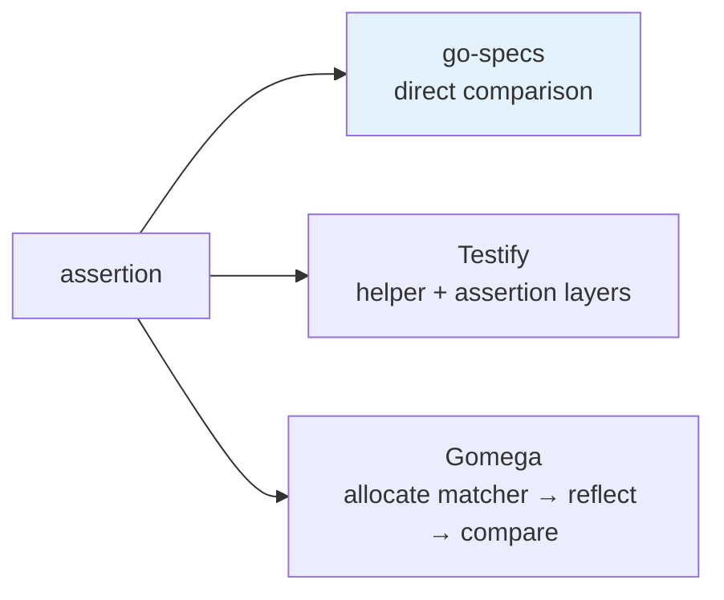

# 08 · Performance

> **Audience:** contributors, performance engineers · **Reading time:** ~12 minutes

Performance is a design constraint here, not a marketing line. This document states the measured
numbers, where they come from, what produces them, and what is **not** currently enforced.

---

## 1. Measured results

Source: `benchmarks/results/BENCH_SUMMARY.md`, averaged over 10 runs on Apple M4 Max, `darwin/arm64`.
Regenerate with `make bench-report`.

### Assertions — single equality, same comparison across frameworks

| Framework | ns/op | allocs/op |
| --- | --- | --- |
| go-specs `EqualTo` | ~1 ns | 0 |
| go-specs `Expect().ToEqual` | ~7.4 ns | 0 |
| Testify `assert.Equal` | ~86 ns | 0 |
| Gomega `Expect().To(Equal)` | ~241 ns | 3 |

### Matchers — `Expect().To(Equal)` style

| Framework | ns/op | allocs/op |
| --- | --- | --- |
| go-specs | ~7.8 ns | 0 |
| Gomega | ~227 ns | 3 |

### Runner — 1000 specs, one assertion each

| Framework | ns/op |
| --- | --- |
| go-specs | ~1.7 µs |
| Testify | ~85 µs |
| Gomega | ~244 µs |

### Hooks — 100 specs, 5 nested `BeforeEach` each

| Framework | ns/op |
| --- | --- |
| go-specs | ~199 ns |
| Testify | ~8.5 µs |
| Gomega | ~24 µs |

### Scaling — go-specs, full suite run

| Specs | Time |
| --- | --- |
| 100 | ~201 ns |
| 1 000 | ~1.7 µs |
| 10 000 | ~17 µs |
| 50 000 | ~85 µs |

Ten times the specs, ten times the time. The scaling is linear because execution is a sequential
loop over a flat step list — there is no per-spec map lookup, tree walk or allocation to make the
curve bend.

## 2. Where the speed comes from

Four decisions, in descending order of impact:

### Compiled execution plan

Hook resolution, scope naming and focus filtering happen once at compile time. The run loop calls
`step(ctx)` over a flat slice. Nothing is resolved, looked up or decided while the suite is running
([ADR-0003](adr/0003-compiled-execution-plan.md)).

### No reflection on the fast path

`EqualTo` and `ExpectT` are constrained to `comparable` and compile down to Go's `==`. The untyped
`Expect().ToEqual` type-switches `int`, `string`, `bool`, `int64`, `float64` and `uint` before it
will consider `reflect.DeepEqual`.

That is the entire distance between ~1 ns and ~241 ns.

### Zero allocations on the success path

`Context`, `Expectation` and the test-backend wrapper are pooled with `sync.Pool`. Matchers on the
typed path are not allocated at all. The assertion and runner success paths report `0 allocs/op`,
which is the number that matters most at scale — allocation is not just its own cost, it is GC
pressure charged to the whole process later.

### Memory locality

The plan is a flat slice. Specs sharing a hook layout are coalesced into one group so they share one
`before`/`after` slice. The runner walks contiguous memory rather than chasing pointers through a
tree.



## 3. Benchmark integrity

A benchmark that measures the wrong thing is worse than no benchmark. The rules the suite holds
itself to:

1. **Setup happens before `b.ResetTimer()`.** Building the suite, compiling the program and creating
   the runner are never inside the timed loop.
2. **Never time suite construction, DSL parsing or registry initialization inside `b.N`.** Those are
   one-time costs in real use; timing them would misrepresent both go-specs and its comparators.
3. **The comparison is identical across frameworks.** Same assertion (`42 == 42`), same spec count,
   same hook count, same nesting depth.
4. **The target is 0 allocs/op on the fast path.** A change that introduces an allocation there is a
   regression even if ns/op improves.

Full layout and category list: `benchmarks/README.md`.

## 4. Running them

```bash
make bench           # quick pass to the terminal
make bench-report    # -count=10, written to benchmarks/results/current.txt
make bench-compare   # benchstat previous.txt vs current.txt
```

`bench-compare` needs `benchstat`:

```bash
go install golang.org/x/perf/cmd/benchstat@latest
```

Charts are rendered from `benchmarks/results/current.txt` by `scripts/bench_to_chart.py`
(dependencies pinned in `scripts/requirements-charts.txt`) into `assertion_chart.png`,
`runner_chart.png` and `hooks_chart.png`.

## 5. The regression gate — and its honest status

`tools/perfcheck` is a CLI that compares two `go test -bench -benchmem -json` outputs and exits `1`
if any benchmark's ns/op regressed beyond a threshold:

```bash
go test ./benchmarks -bench . -benchmem -count=1 -json > baseline.json
# ... make a change ...
go test ./benchmarks -bench . -benchmem -count=1 -json > bench.json

go run ./tools/perfcheck/main.go bench.json baseline.json                # default 10% threshold
go run ./tools/perfcheck/main.go -threshold=0.05 bench.json baseline.json
```

| Exit code | Meaning |
| --- | --- |
| `0` | no benchmark regressed beyond the threshold |
| `1` | at least one did |
| `2` | argument or parse error |

A benchmark present in the current run but absent from the baseline is **skipped, not failed**, so a
newly added benchmark never blocks on its first run.

> **Not enforced in CI.** No workflow invokes `perfcheck`. `benchmarks.yml` runs the suite on pushes
> to `main` and commits refreshed charts — it has no failure condition. Performance regressions are
> currently *visible*, not *blocked*. Running `perfcheck` locally before a performance-sensitive
> change is the only gate that exists.

## 6. Other gates that do not exist

Stated plainly so nobody assumes otherwise:

| Assumed gate | Reality |
| --- | --- |
| Coverage threshold | `make coverage` and CI generate `coverage.out` and print the function table. No minimum is enforced. |
| Lint in CI | `make lint` runs `golangci-lint` locally (falling back to `go vet`). In CI, lint and `govulncheck` live in the Shipwright job, which is **disabled** ([ADR-0016](adr/0016-native-ci-single-toolchain.md)). |
| Allocation regression gate | none; the `0 allocs/op` target is held by review and by the benchmark output, not by a failing build. |

## 7. Working on a hot path

If you are changing assertion or runner code:

1. Record a baseline **before** your change (`make bench-report`, keep the file).
2. Make the change.
3. Re-run and compare with `benchstat` or `perfcheck`.
4. Check **allocs/op**, not just ns/op. A 5% ns/op win that adds an allocation is a loss.
5. Add the typed fast path before the reflected fallback — never instead of it. Generality is the
   fallback's job.
6. Put the measured numbers in the pull request. "It feels faster" is not a benchmark.
