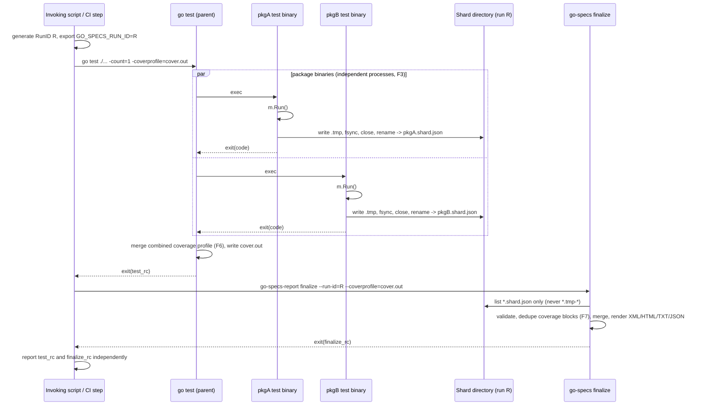

# REPORT-002A: Native multi-package reporting coordination contract

Status: proposed (design gate for #143; unblocks #145, #146)
Scope: activation, completion barrier, run identity/filesystem lifecycle, cache semantics, exit
semantics, and coverage-merge responsibilities for module-wide `go test ./...` reporting. Does
**not** implement shard emission (#145) or merge/render (#146), and does not change
`NormalizedReport` or any renderer from #142.

## 1. Design-space findings

All findings below were produced by running real `go test` invocations against scratch packages
under `/tmp/go144-experiments/modroot` (module `example.com/multipkg`, Go 1.27.0 darwin/arm64),
not recalled from memory. Exact commands are cited per finding.

### F1 — Forwarded custom test flags break packages that don't register them

```
$ go test ./... -args -goSpecsReport=xml:out.xml
ok      example.com/multipkg/pkgA   0.720s
flag provided but not defined: -goSpecsReport
FAIL    example.com/multipkg/pkgB   0.462s
FAIL
```

`pkgA` registered `-goSpecsReport` via `flag.String` in its own file; `pkgB` did not. `go test`
builds one binary per package and each binary parses `os.Args` (via `testing.M.Run`'s internal
`flag.Parse()`) independently — a flag forwarded through `-args` is not "unknown flags are
ignored," it is a hard parse failure in every binary that didn't register it. **A forwarded
custom flag cannot be the module-wide activation signal** unless every package in the module
registers it, which contradicts "module-wide without modifying participating packages."

### F2 — An environment variable is invisible to non-participating packages

```
$ GO_SPECS_REPORT=xml:out.xml go test ./...
ok      example.com/multipkg/pkgA   0.254s
ok      example.com/multipkg/pkgB   0.516s
```

Same two packages, env var set instead of a forwarded flag: both pass, `pkgB` (which never reads
the var) is completely unaffected. Env vars are inherited by every child process `go test`
spawns regardless of whether that process's code ever reads them — the only mechanism in this
comparison set with zero cost to non-participating packages.

### F3 — No package process can observe its peers; only the invoking command can

```
$ go test ./pkgC/... ./pkgD/... -p 2 -v | grep pid=
pkgC pid= 71397 start= ...05.040875-03:00
pkgC pid= 71397 end=   ...05.343739-03:00
pkgD pid= 71399 start= ...05.310691-03:00   # starts before pkgC ends
pkgD pid= 71399 end=   ...05.613720-03:00
```

Two distinct PIDs with overlapping lifetimes, launched under `go test`'s default parallelism
(`-p` defaults to `GOMAXPROCS`, so this is the *default* behavior on multi-core CI, not an
opt-in). Neither binary is a parent/child of the other and neither has a channel to ask "has my
sibling exited." The only process that structurally knows when every package binary has exited
is the `go test` command itself (it must wait for all of them to return before it can exit) —
and by extension, whatever invoked `go test` and is now looking at its own exit status.

### F4 — A cache hit skips `TestMain` entirely; nothing after `m.Run()` executes

```
$ go test ./pkgA/... -v   # first run
pkgA TestMain RUNNING at ...16:01:39.122944...
ok  example.com/multipkg/pkgA  0.302s
$ go test ./pkgA/... -v   # second run, identical inputs
pkgA TestMain RUNNING at ...16:01:39.122944...   # same timestamp — replayed log, not re-executed
ok  example.com/multipkg/pkgA  (cached)
$ go test ./pkgA/... -count=1 -v   # forces re-run
pkgA TestMain RUNNING at ...16:01:39.614717...   # fresh timestamp
ok  example.com/multipkg/pkgA  0.291s
```

On a cache hit, `go test` never re-executes the binary; it replays the previous run's captured
log. A `TestMain` that would write a shard for run *R* does not run at all on a cache hit for a
different run *R′* — the package is simply silent for *R′*, indistinguishable at the filesystem
level from "still running" or "crashed before writing." Reporting is fundamentally incompatible
with cached test results unless the run forces execution.

### F5 — Abrupt process termination bypasses any code after `m.Run()`

```
$ go test ./pkgA/... -timeout=1s   # TestSlow sleeps 3s
... panic: test timed out after 1s ...
FAIL    example.com/multipkg/pkgA   1.485s
```

`"FLUSH-MARKER-RAN"` (printed by code immediately after `m.Run()` returns) never appears. A
`-timeout` terminates the test binary through the testing runtime's timeout path without returning
control to the caller's post-`m.Run()` code. External `SIGKILL`, an OOM kill, and an unrecovered
panic in a goroutine outside the testing package's recovery boundary likewise terminate the
process before that code can run. This must not be generalized to an ordinary panic inside a
test: the testing package normally recovers that panic, marks the test failed, and allows
`m.Run()` to return. Any finalization logic after `m.Run()` is therefore available after ordinary
test failures (including recovered test panics), but not after abrupt process termination.

### F6 — The combined `-coverprofile` file is written once, by the `go` command, after everything finishes

```
$ go test ./... -coverprofile=cover.out -coverpkg=./...
# file does not exist until the command as a whole completes; then contains one merged profile
```

No package binary writes a fragment of this file — `go test` collects each binary's internal
coverage counters and writes the single combined file itself only once the whole invocation is
done. A package-local process genuinely cannot know, or contribute directly to, this file's
final content.

### F7 — `-coverpkg` overlap produces duplicate raw block lines that Go's own tooling merges, but `report.ParseCoverageProfile` does not

Built `pkgE` (imports `pkgF`) and `pkgF` (tested directly), both instrumented via
`-coverpkg=./pkgE/...,./pkgF/...`:

```
$ go test ./pkgE/... ./pkgF/... -coverpkg=./pkgE/...,./pkgF/... -coverprofile=cover6.out
$ cat cover6.out
mode: set
example.com/multipkg/pkgE/e.go:6.2,7.1 1 0
example.com/multipkg/pkgF/f.go:4.2,5.1 1 1
example.com/multipkg/pkgF/f.go:8.2,9.1 1 0
example.com/multipkg/pkgE/e.go:6.2,7.1 1 1   # same block as line 2, different count
example.com/multipkg/pkgF/f.go:4.2,5.1 1 0   # same block as line 3, different count
example.com/multipkg/pkgF/f.go:8.2,9.1 1 1   # same block as line 4, different count
$ go tool cover -func=cover6.out
example.com/multipkg/pkgE/e.go:5:  DoSub  100.0%
example.com/multipkg/pkgF/f.go:3:  Add    100.0%
example.com/multipkg/pkgF/f.go:7:  Sub    100.0%
total:               (statements)  100.0%
```

`pkgE`'s binary and `pkgF`'s binary both instrument the shared dependency, so the combined
profile has **two entries per shared block**, not one — `go test`'s file-level combination is a
raw concatenation, not a merge. `go tool cover -func` produces the *correct* answer (3
statements, 100%) because `golang.org/x/tools/cover`'s profile loader merges duplicate blocks
keyed by `(file, start, end)`: `mode: set` counts are OR'd, `count`/`atomic` counts are summed.

Read against this repo's `report/coverage.go` (`ParseCoverageProfile`, lines 45–58): it has **no
such keying**. It accumulates `pc.Total += numStmt` and conditionally `pc.Covered += numStmt` for
*every line it reads*, unconditionally. Fed `cover6.out` today, it would report `Total = 6`
statements (double-counted) instead of the correct 3, and `Covered` would depend on line order
rather than "is this block covered by *any* contributing binary." **This is a real, currently
unhandled gap** in already-merged code, triggered specifically by the `-coverpkg` overlap
scenario #143 calls out — not a hypothetical. It must be closed by #146 (see §9).

### F8 — There is no free, Go-provided, shared per-invocation identifier

```
$ go test ./pkgA/... ./pkgB/... -coverprofile=covx.out -v | grep GOCOVERDIR
pkgA GOCOVERDIR= .../go-build462199080/b001/gocoverdir
pkgB GOCOVERDIR= .../go-build462199080/b148/gocoverdir
```

`GOCOVERDIR` exists only when `-coverprofile`/`-cover` is used, and is a **per-package build
directory**, different for every binary in the same invocation — it cannot serve as a shared run
identifier. No other env var is both automatically set and shared identically across every
package binary of one `go test ./...` invocation. A run identifier must be generated externally
(by whatever invoked `go test`) and exported before the command runs.

## 2. Rejected alternatives (with reasons)

| Alternative | Rejected because |
|---|---|
| Forwarded custom test flag (`-args -go-specs.report=...`) as the *module-wide* activation signal | F1: hard `flag provided but not defined` failure in every non-participating package's binary. Still fine as a **per-package** convenience once that package already links go-specs (unchanged from #142), just not usable as the cross-package coordination trigger. |
| "Last writer wins" — whichever package process finishes last performs the merge | F3: no package can know it is last; overlapping lifetimes are the default (`-p`≥2), not an edge case. Rejected per #143's explicit invariant. |
| Lock-file / counter that increments per package and triggers merge at N | Requires knowing N in advance and reliably decrementing on every exit path, including the F5 abrupt-termination cases where no code runs after `m.Run()`. A counter can't observe a process that never got to decrement it — indistinguishable from "still running." |
| Stale-directory heuristic ("no shard written in the last Xs ⇒ assume done") | Race-prone by construction (a slow package looks identical to a finished run) and explicitly rejected by #143 and by #144's acceptance criteria. |
| `TestMain`-only coordination with no external step (some in-process signal after all binaries exit) | F3 proves no such signal exists inside the process model; only the `go` command's own exit is authoritative. |
| Rely on `GOCOVERDIR` or any Go-generated value as the shared run ID | F8: it's per-package-build-directory, not shared, and only exists under `-coverprofile`. |
| Each shard independently computes/embeds its own coverage percentage | Directly contradicts #141 ("a package-local process must not claim to know the module-wide total"); also F7 shows per-shard coverage numbers can't be correctly deduplicated without seeing every other shard's blocks first — that information only exists once, in the single combined `-coverprofile` file (F6). |

## 3. Recommended lifecycle

1. **Before `go test` runs**, the invoking script/CI step generates a run identifier and exports
   it (`GO_SPECS_RUN_ID`), alongside an optional shard base directory
   (`GO_SPECS_REPORT_DIR`, default `.go-specs/runs`). This is the *only* place a run ID can
   originate (F8) — go-specs itself cannot manufacture a value multiple independently-launched
   binaries would agree on.
2. **`go test ./... -count=1 ...`** runs exactly as today. Every package that has already wired
   go-specs into its own `TestMain` (unchanged requirement — see §10) reads `GO_SPECS_RUN_ID`
   from its environment (F2: harmless to packages that don't). If absent, shard emission remains
   disabled; if present but invalid, configuration fails loudly and the package must not continue
   as though reporting were disabled. If valid, that package's `TestMain` additionally writes one
   shard file after its own `m.Run()` returns, via
   temp-write + fsync + atomic rename (§5). Packages that never link go-specs do nothing and are
   never broken by the two env vars being present (F1 vs F2).
3. **`go test` returns.** Its exit code is untouched by any of this — reporting has not
   influenced it, per-process, since #142.
4. **After `go test` returns**, the same script/CI step — only if it wants a merged module report
   — runs a separate, explicit finalization command/library call
   (`report.Finalize(ctx, opts)` or a thin `go-specs-report finalize` CLI), passing the same run
   ID, the shard base dir, the authoritative expected-producer manifest supplied by the invoker,
   and (if used) the path to the single combined `-coverprofile` file.
   This step is the only thing in the system entitled to read shards, merge them, and render the
   four #142 formats module-wide.
5. Finalize discovers the run's shard directory, accepts only complete (atomically-renamed) and
   valid shards, checks them against the authoritative expected-producer manifest, merges
   execution data deterministically, merges coverage by deduplicating
   blocks from the single combined profile (§9), and renders XML/HTML/TXT/JSON through the
   existing #142 renderers, unchanged.
6. Finalize's own exit code is independent of `go test`'s (§8) and finalize is itself responsible
   for shard-directory cleanup on success (§5) — no package process deletes anything.

Step 4 is optional and separate from step 2: skipping it leaves `go test` fully functional and
native, exactly as #141 requires. It is an "optional orchestration/finalization step," not a
replacement test runner — the user's canonical command is still, verbatim, `go test ./...`.

## 4. Event/process sequence



## 5. Environment and filesystem contract

Environment variables are optional for activation: absence of `GO_SPECS_RUN_ID` makes shard
emission a no-op, preserving "disabled by default." Presence is an explicit request to activate
coordination, so an invalid value is a configuration error and must fail loudly rather than
silently degrading to disabled mode:

| Variable | Set by | Meaning |
|---|---|---|
| `GO_SPECS_RUN_ID` | invoking script/CI, before `go test` | Opaque run identifier, `^[A-Za-z0-9_.-]{1,128}$`. Absent ⇒ coordination disabled. Present but invalid ⇒ configuration error; the process must fail loudly and must not silently disable shard emission. |
| `GO_SPECS_REPORT_DIR` | invoking script/CI (optional) | Base directory for run subdirectories. Default `.go-specs/runs`. |
| `GO_SPECS_REPORT` | existing, #142 | Unchanged: per-process local format:path target(s), orthogonal to shard emission. |

Filesystem layout: `<GO_SPECS_REPORT_DIR>/<run-id>/shards/<sanitized-package-path>.shard.json`.

- **Sanitization**: package import path with `/` → `_`, any byte outside
  `[A-Za-z0-9_.-]` percent-escaped; result validated with `filepath.Clean` + containment check
  against the shard directory before use, both when writing (F-nothing-observed-but-defensive)
  and when the finalizer reads a shard's self-reported package path back out of its envelope —
  a shard's own content is never trusted as a filesystem destination.
- **Ownership/permissions**: run directory and shard directory `0700`; shard files `0600`. Only
  the invoking user/CI job needs access; test output can include stack traces and assertion
  messages, so least privilege is the safe default even on "our own" CI runners.
- **Write protocol**: write to `<final-name>.tmp-<pid>` inside the *same* shard directory (never
  `/tmp` or another mount — cross-filesystem `rename` is not atomic on POSIX and must be
  documented as a hard constraint on `GO_SPECS_REPORT_DIR`), `Sync()`, `Close()`, then
  `os.Rename` to the final name. The finalizer only ever globs the final naming pattern and
  never opens a `.tmp-*` file — a shard is atomically either wholly absent or wholly present,
  satisfying "aggregation cannot read a shard that is still being written."
- **Duplicate producer identity**: two shards resolving to the same package path is rejected by
  the finalizer as corrupt/ambiguous (§9), never "pick one."
- **Cleanup/retention**: package processes never delete anything (F5/F3: a process that dies
  early must not have been relied on to clean up, and no process should have delete authority
  over a sibling it can't see). The finalizer prunes its own run's shard directory after a
  successful merge (configurable; default keep). A separate, explicit `gc`-style operation
  (library call or CLI verb) removes run directories older than a retention window — never
  triggered automatically mid-run, since an old-looking directory cannot be distinguished from a
  slow-but-alive peer without external knowledge.

## 6. Cache, failure, and coverage semantics

**Cache (F4):** a cache hit skips `TestMain` entirely, so a cached package writes no shard for
the current run. Reporting therefore **requires `-count=1`** (or `GOFLAGS=-count=1`) to
guarantee every discovered package actually executes and has a chance to write a fresh shard.
This is a real, user-visible tradeoff — enabling reporting removes `go test`'s caching benefit
for that invocation — and must be stated plainly in docs, not softened. The finalizer must never
assume a missing shard means "unchanged, reuse the last one"; a missing shard is always reported
as missing (§8), because there is no way to distinguish "cached and skipped" from "crashed"
(F5) or "never built."

**Exit semantics** — see §8, kept as its own section since #144 requires all five states defined
independently.

**Coverage** — see §9.

## 7. API/interface sketches

Illustrative, not final signatures — #145/#146 own the concrete implementation. New surface
lives alongside `report` (same module, possibly a `report/coordination` subpackage) and does not
touch `NormalizedReport` or any `Render*` function.

```go
// RunID identifies one module-wide `go test` invocation across all its package processes.
// It must come from the environment (GO_SPECS_RUN_ID) — no in-process mechanism can produce
// a value multiple independently-launched package binaries would agree on (see F8).
type RunID string

// ValidateRunID enforces ^[A-Za-z0-9_.-]{1,128}$, rejecting empty values and anything that
// could act as a path separator or traversal segment.
func ValidateRunID(s string) (RunID, error)

// ShardConfig is resolved once per package process, typically inside TestMain.
type ShardConfig struct {
	RunID       RunID  // from GO_SPECS_RUN_ID; zero value means shard emission is disabled
	BaseDir     string // from GO_SPECS_REPORT_DIR, default ".go-specs/runs"
	PackagePath string // this package's import path
}

// ShardConfigFromEnv reads GO_SPECS_RUN_ID / GO_SPECS_REPORT_DIR. When GO_SPECS_RUN_ID is
// unset, Enabled() is false and ShardWriter is a no-op. When it is present but invalid,
// ShardConfigFromEnv returns an error that the caller must surface; invalid configuration must
// never be treated as disabled reporting.
func ShardConfigFromEnv(packagePath string) (ShardConfig, error)
func (c ShardConfig) Enabled() bool

// ShardWriter is the #145 producer's entry point: one call, from TestMain, after m.Run()
// returns and before os.Exit — mirroring MultiFormatReporter.Flush's existing placement so the
// two compose in the same TestMain body.
type ShardWriter struct{ /* unexported */ }

func NewShardWriter(cfg ShardConfig) *ShardWriter

// Write serializes rep into a versioned ShardEnvelope and publishes it via
// temp-write + fsync + close + os.Rename (§5). No-op returning nil when cfg.Enabled() is false.
func (w *ShardWriter) Write(rep NormalizedReport) error

// ShardEnvelope is the on-disk shape of one shard file. It carries execution data only: neither
// pre-aggregated coverage numbers nor a coverage-profile path. The invoker gives the one combined
// coverage profile directly to the finalizer, so producers never own or describe coverage (§9).
type ShardEnvelope struct {
	ShardSchemaVersion string // versions this envelope, independent of report.SchemaVersion
	RunID              RunID
	PackagePath        string
	ProducedAt         time.Time
	Report             NormalizedReport // #142's model, unchanged
}

// --- #146 finalizer ---

type FinalizeOptions struct {
	RunID          RunID
	BaseDir        string
	CoverProfile   string   // path to the one combined `go test -coverprofile` file, optional
	ExpectedProducers []string // required authoritative list of packages expected to emit shards
	Targets        []Target // module-wide XML/HTML/TXT/JSON outputs, reusing report.Target
	Cleanup        bool     // prune the run's shard directory after a successful merge
}

// Finalize is the only code path allowed to read shard files, merge them, and render module-wide
// reports. It lists only final (non-.tmp) shard names, checks them against ExpectedProducers,
// rejects corrupt/duplicate/unexpected/wrong-run/incompatible-version shards explicitly (never
// silently drops or silently picks one), merges
// coverage from CoverProfile with block-level deduplication (§9), and renders every Target
// through #142's existing RenderXML/RenderHTML/RenderTXT/RenderJSON — unchanged.
func Finalize(ctx context.Context, opts FinalizeOptions) (FinalizeResult, error)

type FinalizeResult struct {
	Merged          NormalizedReport
	PackagesFound   []string
	PackagesMissing []string        // in ExpectedProducers but no valid shard found
	Rejected        []RejectedShard
}

type RejectedShard struct {
	Path   string
	Reason string // "corrupt" | "duplicate-package" | "unexpected-package" | "schema-version-mismatch" | "wrong-run-id" | "stale"
}
```

`ExpectedProducers` is authoritative input owned by the invoker, not a value the finalizer may
infer with `go list ./...`. Module discovery includes packages that do not integrate go-specs and
therefore are not shard producers; treating that broader set as expected would create false
missing-shard failures. The list must come from explicit configuration (for example, a checked-in
manifest or repeated CLI argument), be normalized and de-duplicated, and be captured before
`go test` starts so the finalizer validates the same producer set the invocation intended.

A thin `cmd/go-specs-report` CLI wrapping `Finalize` (subcommands `finalize`, `gc`) is a
reasonable #146 deliverable given #141 names GitHub Actions/Shipwright/generic-CI as consumers,
but the library entry point is the actual contract; the CLI is optional sugar.

## 8. Exit semantics

| State | `go test` exit code | Finalize exit code | Notes |
|---|---|---|---|
| Tests pass, reporting succeeds | unchanged (0) | 0 | |
| Tests fail, reporting succeeds | unchanged (1) | 0 | Per-process shard write still happens (`TestMain`'s post-`m.Run()` code runs on ordinary failure, including a panic recovered by the testing package; only abrupt process
termination bypasses it — F5) so the failure is fully represented in the merged report. |
| Tests pass, reporting fails (finalize) | unchanged (0) | non-zero, distinct from `go test`'s codes | |
| Tests fail and reporting also fails | unchanged (1) | non-zero | Two independent signals, never collapsed into one. |
| Abrupt process termination: timeout/SIGKILL/OOM/unrecovered out-of-band panic (F5) | whatever `go test`/the OS already reports for a kill/timeout | Finalize reports that package under `PackagesMissing` or `Rejected`, not silently | The killed package's shard was never written; finalize's job is to make that fact loud, not to guess. |

`go test`'s exit code is never touched by anything in this design — it is exactly what #142
already preserves per-process, and multi-package coordination does not add a new way for a test
binary to change its own exit status based on reporting outcome (F5 already makes that
impossible for the kill case, and the design deliberately keeps it impossible for every other
case too, for consistency).

Finalize's exit code is a **separate command's** exit code by construction (§3 step 4), so it can
never retroactively overwrite what `go test` already returned. Recommended CI wiring keeps `go
test` and `finalize` as two distinct steps/checks (not one combined shell `&&`/exit-code-max
trick) so both failures stay independently attributable, per #144's acceptance criterion.

## 9. Coverage lifecycle and merge responsibility

- `go test ./... -coverprofile=path` produces exactly **one** combined file, written by the `go`
  command itself only after every package binary has finished (F6) — no package process
  contributes a coverage *fragment* to this file; it's not shard-like at all.
- Under `-coverpkg` overlap, that single combined file legitimately contains multiple raw entries
  for the same instrumented block, one per contributing test binary (F7) — this is normal, not
  corruption.
- Go's own tooling resolves this by merging on `(file, start, end)`, using OR for `mode: set` and
  summation for `mode: count`/`atomic` (F7, cross-checked against `go tool cover -func`'s
  correct output). **`report.ParseCoverageProfile` (#142) does not do this merge today** and
  will double-count `Total` on an overlapping profile — verified by inspection of
  `report/coverage.go` lines 45–58 against the `cover6.out` fixture in F7.

Responsibility split:

- **#145 (shard producers) must not compute or embed per-package coverage numbers.** A
  package-local process cannot know the module-wide picture (per #141, explicitly), and per F7
  it can't even correctly de-duplicate against sibling packages' contributions — that
  information only exists once everyone's output has landed in the single combined profile.
  Shards carry execution data (`NormalizedReport` minus `Coverage`, or with `Coverage` left
  zero-value) only. They must not carry a coverage-profile path; the invoker passes the single
  combined profile directly to the finalizer.
- **#146 (finalizer) owns coverage exclusively**, reading the one combined `-coverprofile` file
  named in `FinalizeOptions.CoverProfile` and parsing it through a **new or extended**
  block-deduplicating parser (key: `file, startLine.startCol, endLine.endCol, numStmt`;
  `set`→OR, `count`/`atomic`→sum) before computing `Covered`/`Total`/percentages. This can be
  added as new/extended logic in the `report` package without breaking
  `ParseCoverageProfile`'s existing documented behavior for its current (non-overlapping)
  callers — additive, not a break of #142's contract.
- Aggregate percentages remain summed-statement-based, never averaged (unchanged from #142);
  packages with zero statements remain absent from the profile and contribute nothing (unchanged
  Go coverage instrumentation behavior, already documented in `coverage.go`).

## 10. Security considerations

- **Run ID**: validated against `^[A-Za-z0-9_.-]{1,128}$` before being used as a path segment;
  rejects empty, `..`, `/`, and control characters — blocks path traversal via a crafted
  `GO_SPECS_RUN_ID`.
- **Package-path-to-filename mapping**: sanitized and then containment-checked
  (`filepath.Clean` + prefix check against the shard directory) both when a shard is written and
  when its self-reported `PackagePath` is read back by the finalizer — a shard's own content is
  never trusted as a write/read destination without revalidation.
- **Permissions**: run/shard directories `0700`, shard files `0600` — least privilege even on
  single-tenant CI, since shard contents (failure messages, stack traces, file paths) are not
  meant to be world-readable by default.
- **Untrusted shard contents**: shard files are treated as untrusted input at parse time — bound
  the read size before decoding (a corrupt or adversarially large file must not be able to OOM
  the finalizer), use a safe self-describing format (JSON; no `gob`/anything that can execute
  code on decode), and check `ShardSchemaVersion` before trusting any other field. An
  incompatible or unparseable shard is rejected explicitly (`RejectedShard`), never partially
  trusted.
- **Cross-filesystem rename**: documented hard constraint — `GO_SPECS_REPORT_DIR` must be on a
  single local filesystem; temp files are written inside the destination shard directory
  specifically so `os.Rename` stays atomic (POSIX rename atomicity does not hold across
  filesystem/mount boundaries).
- **Concurrent independent runs**: isolated by construction, since each run's shards live under
  `<base>/<run-id>/shards/` and run IDs are validated to be non-empty/non-colliding path
  segments supplied by the caller; two runs sharing a base dir never share a shard directory
  unless the caller reuses a run ID, which is a caller error the validator can additionally guard
  against (e.g., refuse to write into an existing run directory that already has a *different*
  finalize-success marker, if stricter collision detection is wanted in #145's implementation).

## 11. Acceptance-criteria mapping (issue #144)

| # | Criterion | How this design satisfies it |
|---|---|---|
| 1 | Lifecycle described invocation → final report publication | §3, §4 |
| 2 | No package process elected by timing or "last writer wins" | Rejected explicitly in §2 (F3); finalization is a separate, externally-triggered step, not an election among package processes |
| 3 | Aggregation cannot read a shard still being written | §5: temp-write + fsync + close + atomic rename; finalizer globs only final names, never `.tmp-*` |
| 4 | Existing Go flags and package discovery retain normal behavior | No new required test flags (§1 F1, §2); activation is env-var only, `go test`'s own discovery remains untouched. Expected shard producers are supplied separately and authoritatively, never inferred by changing or reinterpreting `go test` discovery. |
| 5 | Packages without go-specs integration do not fail due to unknown flags | §1 F1/F2: no forwarded flag is used for module-wide activation; env vars are silently ignored by non-participating packages |
| 6 | Cache behavior explicit and tested in the later integration slice | §6/§1 F4: `-count=1` required, documented as a stated tradeoff; the finalizer compares shards with the authoritative expected-producer list, so a cache-skipped producer is reported missing and specified for #146 to test |
| 7 | Test failure and reporting failure exit semantics defined independently | §8, full 5-state table |
| 8 | Run directories cannot collide across concurrent invocations | §5/§10: run ID is a validated, caller-supplied, non-empty path segment; `<base>/<run-id>/shards/` namespaces every run |
| 9 | #141 and #143 contain no contradictory execution requirements after this decision | §12: no contradiction found; #141 explicitly pre-authorized exactly this "document the limitation, propose an external coordinator" outcome |
| 10 | Design identifies exact work owned by REPORT-002B and REPORT-002C | §7 (API sketch split), §9 (coverage responsibility split), §12 |

## 12. Scope updates needed in #141 / #143 / #145 / #146

**No contradiction was found that requires a product decision or a weakening of #141.** #141
already anticipates this exact outcome ("If Go's execution model makes single-command final
aggregation impossible without an external coordinator, the implementation must document that
limitation before coding and propose the smallest Go-native-compatible mechanism") — this
document *is* that documentation, and §3's optional, separate `Finalize` step *is* that smallest
mechanism: `go test` itself is never wrapped, replaced, or given new required flags.

Recommended (non-blocking) updates:

- **#141**: add a pointer from "Multi-package constraint" to this design doc; no requirement
  text needs to change.
- **#143**: add this doc's path to References; the architectural invariants list is already
  fully satisfied and needs no edits.
- **#145**: scope should be tightened to explicitly exclude all per-package coverage ownership
  (§9) — shards carry execution data only, with neither coverage values nor a coverage-profile
  path — and
  should reference `ShardConfig`/`ShardWriter`/`ShardEnvelope` (§7) as its contract surface.
- **#146**: scope should explicitly add (a) a block-deduplicating coverage merge keyed by
  `(file, start, end, numStmt)` with `set`→OR / `count|atomic`→sum semantics, since existing
  `ParseCoverageProfile` does not do this and will double-count under `-coverpkg` overlap (F7);
  and (b) explicit, tested handling of "missing shard" against the invoker-supplied authoritative
  expected-producer list (cache skip, abrupt termination, or genuine failure to launch — §6/§8),
  never silently treated as "package had nothing to report" and never inferred from `go list ./...`.

## 13. Unresolved decisions (non-blocking, flagged for a quick maintainer call)

- **Run ID generation recipe**: left to the invoking CI wrapper (uuidgen, CI-native build ID,
  timestamp+random) — go-specs only validates, never generates, since no in-process mechanism
  can produce a value shared across independently-launched binaries (F8). Recommend documenting
  2–3 concrete recipes in #146's docs rather than prescribing one.
- **Thin CLI vs. library-only finalizer**: recommend shipping both (a small `cmd/go-specs-report`
  wrapping `Finalize`), since #141 names GitHub Actions/Shipwright/generic CI as consumers and a
  CLI is the lowest-friction integration point — but this is a #146 implementation-time call.
- **Strict vs. lenient missing-shard default**: the producer list itself is mandatory and
  authoritative; recommend strict-by-default (fail the finalize step when an expected producer
  has no valid shard) with an explicit opt-out for local/dev use. The finalizer must never replace
  that list with `go list ./...`; final strictness is a #146/product call.
