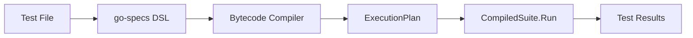
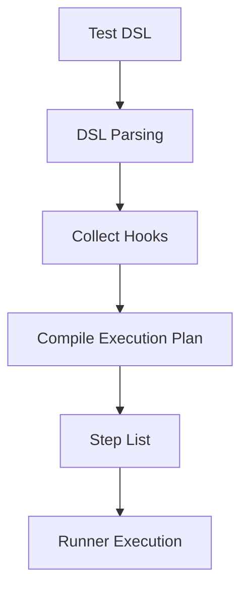
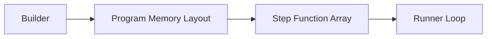
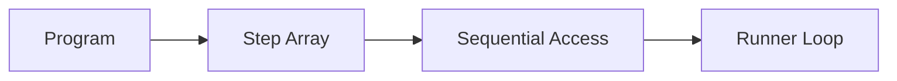
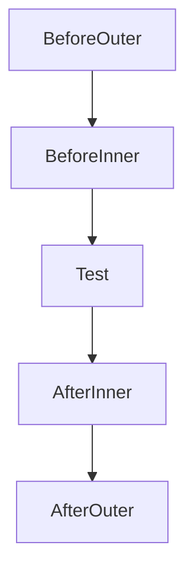
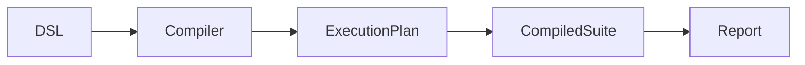

# Architecture

High-level architecture of go-specs: how tests are defined, compiled, and executed.

## Overview

`Describe` — the documented, default entry point — compiles directly to a flat instruction stream.
It never touches `Builder`, `Program`, or `Runner`:

**DSL → Compiler → ExecutionPlan → CompiledSuite**


`Builder → Program → Runner` is a second, parallel path, reachable only when a caller constructs it
by hand via `NewBuilder`/`BuildProgram` + `NewRunner`. It is a compatibility surface: CI sharding,
its last unique capability, is also available on the canonical path as `CompiledSuite.RunShard`
since [#251](https://github.com/getsyntegrity/go-specs/issues/251). Both paths share the same external
shape — hooks resolved at compile time, steps executed in a flat loop — but share no code with each
other.

| Component | Responsibility |
| --------- | -------------- |
| **DSL** | User-facing test definition. `Describe`, `BeforeEach`, `AfterEach`, and `It` register structure and callbacks with the bytecode compiler as they run; the `Builder` API offers the same shape for the alternate path. |
| **Compiler** (`specs/compiler.go`) | Compiles `Describe`'s DSL calls into an `ExecutionPlan`. Resolves hooks at compile time and flattens each spec's before/body/after into its own instruction range. |
| **ExecutionPlan / CompiledSuite** (`specs/execution_plan.go`) | The compiled artifact for the `Describe` path: a flat instruction stream with per-spec bounds. `CompiledSuite.Run` iterates it — no tree structure at run time. |
| **Builder / Program / Runner** (`specs/builder.go`, `specs/program.go`, `specs/runner.go`) | The alternate, caller-constructed path. `Builder.Build()` produces a `Program` — a slice of groups, each with before/specs/after steps; `Runner.Run` iterates it. Never reached from `Describe`. |

Heavy work (parsing, hook collection, plan construction) happens during **compilation**; execution is a thin loop over the compiled plan on both paths. See [PERFORMANCE.md](PERFORMANCE.md) for execution cost and scaling, and [EXECUTION_ENGINES.md](EXECUTION_ENGINES.md) for the full inventory of every execution engine in this repository and which one is canonical.

---

## DSL → Execution pipeline (full lifecycle)

The full lifecycle from user code to test results, for the default `Describe` path:



| Stage | Description |
| ----- | ----------- |
| **Test file** | User writes a `*_test.go` file and calls `Describe(t, "name", ...)`. |
| **go-specs DSL** | `Describe`, `BeforeEach`, `AfterEach`, and `It` register scope and callbacks with the compiler as they run. |
| **Bytecode compiler** | Flattens hooks and specs into a linear `ExecutionPlan`. No tree is retained at run time. |
| **ExecutionPlan** | A flat instruction stream with per-spec bounds — each spec's own `OpBeforeHook`/`OpBody`/`OpAfterHook` range, already in the correct order. |
| **CompiledSuite.Run** | Iterates the plan and runs each spec's instructions with a pooled Context. Zero allocations in the loop. |
| **Test results** | Pass/fail is reported via the test backend (`*testing.T`); the runner does not interpret assertions. |

Constructing `Builder`/`BuildProgram` + `NewRunner` by hand instead of `Describe` follows the same
shape — DSL calls flattened into a plan ahead of time, then executed in a flat loop — but produces
a `Program` (groups of before/specs/after steps) run by `Runner`, not an `ExecutionPlan` run by
`CompiledSuite`. See [EXECUTION_ENGINES.md](EXECUTION_ENGINES.md).

---

## Test compilation model

A test definition is turned into executable steps by parsing the DSL, collecting hooks, and compiling a step list.

**Example DSL:**

```go
Describe(t, "math", func(s *specs.Spec) {
    s.BeforeEach(setup)
    s.It("adds numbers", testAdd)
})
```



1. **DSL parsing** — The compiler receives the `Describe` callback and runs it; each `BeforeEach` and `It` call registers a hook or spec.
2. **Collect hooks** — Before and after hooks are pushed onto scope stacks (outer to inner). When an `It` is seen, the current stacks define that spec’s hooks.
3. **Compile execution plan** — For each spec, the compiler emits a sequence: before hooks (outer→inner), body, after hooks (inner→outer). The result is a single flat step list (or grouped steps for the Program model).
4. **Step list** — The plan is a slice of `func(*Context)`. No metadata is needed at run time beyond the function pointers.
5. **Runner execution** — The runner loops over the step list and invokes each step with the same Context.

No maps, no reflection, and no per-spec allocation in the runner loop.

---

## Memory layout (why the framework is fast)

The builder produces a plan that is nothing more than a flat slice of function pointers. The runner then walks that slice in order.



Steps are compiled into a **flat slice of function pointers**. There are no maps, no trees, and no per-step metadata in the hot path. The runner just does `for i := range steps { steps[i](ctx) }`, which gives sequential memory access and direct function dispatch. That keeps the inner loop small and cache-friendly.

### Memory access pattern

The runner reads step functions sequentially from memory—no random access or pointer chasing.



Sequential access is cache-friendly: the CPU can prefetch the next steps while executing the current one. See [PERFORMANCE.md](PERFORMANCE.md) for more on execution cost and scaling.

---

## Hook execution path

Nested before/after hooks are compiled into a linear sequence; at run time there is no tree traversal.



Hooks are **compiled into the execution plan** and do not require runtime traversal. The builder flattens scope and emits one sequence per spec (outer before → inner before → spec body → inner after → outer after). The runner executes that sequence as a straight line of steps with no lookup or recursion.

---

## Internal package architecture

There is no `internal/` package under `specs` — the compiler, `ExecutionPlan`/`CompiledSuite`, and
`Builder`/`Program`/`Runner` all live directly in the `specs` package. (`report/coordination/internal/`
is a separate, unrelated `internal/` package scoped to shard-report coordination.) High-level
responsibilities:



| Package / file | Role |
| ------- | ---- |
| **specs** | Public DSL (`Describe`, `BeforeEach`, `AfterEach`, `It`), the bytecode compiler, `ExecutionPlan`/`CompiledSuite` (the default engine), the `Builder`/`Program`/`Runner` compatibility surface, and `Context`. Entry point for all user code. |
| `specs/compiler.go` | Compiles `Describe`'s DSL calls into an `ExecutionPlan` (the bytecode-compiler path); the `Analyze`/registry path builds the same `ExecutionPlan` type from an arena instead (`specs/execution_plan.go`'s `buildExecutionPlanFromArena`). |
| `specs/execution_plan.go` | `ExecutionPlan` and `CompiledSuite`: the flat instruction stream and the code that runs it. |
| `specs/builder.go`, `specs/program.go`, `specs/runner.go` | `Builder`, `Program`, and `Runner`: the alternate, caller-constructed engine; the package-level `RunShard` (`specs/scheduler.go`) shards a `*Program`, while `CompiledSuite.RunShard` covers the canonical path. |
| **report** | Reporting and formatting (e.g. for structured output). Used by both engines when a reporter is configured. |

See [EXECUTION_ENGINES.md](EXECUTION_ENGINES.md) for the complete inventory of every execution
engine in this repository (including `MinimalRunner`, `BytecodeRunner`, `BlockRunner`, and the
parallel scheduler) and which ones are canonical, compatibility surface, or slated for removal.
