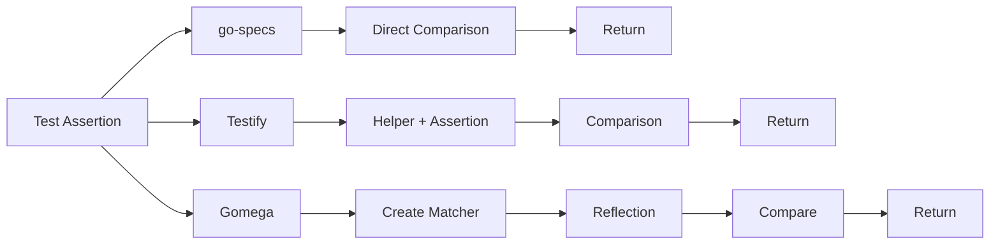
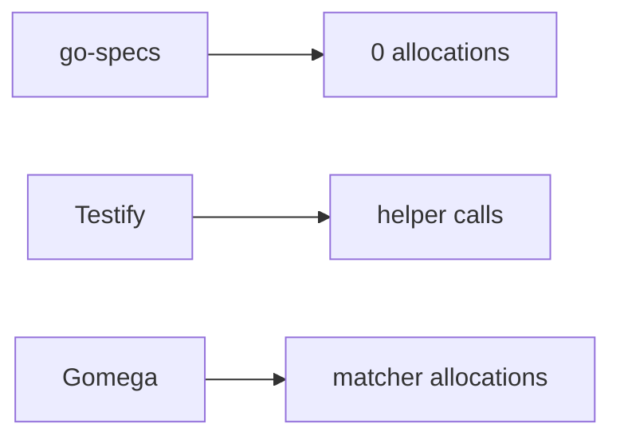
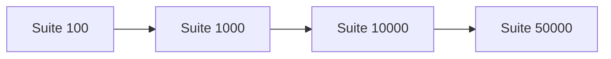

# Benchmarks

Benchmark methodology, environment, and results for go-specs compared with Testify and Gomega.

## Hardware and environment

Two sets of numbers appear on this page, and they are kept apart on purpose.

**Current measurements** (the tables below unless a heading says "historical"):

| Item | Value |
| ---- | ----- |
| **Date** | 2026-09-28 |
| **Go version** | go1.26.6 linux/amd64 |
| **CPU** | 13th Gen Intel(R) Core(TM) i7-13620H (16 logical CPUs) |
| **Method** | `-count=5`, median of the 5 samples reported by `benchstat` |
| **Isolation** | None. Other workloads were running on the machine, so treat every figure as indicative, not as a reference result. |

**Go version the repository targets.** [go.mod](../go.mod) declares `go 1.25.0`, the language floor. CI installs
the exact toolchain pinned in [`.go-version`](../.go-version) (currently `1.25.14`) and
[`check-go-version.sh`](../.github/scripts/check-go-version.sh) fails the build if the two drift apart. An
earlier revision of this page said "Go 1.26+"; that was wrong. The benchmark run above used go1.26.6 only
because that is the toolchain installed on the measuring machine, which is allowed because 1.26 is newer than
the 1.25.0 floor.

**Historical measurements** were taken on an Apple M4 Max, before per-spec panic recovery, failure
isolation and reporting were added to the runner (March 2026, per the note in the
[README](../README.md#flat-execution-framework-overhead-with-the-subtest-removed)). They are kept only where
labelled "historical" and must not be compared with current numbers as if they were the same experiment.

## Benchmark commands

From the repository root (`make bench` and `make bench-report` are wrappers around the same command; see the
[Makefile](../Makefile)):

```bash
# what the numbers below were measured with
go test ./benchmarks -run='^$' -bench=. -benchmem -count=5

# summarise (needs: go install golang.org/x/perf/cmd/benchstat@latest)
benchstat current.txt        # after redirecting the run above to current.txt
```

`make bench-report` runs the same thing with `-count=10` and writes `benchmarks/results/current.txt`;
`make bench-compare` diffs it against a saved `previous.txt`. `make bench-e2e` measures the real
`*testing.T` path (see below).

Setup (building the suite, creating the runner) is done before `b.ResetTimer()` so the reported time and
allocations reflect only the measured loop.

**These `*testing.B` benchmarks measure the flat path.** When the runner is given a `*testing.B` it skips the
per-spec `t.Run` subtest, so the numbers below isolate the framework's own overhead. They are not what a
`go test` run costs; the end-to-end table further down is.

## Assertions

Single equality assertion, current measurements (same comparison across frameworks, comparing `42` with `42`):

| Assertion                 | ns/op    | allocs | Historical (Apple M4 Max) |
| ------------------------- | -------- | ------ | ------------------------- |
| GoSpecs EqualTo           | ~1.1 ns  | 0      | ~1 ns                     |
| GoSpecs Expect().ToEqual  | ~9.1 ns  | 0      | ~7 ns                     |
| Testify assert.Equal      | ~135 ns  | 0      | ~86 ns                    |
| Gomega Expect().To(Equal) | ~418 ns  | 3      | ~238 ns                   |

The historical column is the old table, kept for context only; different CPU, different Go version.
Comparing `42` with `42` is also the case least able to allocate, because Go serves small-integer interface
conversions from a static table. The allocation guarantee for realistic values is stated by value shape in the
[README](../README.md#allocations-by-value-shape-go-specs).

### Assertion execution cost

Execution paths differ by framework. go-specs avoids matcher allocation and reflection on the hot path.



go-specs takes a direct comparison path; Testify adds helper and assertion layers; Gomega allocates matchers and uses reflection. See [PERFORMANCE.md](PERFORMANCE.md) for details.

## Runner

Full suite run on a `*testing.B` (flat path, no per-spec subtest), 1000 specs, one assertion per spec.
Current measurements, time per run of the whole 1000-spec suite:

| Framework | Time (current) | allocs/op (current) | Historical time |
| --------- | -------------- | ------------------- | --------------- |
| GoSpecs (`BenchmarkRunner_GoSpecs`)   | ~14.8 µs  | 0     | ~1.7 µs (stale)       |
| Testify (`BenchmarkRunner_Testify`)   | ~132 µs   | 0     | ~86 µs (stale)        |
| Gomega (`BenchmarkRunner_Gomega`)     | ~416 µs   | 3003  | ~238 µs (stale)       |

**The historical `~1.7 µs` figure is stale and must not be quoted.** It predates per-spec panic recovery,
failure isolation and reporting; each of those added real per-spec cost and the table was never re-measured
([#235](https://github.com/getsyntegrity/go-specs/issues/235) tracks a measured wall-clock regression on the
same benchmark). Today's flat-path cost is roughly 15 ns per spec. Testify and Gomega rows here are plain
loops of assertions with no runner, so the comparison is framework overhead against bare assertion cost, not
like-for-like suite machinery.

### End to end on the real `*testing.T` path

The flat numbers above do not include the `t.Run` subtest every spec gets under `go test`. Measured with
`make bench-e2e` on the same machine and date (31 runs, median wall time per 1000-spec suite):

| Framework                          | per spec | vs baseline | allocs per suite |
| ---------------------------------- | -------- | ----------- | ---------------- |
| baseline (`t.Run` + `if`)          | ~8.7 µs  | 1.00x       | ~25003           |
| Testify (`t.Run` + `assert.Equal`) | ~8.4 µs  | 0.97x       | ~27003           |
| Gomega (`t.Run` + `NewWithT`)      | ~8.9 µs  | 1.03x       | ~33003           |
| go-specs `Describe` (declare+run)  | ~9.0 µs  | 1.03x       | ~26039           |
| go-specs `BuildSuite` (run only)   | ~8.1 µs  | 0.93x       | ~25002           |

Differences under ~10% between rows are within run-to-run noise (this machine was not isolated), so read
this as "go-specs costs about the same as a bare subtest loop", not as go-specs being faster than the baseline.
The README carries the multi-machine version of this table. **This path allocates**: roughly 25 allocations per
spec come from `testing.T.Run` itself, so no zero-allocation claim applies here.

## Why go-specs is faster

- **No reflection** — Assertions use generics and direct comparison. The fast path does not use `reflect.DeepEqual` or runtime type switches.
- **Compiled execution plan** — Suites are compiled once into a flat list of steps. The runner does not resolve hooks or look up specs at run time.
- **Zero allocations on the typed equality path** — the Context is pooled and the handle never escapes the assertion that consumes it, so it is stack-allocated; `EqualTo` and `ExpectT(...).ToEqual(...)` also hold the value at its own type, so they allocate nothing for a value of any size. The flat-path runner loop allocates nothing per spec (not the `*testing.T` subtest path, which allocates in the standard library).
  The enforced form of this claim, and its exceptions (value-capturing matchers and the `t.Run` subtest path), are listed in [BENCHMARKS.md](../BENCHMARKS.md#contractual-vs-observational-claims).
- **Simple runner loop** — The runner just iterates over steps and calls `step(ctx)`. No maps, no reflection, no per-spec allocation.

### Allocation comparison

**Contractual** (gated by `go test ./...` through
[`specs/allocation_contract_test.go`](../specs/allocation_contract_test.go) and
`specs/assertion_allocations_test.go`): on the typed equality path (`EqualTo`, `ExpectT(...).ToEqual(...)`)
go-specs performs no allocations on the success path, for values of any type or size, and the flat runner loop
has no per-spec allocation. **Observational** (measured above, never asserted): every ns/op figure, the
comparisons with Testify and Gomega, and the `*testing.T` allocation counts. Other frameworks incur
helper or matcher allocations. The matcher and untyped forms convert the value to an `any` and cost
one and two allocations respectively for values Go cannot convert for free — see the table in
[../README.md#allocations-by-value-shape-go-specs](../README.md).



See [PERFORMANCE.md](PERFORMANCE.md) for execution cost diagrams and design choices.

## Scaling and benchmark scaling visualization

Large-suite benchmarks measure how execution time scales with the number of specs (100, 1000, 10000, 50000). Suite creation is outside the timed region; only execution is measured. Current measurements (flat path, go1.26.6, i7-13620H, 2026-09-28, not isolated):

| Specs | Time (current) | Per spec |
| ----- | -------------- | -------- |
| 100   | ~1.6 µs        | ~16 ns   |
| 1000  | ~15.0 µs       | ~15 ns   |
| 10000 | ~146 µs        | ~15 ns   |
| 50000 | ~720 µs        | ~14 ns   |



Runtime scales **linearly** with suite size because execution is a simple sequential loop over the compiled step list. Doubling the number of specs doubles the number of steps and thus roughly doubles run time; there is no extra per-spec overhead from maps, reflection, or allocation in the runner.

Run large-suite benchmarks:

```bash
go test ./benchmarks -run='^$' -bench=BenchmarkSuite_ -benchmem
```

## Further reading

- [PERFORMANCE.md](PERFORMANCE.md) — Why go-specs is fast: assertion cost, runner loop, allocation behavior, scaling, and design choices.
- [benchmarks/README.md](../benchmarks/README.md) — Full benchmark suite layout, categories, and scripts (benchstat, charts).
- [ARCHITECTURE.md](ARCHITECTURE.md) — How the DSL compiles to a program and how the runner executes it.
