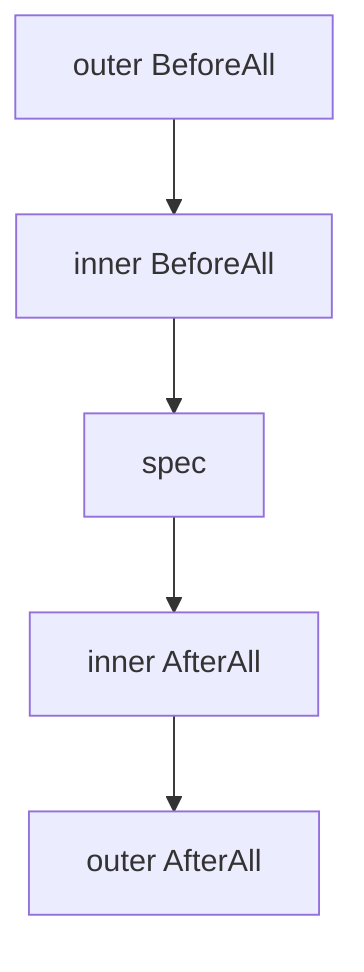
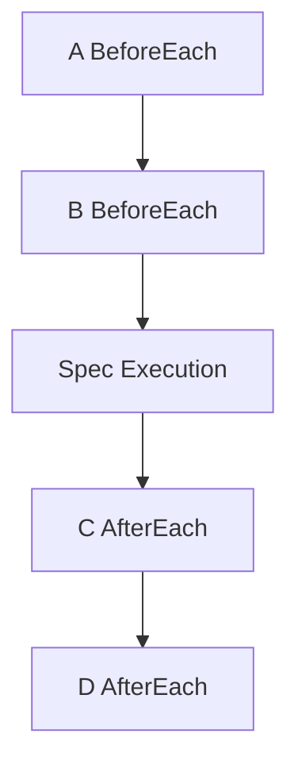

# DSL API

The go-specs DSL is the user-facing API for defining tests. This document describes each construct and execution order.

## Describe

`Describe` starts a suite or a nested block. It takes a test handle (`*testing.T` or `*testing.B`), a name, and a callback that receives a `*Spec`.

```go
specs.Describe(t, "math", func(s *specs.Spec) {
    // register hooks and specs on s
})
```

Nested `Describe` (when using the Builder API) creates nested scope; hooks from outer blocks run before and after inner specs.

## When

`When` starts a nested block, exactly like a nested `Describe`, for naming the condition a group of specs runs under. It takes a name and a callback that receives the nested `*Spec`.

```go
s.When("the account is empty", func(w *specs.Spec) {
    w.It("rejects a withdrawal", func(ctx *specs.Context) {
        ctx.Expect(withdraw(0, 10)).To(specs.BeFalse())
    })
})
```

`fn` must be `func(*specs.Spec)`. Earlier versions also accepted a legacy `func()` body that ignored the nested `*Spec` and ran against the enclosing scope by closure; that shape is removed, so an unsupported body is now a compile error instead of being registered under `When`'s name and silently never run. Migrate a `func()` body to `func(*specs.Spec)`, adding the parameter and ignoring it if the body does not need it.

## BeforeEach

`BeforeEach` registers a function that runs before every `It` in the current scope (and nested scopes). Use it for setup that must run before each spec.

```go
s.BeforeEach(func(ctx *specs.Context) {
    // reset state, create fixtures, etc.
})
```

Multiple `BeforeEach` calls in the same scope run in registration order (outer scope first, then inner).

## AfterEach

`AfterEach` registers a function that runs after every `It` in the current scope. Execution order is **LIFO**: innermost after runs first, then outer.

```go
s.AfterEach(func(ctx *specs.Context) {
    // teardown, release resources
})
```

## BeforeAll / AfterAll

`BeforeAll` and `AfterAll` register a function that runs once per group — the root `Describe` body,
a nested `Describe`, or a `When` — instead of once per spec. See
[`docs/SUITE_HOOKS_CONTRACT.md`](SUITE_HOOKS_CONTRACT.md) for the full normative contract (entry
order, failure semantics, reporting); the short version:

```go
s.BeforeAll(func(ctx *specs.Context) {
    // runs once, right before this group's first runnable spec
})
s.AfterAll(func(ctx *specs.Context) {
    // runs once, right after this group's last spec (or subgroup) finishes
})
```

A group with no `It` anywhere in it (including nested groups) never runs its `BeforeAll`/
`AfterAll` at all — there is nothing to set up for. A `BeforeAll` failure skips the rest of the
group (every descendant spec is reported skipped) but the group's `AfterAll` still runs.

**Example**, mirroring the nested execution order below:

```go
specs.Describe(t, "outer", func(s *specs.Spec) {
    s.BeforeAll(func(ctx *specs.Context) { /* runs once, before "inner"'s first spec */ })
    s.AfterAll(func(ctx *specs.Context) { /* runs once, after "inner"'s last spec */ })

    s.When("inner", func(w *specs.Spec) {
        w.BeforeAll(func(ctx *specs.Context) { /* runs once, before "spec" */ })
        w.AfterAll(func(ctx *specs.Context) { /* runs once, after "spec" */ })
        w.It("spec", func(ctx *specs.Context) { /* ... */ })
    })
})
```

Execution order — outer `BeforeAll`, then inner `BeforeAll`, then the spec, then inner `AfterAll`,
then outer `AfterAll`:



Unlike `BeforeEach`/`AfterEach`, a group's `BeforeAll`/`AfterAll` never run again for a second
spec in the same group — the whole point is that they run once, no matter how many specs (or
nested groups' specs) the group contains. See
[`examples/suite_hooks`](../examples/suite_hooks) for a runnable example sharing one fixture
across several specs, and `docs/SUITE_HOOKS_CONTRACT.md` for the full failure-handling contract
(a failing `BeforeAll` skips the rest of its group but never a sibling group, and a group's
`AfterAll` is guaranteed once the group was entered, even after a failure).

## It

`It` registers a single spec (test case). The function receives the execution context.

```go
s.It("adds numbers", func(ctx *specs.Context) {
    ctx.Expect(1 + 1).ToEqual(2)
})
```

Each `It` is compiled into a step sequence: before hooks (outer to inner), then the spec body, then after hooks (inner to outer).

## ItParallel

`ItParallel` registers a spec that runs in parallel with adjacent `ItParallel` specs. It is available on the **Builder** API, not on the top-level `Describe` path.

```go
b := specs.NewBuilder()
b.Describe("suite", func() {
    b.ItParallel("A", func(ctx *specs.Context) { ctx.Expect(add(1, 1)).ToEqual(2) })
    b.ItParallel("B", func(ctx *specs.Context) { ctx.Expect(add(2, 2)).ToEqual(4) })
})
prog := b.Build()
specs.NewRunner(prog).Run(t)
```

Consecutive `ItParallel` specs are grouped into one parallel step; they run concurrently, then execution continues with the next sequential step.

Each `ItParallel` spec runs on its own `*specs.Context`. `ctx.T` is `nil` inside these bodies — sharing the real `*testing.T` across goroutines is not safe, so use `ctx.Expect(...)` for assertions instead of `ctx.T` directly.

A failing assertion still stops the rest of that spec body, same as in a sequential `It` — code after a failed `ctx.Expect(...)` inside `ItParallel` does not run. Every spec in the parallel group always runs to completion before the runner moves on; `Runner.FailFast` only takes effect at the next group, it cannot cancel a sibling `ItParallel` spec mid-group.

### `ctx.T.Parallel()` is not supported

`ItParallel` and `RunParallel`/`RunParallelBatched` are the only supported ways to run specs concurrently. Calling Go's own `ctx.T.Parallel()` from inside a sequential `It` body is **unsupported and fails the run immediately** with a diagnostic naming the operation.

The reason is structural. Sequential execution runs the specs of a group against one shared, mutable `*specs.Context`, re-pointing it at the current subtest for the duration of each body. That is safe only because `testing.T.Run` does not return until the body has finished. `t.Parallel()` parks the subtest goroutine and returns control to the runner early, which leaves the Context bound to a spec that has not executed yet. Two things then go wrong, and the quiet one is worse:

- the next spec opens its subtest under the previous spec's `*testing.T`, producing nested identities like `suite/bravo/suite/charlie` that no reporter or `-run` pattern can address; and
- the runner finishes the spec and recycles the shared Context while the parked body has not run, so every assertion it later makes sees no backend, returns silently, and the suite reports **PASS having proven nothing**.

Rather than tolerate either, the runner detects the parked subtest, stops the run, and reports:

```
ctx.T.Parallel() is not supported in the sequential spec "suite/bravo": the subtest parked and
t.Run returned before the body finished ... Use ItParallel (or RunParallel/RunParallelBatched) to
run specs concurrently; those give each spec its own Context and never expose a live *testing.T.
```

The parked body's Context is deliberately abandoned rather than recycled, so if that body does resume, its assertions still report against its own subtest instead of disappearing or landing on an unrelated spec.

## Builder.It, Skip and Focus

`Builder.It` is the Builder-API counterpart of `Spec.It`: `func (b *Builder) It(name string, fn func(*Context))`. Use it directly for a plain spec body:

```go
b := specs.NewBuilder()
b.It("adds numbers", func(ctx *specs.Context) {
    ctx.Expect(1 + 1).ToEqual(2)
})
```

`specs.Skip(fn)` and `specs.Focus(fn)` wrap a `func(*Context)` into a `SpecFn` that marks it skipped or focused. A `SpecFn` does not go through `It` — pass it to `Builder.ItWith(name string, fn SpecFn)` instead:

```go
b.ItWith("not ready yet", specs.Skip(func(ctx *specs.Context) { /* ... */ }))
b.ItWith("only this one runs", specs.Focus(func(ctx *specs.Context) { /* ... */ }))
```

`ItWith` routes a `Skip`-wrapped `fn` to `SkipIt` (the spec's name is preserved and reported as skipped, but its body never compiles into a step) and a `Focus`-wrapped `fn` to `FIt` (if any spec in the suite is focused, only focused specs are compiled). `It` previously accepted a `SpecFn` too, dispatching on its dynamic type at runtime; that dispatch is removed. Migrate `b.It("x", specs.Skip(fn))` / `b.It("x", specs.Focus(fn))` to `b.ItWith("x", specs.Skip(fn))` / `b.ItWith("x", specs.Focus(fn))`.

## Builder.PendingIt and Pending: specs that exist but aren't implemented yet

`SkipIt`/`Skip` say "intentionally not executed" — an environment gap, a temporary exclusion. `PendingIt` and `Pending(fn)` say something different: "the specification exists, the implementation does not." Both never run the spec's body, but every report keeps the two apart, so a pending list reads as a to-do list rather than an exclusion list ([#208](https://github.com/getsyntegrity/go-specs/issues/208)).

```go
b := specs.NewBuilder()
b.PendingIt("rejects a withdrawal larger than the balance", nil) // no implementation yet
b.ItWith("charges a late fee", specs.Pending(func(ctx *specs.Context) {
    // sketch of the assertion, not wired up yet
}))
```

`PendingIt`'s `fn` may be `nil` — a pending spec often has no body at all yet — and even when given a body, that body never runs; the identity is preserved so the compiled `Program` can still report it. `ItWith("name", specs.Pending(fn))` behaves exactly like `PendingIt("name", fn)`, mirroring how `specs.Skip`/`specs.Focus` route through `ItWith`.

When any spec in the suite is focused (`FIt`/`Focus`), a pending spec is dropped by the same filter that drops skipped and plain specs — a suite mid-TDD with both a focused spec and a pending one does not still report the pending spec. `RunShard`/`RunShardWithReporter` carry a group's pending specs to whichever shard that group lands on, exactly like skipped specs.

`Pending` is only on the Builder/`ItWith` path today, alongside `Skip`/`Focus` — see `docs/EXECUTION_ENGINES.md` for why `Spec`/`Describe` has none of the three.

## Expect and EqualTo

Assertions use the context. Two main styles:

**`EqualTo`** — Direct equality; zero allocations on the fast path.

```go
specs.EqualTo(ctx, actual, expected)
```

**`Expect` / `ToEqual`** — Fluent style; still zero allocations when using `ExpectT(ctx, x).ToEqual(y)` for comparable types.

```go
ctx.Expect(1 + 1).ToEqual(2)
// or with matchers:
ctx.Expect(value).To(specs.BeTrue())
ctx.Expect(value).To(specs.Equal(expected))
```

`ExpectT(ctx, x).ToEqual(y)` is the preferred form for typed equality, and the only fluent form that
allocates nothing whatever `x` is. It holds the value at its own type, so no interface conversion
happens at all.

The other two forms do convert the value to an `any`, and for a value Go cannot convert for free
(any string, any struct, an integer outside the runtime's static small-integer table) that costs one
allocation per operand:

| Form                          | allocations on success                |
| ----------------------------- | ------------------------------------- |
| `EqualTo(ctx, x, y)`          | 0                                     |
| `ExpectT(ctx, x).ToEqual(y)`  | 0                                     |
| `ExpectT(ctx, x).To(m)`       | 1 — `Matcher` is `Match(any)`          |
| `ctx.Expect(x).ToEqual(y)`    | 2 — both operands are `any`            |

The matcher cost is a property of the `Matcher` interface, not of the handle: a matcher cannot see a
typed value without one conversion. A generic `Matcher[T]` would remove it; until then, reach for
`ToEqual` when the comparison is equality. The counts are pinned by
`TestAssertionAllocationsByValueShape` in `specs/assertion_allocations_test.go`.

### An expectation is single-use

The value returned by `ctx.Expect(x)` or `specs.ExpectT(ctx, x)` carries exactly one assertion. The
first `To` or `ToEqual` call spends it, and asserting through the same handle again panics:

```go
e := ctx.Expect(1)
e.ToEqual(1)
e.ToEqual(999) // panics: assertion handle reused
```

Write `ctx.Expect(...)` once per assertion instead. The panic is deliberate: the runner recovers it
and reports the spec as failed, which is the only safe outcome for a framework whose job is to tell
you the truth about your tests. Before this was enforced the second assertion silently passed — and
worse, could report against whichever spec had since acquired the recycled object.

The claim is atomic, so this holds under concurrency too. If several goroutines reach the same
handle, exactly one of them asserts and the rest panic — whatever the interleaving, and without a
data race on the handle. You still should not share a handle between goroutines; the guarantee
exists so that doing so by accident fails loudly instead of quietly asserting twice.

### Equality semantics differ between the three `ToEqual`-shaped APIs — by design

`EqualTo`, `ExpectT(ctx, x).ToEqual(y)`, and `ctx.Expect(x).ToEqual(y)` do not always agree on equal-looking values, because they trade off differently between speed and generality:

| API | Constraint | Comparison |
|---|---|---|
| `EqualTo(ctx, actual, expected)` | `T comparable` (compile-time) | Go's `==`, always. No reflection. |
| `ExpectT(ctx, x).ToEqual(y)` | `T comparable` (compile-time) | Go's `==`, always. No reflection. |
| `ctx.Expect(x).ToEqual(y)` | `any` | `==` for `int`/`string`/`bool`/`int64`/`float64`/`uint` (fast path), `errors.Is(actual, expected)` when both sides are errors, `reflect.DeepEqual` for everything else. |

The `comparable`-constrained pair (`EqualTo`/`ExpectT`) can't even be called with a slice or map — that's a compile error, not a runtime surprise. But for structs containing pointer fields, `==` compares the pointer values themselves, while `reflect.DeepEqual` can recursively compare the values they point to:

```go
type withPtr struct{ N *int }
a, b := 5, 5
x, y := withPtr{&a}, withPtr{&b}

x == y                    // false — different pointers
reflect.DeepEqual(x, y)   // true  — same pointed-to value
```

So `EqualTo(ctx, x, y)` fails while `ctx.Expect(x).ToEqual(y)` passes, for the exact same `x`/`y`. This is the tradeoff: pick `EqualTo`/`ExpectT` for the zero-allocation, no-reflection fast path when your type's `==` already means what you want (primitives, or plain value structs with no pointer fields); pick `ctx.Expect(...).ToEqual(...)` when you need value-based deep equality for structs, slices, or maps.

### Errors compare by identity, and the comparison is oriented

Structural equality is the wrong question to ask about an error. `reflect.DeepEqual` dereferences two `*errorString` pointers and compares the structs, so two errors built independently from the same message compare as equal — and a wrapped error fails against the very sentinel it wraps. Both halves are wrong, and the first one is silent.

So `ctx.Expect(...).ToEqual(...)`, `Equal`, `NotEqual` and `Contain` ask `errors.Is` when **both** sides are errors:

```go
sentinel := errors.New("boom")
impostor := errors.New("boom")           // a different error, same message
wrapped  := fmt.Errorf("layer: %w", sentinel)

ctx.Expect(impostor).ToEqual(sentinel)   // fails — unrelated errors
ctx.Expect(wrapped).ToEqual(sentinel)    // passes — wrapped carries sentinel's identity
ctx.Expect(sentinel).ToEqual(wrapped)    // fails — see orientation, below
ctx.Expect(errors.New("EOF")).ToEqual(io.EOF) // fails
```

The comparison is **oriented**: it asks `errors.Is(actual, expected)`, never the reverse and never both directions. A matcher is built around a value you declared as expected, so the question is "does the error I got carry the identity I asked for?". An actual that wraps your sentinel answers yes. A bare sentinel does *not* satisfy an expectation of some wrapped error that merely contains it — that is a stricter claim, and accepting it would invent a relation `errors.Is` never makes.

`assert.EqualValues` is the one deliberate exception: its parameters are `a, b` rather than expected/actual, neither side is privileged, and it answers the symmetric question "are these two errors related at all?".

Two matchers state the intent explicitly at the call site:

```go
ctx.Expect(err).To(specs.MatchError(io.EOF))   // errors.Is

var pathErr *fs.PathError
ctx.Expect(err).To(specs.MatchErrorAs(&pathErr))  // errors.As, populates pathErr
```

`MatchError` is the same semantics `Equal` applies, spelled out. `MatchErrorAs` is the only way to reach `errors.As`, and it reports a failure rather than panicking when handed an unusable target.

`EqualTo` and `ExpectT(...).ToEqual(...)` are unaffected — they use `==`, which for errors compares interface identity. A wrapped error is not `==` its sentinel.

### Matcher composition: `Not`, `All`, `Any`

`assert` ships a fixed set of matchers (`Equal`, `NotEqual`, `BeNil`, `BeTrue`, `BeFalse`, `Contain`, `MatchError`, `MatchErrorAs`). Without composition, combining them logically means hand-writing a new matcher type for every combination — which is exactly what `NotEqual` is: `Equal` negated by hand, in its own type, with its own message. `specs.Not`, `specs.All` and `specs.Any` (re-exported from `assert`) let a call site combine existing matchers instead ([#209](https://github.com/getsyntegrity/go-specs/issues/209)).

```go
ctx.Expect(5).To(specs.Not(specs.Equal(1)))                          // negation
ctx.Expect(true).To(specs.All(specs.Equal(true), specs.BeTrue()))    // AND
ctx.Expect(3).To(specs.Any(specs.Equal(1), specs.Equal(3)))          // OR
```

#### Failure messages name the sub-matcher, not "combined matcher failed"

#149/#200 taught this repo that a matcher's message is the product, so a composite has to say exactly which sub-matcher is responsible, not just that the composite failed.

`All` and `Any` build their message from each failing sub-matcher's own `FailureMessage`, indexed by position (1-based), so a failing composite of several matchers still reads as a list of concrete reasons:

```go
ctx.Expect(2).To(specs.All(specs.Equal(1), specs.BeTrue()))
// All: #1: "expected 2 to equal 1"; #2: "expected true, got 2 (int)"

ctx.Expect(3).To(specs.Any(specs.Equal(1), specs.Equal(2)))
// Any: #1: "expected 3 to equal 1"; #2: "expected 3 to equal 2"
```

A sub-matcher that matched contributes nothing to the message — only the ones actually responsible for the failure are named. `All(Equal(2), BeTrue()).FailureMessage(2)` (where `Equal(2)` matches) reports only `All: #2: "expected true, got 2 (int)"`.

`Not` cannot use the same trick. When `Not` fails, its sub-matcher *succeeded* — calling `sub.FailureMessage(actual)` at that point would print a message describing a comparison that did *not* fail (imagine `Not(Equal(5))` against `5`: `sub.FailureMessage` would say "expected 5 to equal 5", which reads like a bug report about `Equal`, not about `Not`). So `Not` never quotes its sub-matcher's `FailureMessage`; it names the sub-matcher by its **description** instead:

```go
ctx.Expect(1).To(specs.Not(specs.Equal(1)))
// expected 1 not to be equal to 1
```

Composites nest, and nesting reads as English at every depth because `Not`, `All` and `Any` all implement `Description()` themselves:

```go
ctx.Expect(true).To(specs.Not(specs.All(specs.Equal(true), specs.BeTrue())))
// expected true not to be all of [equal to true, true]

ctx.Expect(1).To(specs.All(specs.Not(specs.Equal(1)), specs.BeTrue()))
// All: #1: "expected 1 not to be equal to 1"; #2: "expected true, got 1 (int)"
```

#### `Describer`: how a composite names a sub-matcher without quoting a (possibly misleading) `FailureMessage`

```go
// Describer is an optional interface a Matcher may implement to name itself in composite failures.
type Describer interface{ Description() string }
```

Every built-in matcher implements it — `Equal(43)` describes itself as `"equal to 43"`, `BeNil()` as `"nil"`, `BeTrue()` as `"true"`, and so on — and so do `Not`, `All` and `Any` themselves, which is what makes nesting above read as English instead of `%T` soup. A third-party matcher that does not implement `Describer` falls back to its Go type name via `%T` (e.g. `*yourpkg.customMatcher`) rather than printing nothing. The rejected alternative was printing `%T` unconditionally for every matcher, built-in included, which leaks unexported type names such as `*assert.equalMatcher` into user-facing failure output — `Description()` exists so the built-ins never have to leak that.

#### Single-pass evaluation: `assert.Evaluate` and `assert.Evaluator`

`ctx.Expect(actual).To(m)` and `ExpectT(ctx, actual).To(m)` evaluate `m` **exactly once** per assertion: once to decide the result, and, only on failure, once more to build the failure message. `assert.Evaluate(m, actual)` is the exported spelling of that rule, for a composite driving its own children and for anyone calling a matcher outside the DSL.

The two `To` methods apply the rule inline rather than calling `assert.Evaluate` themselves: they prefer `m`'s `Evaluator` implementation when it has one, and otherwise call `Match` and — only when it reports false — `FailureMessage`. The behaviour is identical; the reason for the duplication is that `ExpectT(ctx, x).To(m)` is a zero-allocation path with a benchmark and an allocation contract, and routing every ordinary matcher through an extra function call cost about 2ns per assertion for no behavioural gain. One difference is worth knowing: `assert.Evaluate` reports a nil matcher — typed or untyped — as a failure, while `To` keeps its long-standing early return for an untyped nil `m` and, like every release before this one, does not guard a **typed** nil handed straight to it. Inside a composite, both forms are caught.

```go
// Evaluator is an optional interface a Matcher may implement to produce its verdict and its failure
// message in a single pass over its inputs.
type Evaluator interface {
	Evaluate(actual any) (matched bool, failure string)
}

func Evaluate(m Matcher, actual any) (matched bool, failure string)
```

`Not`, `All` and `Any` all implement `Evaluator`, so a composite evaluates each of its own sub-matchers exactly once per assertion too — however deeply it nests. This matters because a matcher may deliberately carry a side effect: `MatchErrorAs`, in this very package, calls `errors.As(actual, target)`, which populates `target` as part of matching. An earlier version of this framework asked `Match` to decide the result and, on failure, called `FailureMessage` separately, with `All`/`Any` re-running each sub-matcher's `Match` inside that second call to work out which entries were still responsible — which meant a failing composite evaluated every sub-matcher **twice**, and populated `target` twice for one failing assertion (issue [#225](https://github.com/getsyntegrity/go-specs/issues/225)). `assert.Evaluate` is the fix: it is the one seam the DSL drives a matcher through, and it guarantees exactly one evaluation.

`Match` and `FailureMessage` are unchanged and remain separately callable — they are still part of the `Matcher` interface, and third-party code may call either directly. A hand-rolled matcher does not need to implement `Evaluator` to be evaluated correctly through `assert.Evaluate`: the default path for a matcher that does not implement it already calls `Match` once and, only on failure, `FailureMessage` once — one evaluation already. Implementing `Evaluator` is only useful for a composite (or a matcher wrapping other matchers) that would otherwise need to decide and explain in two separate passes.

#### Nil and empty semantics

None of the forms below panic — a testing framework reports a failure, it does not take the suite down. This mirrors the existing `MatchErrorAs` precedent, which turns an unusable target into a failed match with an explanatory message instead of letting `errors.As` panic. This includes a **typed** nil — a declared-but-unassigned pointer matcher passed as a `Matcher`, e.g. `var m *customMatcher; assert.Not(m)` — which is indistinguishable from a real matcher by a plain `== nil` check but is still a caller mistake, not a logical value; every nil check in `assert/composite_matchers.go` catches both forms alike.

| Form | `Match` result | Why |
| --- | --- | --- |
| `All()` — no matchers | `true` | The identity of AND: "all of nothing holds" is the only composable answer, the same reason an empty product is 1. |
| `Any()` — no matchers | `false` | The identity of OR: nothing was offered, so nothing was satisfied. |
| `Not(nil)`, including a typed nil | `false` | A nil sub-matcher is a caller mistake, not a logical value — it can never be asked to match, so `Not` of it never matches either. |
| `All(..., nil, ...)`, including a typed nil | `false` | Same reasoning as `Not(nil)`: a nil entry can never match, so it fails the whole composite exactly like any other failing entry — by position, named in the message (`#2: nil matcher (never matches)`). |
| `Any(..., nil, ...)`, including a typed nil | `false` for the **whole** composite, even if a sibling matches | A nil entry must never be masked by a sibling that happens to match — if it were, the caller's mistake would ship green. Because `Match` never evaluates a sibling once any entry is nil (its own nil scan short-circuits first), `FailureMessage` does not evaluate that sibling either — it only describes it. `Any(Equal(1), nil).FailureMessage(1)` reports: `Any: #1: equal to 1 — not evaluated, the nil entry at #2 forces this Any to fail; #2: nil matcher (never matches)`. |

Each nil case names its position (`#1`, `#2`, ...) in the failure message, the same indexing `All`/`Any` already use for ordinary failing entries.

## Example

```go
package math_test

import (
    "testing"
    "github.com/getsyntegrity/go-specs/specs"
)

func setup(ctx *specs.Context) {
    // per-spec setup
}

func TestMath(t *testing.T) {
    specs.Describe(t, "math", func(s *specs.Spec) {
        s.BeforeEach(setup)

        s.It("adds numbers", func(ctx *specs.Context) {
            ctx.Expect(1 + 1).ToEqual(2)
        })
    })
}
```

## Where a `*Spec` comes from

Every construct above is a method on a `*Spec`, and a `*Spec` is only usable when it carries a
**build target**: the destination a registration is written to. The entry points — `Describe`,
`DescribeFlat`, `DescribeWithReporter`, `DescribeFlatWithReporter` and `BuildSuite` — set that target
and thread it into every nested block they hand you.

`Spec` is exported with unexported fields, so `&specs.Spec{}` compiles. It has no build target, and
there is nowhere for an `It`, a hook or a nested block to go. Rather than accept the registration and
drop it — which would let a suite declare specs, register none of them, and still report green — each
method panics:

```go
s := &specs.Spec{}            // compiles, but has no build target
s.It("adds", func(ctx *specs.Context) {})
// panic: specs: Spec.It called on a Spec with no build target;
//        obtain a *Spec from Describe/BuildSuite instead of constructing one
```

Take the `*Spec` the entry point gives you; never construct one. A `nil` *Spec is still a tolerated
no-op — there is no Spec there to have registered anything into.

## Analyze and the registry extension surface

`Analyze` is a **supported extension API**, not legacy residue. It builds a `SuiteTree` without
running anything, for code that generates or inspects a suite — an external DSL, a generator, an
editor integration:

```go
tree := specs.Analyze(func() {
    specs.Describe(nil, "math", func(s *specs.Spec) {
        s.It("adds", func(ctx *specs.Context) {})
    })
})
fmt.Print(tree.Tree())
```

`Analyze` establishes the build context; the package-level helpers read or write the registry it
pushed, without needing the unexported registry type:

| Helper | Kind | Outside `Analyze` |
|---|---|---|
| `CurrentSuite`, `CurrentArena` | read-only | returns `nil` |
| `AppendBeforeHook`, `AppendAfterHook` | mutating | **panics** |

The split is deliberate. "No suite is being built" is a legitimate answer to a question, so the
accessors return `nil`. A mutating helper has nowhere to write, so returning quietly would discard
the caller's hook or generator and report success — the same silent-discard failure the zero-value
`Spec` used to have.

Valid context means *inside the `fn` passed to `Analyze`, or inside a `Describe`/`BuildSuite` nested
in one, on the same goroutine*. The registry stack is keyed per goroutine so that concurrent
`Analyze` calls never observe each other's tree; a helper called from a goroutine started inside
`Analyze` therefore sees no registry and panics.

## Execution order of hooks

For nested describes, before hooks run **outer to inner**; after hooks run **inner to outer** (LIFO).

**Example:**

- `Describe("outer")` with `BeforeEach` A and `AfterEach` D  
- `Describe("inner")` with `BeforeEach` B and `AfterEach` C  
- One `It` (test)

Execution order:

**A → B → test → C → D**



So: outer before (A), then inner before (B), then the spec body, then inner after (C), then outer after (D). This order is fixed at compile time when the builder flattens hooks into the step list.
