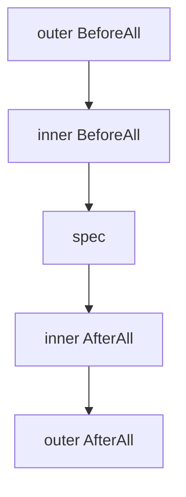
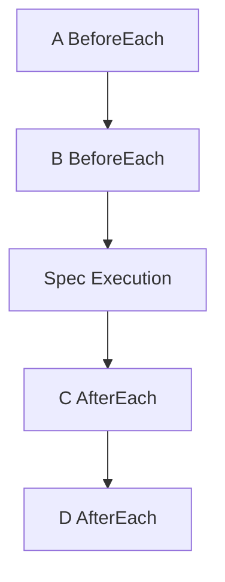

# DSL API

The go-specs DSL is the user-facing API for defining tests. This document describes each construct and execution order.

## Describe

`Describe` starts a suite or a nested block. It takes a test handle (`*testing.T` or `*testing.B`), a name, and a callback that receives a `*Spec`.

```go
specs.Describe(t, "math", func(s *specs.Spec) {
    // register hooks and specs on s
})
```

Nested `Describe` (when using the Builder API) creates nested scope; hooks from outer blocks run before and after inner specs.

## When

`When` starts a nested block, exactly like a nested `Describe`, for naming the condition a group of specs runs under. It takes a name and a callback that receives the nested `*Spec`.

```go
s.When("the account is empty", func(w *specs.Spec) {
    w.It("rejects a withdrawal", func(ctx *specs.Context) {
        ctx.Expect(withdraw(0, 10)).To(specs.BeFalse())
    })
})
```

`fn` must be `func(*specs.Spec)`. Earlier versions also accepted a legacy `func()` body that ignored the nested `*Spec` and ran against the enclosing scope by closure; that shape is removed, so an unsupported body is now a compile error instead of being registered under `When`'s name and silently never run. Migrate a `func()` body to `func(*specs.Spec)`, adding the parameter and ignoring it if the body does not need it.

## Duplicate sibling group names

Two sibling `Describe`/`When` groups that share a literal name — `s.Describe("D", ...)` declared twice under the same parent — used to report the identical `Path` for every spec inside them: `["suite", "D", "z"]` for both groups' `It("z")`, indistinguishable in JSON, JUnit XML, TXT and HTML output (issue #275). This only ever affected the *reported* `Path`. #102 already documents, and this does not change, that Go's own subtest identity keeps its accepted ambiguity too: `go test -v` and `-run` still tell the two groups apart only by testing's own `#01` suffix, exactly as before.

As of this fix, every reported spec, compile-time `SkipIt`/`PendingIt` mark, and hooked group's synthetic `[BeforeAll]`/`[AfterAll]` case gets a **disambiguated** `Path` instead, computed once when the suite compiles:

- Among the sibling `Describe`/`When` groups of one parent scope, compared by their exact declared name (no space/slash normalization, unlike Go's own subtest naming):
  - the first group with a given name keeps that name unchanged;
  - each later group with the same name gets `name#k`, where `k` is the smallest integer `>= 2` such that `name#k` is neither the literal declared name of another sibling group in that parent nor a label this computation already assigned to an earlier sibling.
- The ordinal is computed once, at compile time, from every sibling of a parent scope — not assigned as each group is declared. A literal `Describe("D#2")` declared *after* two plain `Describe("D")` siblings still reserves `"D#2"` for itself: the second `Describe("D")` skips over it and becomes `"D#3"`.
- Nesting is independent per parent: a duplicate name in one `Describe`/`When` subtree never affects the ordinals of a same-named duplicate declared under a different parent.
- Only `Describe`/`When` groups get a disambiguated segment. Two `It` specs with the same leaf name directly inside one group are unaffected — that ambiguity is #102's, and stays accepted exactly as documented there.
- Repeated compilations of the same suite (e.g. in different test binaries, or via `BuildSuite` called more than once) produce byte-identical `Path`s: the ordinal is a pure function of declaration order, never a global or process-wide counter.
- A suite with no duplicate sibling group name is completely unaffected: every reported `Path` is byte-identical to what it always was.

Example: three sibling groups declared `Describe("D")`, `Describe("D")`, `Describe("D#2")` (in that order) report the segments `"D"`, `"D#3"`, `"D#2"` — the literal `"D#2"` is respected, so the second plain `"D"` is pushed to `"D#3"` instead of colliding with it.

```go
specs.Describe(t, "suite", func(s *specs.Spec) {
    s.Describe("D", func(s *specs.Spec) { // reported segment: "D"
        s.It("z", func(ctx *specs.Context) {}) // Path: ["suite", "D", "z"]
    })
    s.Describe("D", func(s *specs.Spec) { // reported segment: "D#2"
        s.It("z", func(ctx *specs.Context) {}) // Path: ["suite", "D#2", "z"]
    })
})
```

Both sequential execution models (`Describe`/`Spec`/`ExecutionPlan`, including its arena/registry `Analyze` build path, and `Builder`/`Program`/`Runner`) apply the identical rule, so a suite reports the same disambiguated `Path`s regardless of which one built it.

## BeforeEach

`BeforeEach` registers a function that runs before every `It` in the current scope (and nested scopes). Use it for setup that must run before each spec.

```go
s.BeforeEach(func(ctx *specs.Context) {
    // reset state, create fixtures, etc.
})
```

Multiple `BeforeEach` calls in the same scope run in registration order (outer scope first, then inner).

### Declare per-spec hooks before specs and nested scopes

`BeforeEach` and `AfterEach` are captured by each spec as it is registered, so a hook must be declared
**before the first `It` (or `SkipIt`, `PendingIt`, `FIt`, `ItParallel`) and before the first nested
`Describe`/`When` of its scope**. Registering one afterwards would apply it only to later specs, so a
teardown assertion written at the end of a `Describe` would silently never run for the specs above it.
Instead of allowing that, `Spec` and `Builder` fail the build with a panic that starts with `specs:` and
names the hook (for example `specs: AfterEach registered after a spec or nested scope in the same scope`).
`BeforeAll`/`AfterAll` are not affected: they cover the whole scope wherever they are declared.

## AfterEach

`AfterEach` registers a function that runs after every `It` in the current scope. Execution order is **LIFO**: innermost after runs first, then outer.

```go
s.AfterEach(func(ctx *specs.Context) {
    // teardown, release resources
})
```

## BeforeAll / AfterAll

`BeforeAll` and `AfterAll` register a function that runs once per group — the root `Describe` body,
a nested `Describe`, or a `When` — instead of once per spec. See
[`docs/SUITE_HOOKS_CONTRACT.md`](SUITE_HOOKS_CONTRACT.md) for the full normative contract (entry
order, failure semantics, reporting); the short version:

```go
s.BeforeAll(func(ctx *specs.Context) {
    // runs once, right before this group's first runnable spec
})
s.AfterAll(func(ctx *specs.Context) {
    // runs once, right after this group's last spec (or subgroup) finishes
})
```

A group with no `It` anywhere in it (including nested groups) never runs its `BeforeAll`/
`AfterAll` at all — there is nothing to set up for. A `BeforeAll` failure skips the rest of the
group (every descendant spec is reported skipped) but the group's `AfterAll` still runs.

**Example**, mirroring the nested execution order below:

```go
specs.Describe(t, "outer", func(s *specs.Spec) {
    s.BeforeAll(func(ctx *specs.Context) { /* runs once, before "inner"'s first spec */ })
    s.AfterAll(func(ctx *specs.Context) { /* runs once, after "inner"'s last spec */ })

    s.When("inner", func(w *specs.Spec) {
        w.BeforeAll(func(ctx *specs.Context) { /* runs once, before "spec" */ })
        w.AfterAll(func(ctx *specs.Context) { /* runs once, after "spec" */ })
        w.It("spec", func(ctx *specs.Context) { /* ... */ })
    })
})
```

Execution order — outer `BeforeAll`, then inner `BeforeAll`, then the spec, then inner `AfterAll`,
then outer `AfterAll`:


```mermaid
flowchart TD
    OuterBefore[outer BeforeAll] --> InnerBefore[inner BeforeAll]
    InnerBefore --> Spec[spec]
    Spec --> InnerAfter[inner AfterAll]
    InnerAfter --> OuterAfter[outer AfterAll]
```

Unlike `BeforeEach`/`AfterEach`, a group's `BeforeAll`/`AfterAll` never run again for a second
spec in the same group — the whole point is that they run once, no matter how many specs (or
nested groups' specs) the group contains. See
[`examples/suite_hooks`](../examples/suite_hooks) for a runnable example sharing one fixture
across several specs, and `docs/SUITE_HOOKS_CONTRACT.md` for the full failure-handling contract
(a failing `BeforeAll` skips the rest of its group but never a sibling group, and a group's
`AfterAll` is guaranteed once the group was entered, even after a failure).

A hooked group runs in a Go subtest of its own, with the same full subtest names its specs have
without hooks, so `go test -run` selecting one spec still runs that spec's group hooks. The hooks
belong to the group's subtest: a pattern that does not select the group runs none of them, and one
that selects the group but none of its specs still runs its `BeforeAll`/`AfterAll`.
`ctx.T.SkipNow()` in a `BeforeAll` skips the group. Inside a hook, `ctx.T` is the group's
subtest: `ctx.T.Cleanup`, `ctx.T.TempDir` and `ctx.T.Setenv` registered in a `BeforeAll` last until
the group's `AfterAll` has run, and never leak into a sibling group. `ctx.T.Parallel()` is not
supported inside a hook.

Because a hooked group is a subtest, it needs a name that works as one: explicit, non-empty, and not
shared (after `go test`'s normalization, e.g. spaces to `_`) with a spec or another hooked group of
the suite. A group that breaks this — `When("")` with hooks, a hooked group with an `It("")`
directly inside, a hooked `When("x")` next to an `It("x")` or another hooked `When("x")` — is
rejected with a panic while the suite is built, before anything runs. Groups without hooks keep
every name they could always have. Each hooked group also shows up as a test of its own in `go test -v`/`-json` output.

## It

`It` registers a single spec (test case). The function receives the execution context.

```go
s.It("adds numbers", func(ctx *specs.Context) {
    ctx.Expect(1 + 1).ToEqual(2)
})
```

Each `It` is compiled into a step sequence: before hooks (outer to inner), then the spec body, then after hooks (inner to outer).

## Shared behaviors: reusing specs across implementations

A "shared behavior" — the same set of specs applied to several implementations of one interface —
does not need a new DSL primitive. The existing composition model already supports it: a shared
behavior is just an ordinary Go function that takes the `*specs.Spec` its caller was handed and
registers specs on it, exactly like inline code in that `Describe`/`When` block would.

```go
type Store interface {
    Set(key, value string)
    Get(key string) (string, bool)
}

// behavesLikeAStore is a plain Go function, not a specs.* API. It registers directly on the *Spec
// it is given, so its Its become part of whichever Describe/When calls it.
func behavesLikeAStore(s *specs.Spec, mk func() Store) {
    var store Store
    s.BeforeEach(func(ctx *specs.Context) {
        store = mk()
    })

    s.It("stores and retrieves a value", func(ctx *specs.Context) {
        store.Set("key", "value")
        got, ok := store.Get("key")
        ctx.Expect(ok).To(specs.BeTrue())
        ctx.Expect(got).ToEqual("value")
    })

    s.It("reports a missing key", func(ctx *specs.Context) {
        _, ok := store.Get("missing")
        ctx.Expect(ok).To(specs.BeFalse())
    })
}
```

Apply the same helper from as many `Describe` blocks as there are implementations to cover:

```go
func TestMapStore(t *testing.T) {
    specs.Describe(t, "mapStore", func(s *specs.Spec) {
        behavesLikeAStore(s, func() Store { return newMapStore() })
    })
}

func TestPrefixedStore(t *testing.T) {
    specs.Describe(t, "prefixedStore", func(s *specs.Spec) {
        behavesLikeAStore(s, func() Store { return newPrefixedStore("ns:") })
    })
}
```

Nothing about `behavesLikeAStore` changes between the two call sites: it is called the same way,
with a different constructor, from a different `Describe`. This is ordinary Go function composition
— the same `func(*Spec)` shape `Describe` and `When` already hand out (see "Describe" and "When"
above) — not a separate runtime feature, a registry, or a macro. A shared behavior can take any
extra parameters it needs (a factory function, fixtures, configuration), can call `s.When` to nest
further, and can itself call out to other shared behaviors, all without touching the compiler or the
registry directly.

### Hooks: the helper shares its caller's scope

A shared behavior does not open a new `Describe`/`When` scope unless it explicitly calls `s.Describe`
or `s.When` itself — plain `s.BeforeEach`, `s.AfterEach` and `s.It` calls inside it register on the
very same scope as the code that called it. That means the usual hook rules ("Execution order of
hooks" below) apply exactly as if the helper's calls were written inline:

- A `BeforeEach`/`AfterEach` registered in the surrounding `Describe` **before** the helper is called
  still runs for every spec the helper registers — there is nothing helper-specific about it.
- If the helper registers its own `BeforeEach`/`AfterEach`, they share that same scope with the
  surrounding ones: multiple `BeforeEach` calls in one scope run in registration order, and multiple
  `AfterEach` calls run LIFO (last registered runs first) — regardless of whether a given call came
  from inline code or from inside the helper.

Concretely, for a `BeforeEach` registered by the surrounding `Describe` before the helper call, and a
`BeforeEach`/`AfterEach` pair registered by the helper itself:

```go
specs.Describe(t, "instrumented store", func(s *specs.Spec) {
    s.BeforeEach(func(ctx *specs.Context) { /* outer-before */ })
    s.AfterEach(func(ctx *specs.Context) { /* outer-after */ })

    behavesLikeAnObservedStore(s, func() Store { return newMapStore() }, &order)
})
```

runs, per spec, in this order: `outer-before`, then the helper's own before hook, then the spec
body, then the helper's own after hook (registered after `outer-after`, so LIFO runs it first), then
`outer-after`. `examples/shared_behaviors/shared_behaviors_test.go` runs exactly this and asserts the
full order for two specs, so this is verified behavior, not a claim.

No new production API was needed to support this pattern — it already worked before this section was
written; only the documentation was missing.

## Spec.FIt, SkipIt and PendingIt

`*Spec` — the `Describe`/`It` path — has the same `FIt`, `SkipIt` and `PendingIt` `Builder` already
had ([#245](https://github.com/getsyntegrity/go-specs/issues/245)), with the same signatures and
the same observable behavior; there is no `SpecFn`/`ItWith` indirection here, since `*Spec` never
had that dispatch to begin with.

```go
specs.Describe(t, "checkout", func(s *specs.Spec) {
    s.It("charges the card", func(ctx *specs.Context) { /* ... */ })
    s.SkipIt("refunds in a currency we don't support yet", func(ctx *specs.Context) { /* ... */ })
    s.PendingIt("splits a payment across two cards", nil) // not implemented yet
})
```

`SkipIt`/`PendingIt`'s `fn` is never compiled or run — it may be `nil` — but the spec's name is kept
and reported as `StatusSkipped`/`StatusPending` (`report/model.go`), the same distinction described
above for `Builder.PendingIt`/`Pending`: `SkipIt` means "intentionally not executed", `PendingIt`
means "the specification exists, the implementation does not."

`FIt` with a `nil` `fn` is a no-op. If a `Describe`/`BuildSuite` call registers at least one `FIt`
anywhere in its tree, only focused specs compile — every other `It`, `SkipIt` and `PendingIt` in
that same call is dropped from execution, exactly like `Builder.FIt`/`finalize`'s focus filter, but
(since [#273](https://github.com/getsyntegrity/go-specs/issues/273)) it is no longer dropped
*without a trace*: see "Committed focus fails the enclosing test" below. Focus is scoped to that one
top-level call, never process-wide. `BeforeEach`/`AfterEach` and `BeforeAll`/`AfterAll` around a
focused spec still run; a `BeforeAll`/`AfterAll` group left with zero runnable specs after focus
filtering is never entered — the same H3 rule (`docs/SUITE_HOOKS_CONTRACT.md`) that already applies
to a group declaring no `It` at all.

Both `Spec` build paths agree: the bytecode compiler (the default, top-level `Describe`/
`BuildSuite`) and the `Analyze`/registry path produce the same outcomes for the same declared tree
— see `specs/spec_builder_equivalence_test.go` for the table proving `Spec` and `Builder` agree too.

### Committed focus fails the enclosing test

**Breaking change, [#273](https://github.com/getsyntegrity/go-specs/issues/273).** A suite-wide
`FIt` used to compile only the focused specs and drop every other `It`/`SkipIt`/`PendingIt`
entirely — no plan entry, no report, no trace at all. That let a forgotten debugging focus turn a
failing suite green, silently, both locally and in CI: one failing `It` plus one passing `FIt`
reported `Total:1 Passed:1` and a passing test.

The policy now is:

| | `GO_SPECS_ALLOW_FOCUS` unset (default) | `GO_SPECS_ALLOW_FOCUS=1` |
|---|---|---|
| Focus still filters (only focused specs run) | yes | yes |
| Every excluded spec (`It`, `SkipIt`, `PendingIt`, `ItParallel`) is reported `Filtered` | yes | yes |
| The enclosing test fails via `tb.Errorf` (focused specs still run and report their own result) | **yes, always — local and CI** | no |

There is no CI-only detection: a forgotten `FIt` fails the same way on a laptop as it does in a CI
job, which is the point — "fail only under CI" was considered and rejected, because it would still
let the same suite pass green on a laptop. The failure message names how many specs are focused and
how many were excluded, e.g.:

```
go-specs: 1 focused spec(s) (FIt) are active, 2 spec(s) excluded; remove FIt or set GO_SPECS_ALLOW_FOCUS=1
```

and, for the `Analyze`/registry build path, the focused spec's own file:line too, whenever caller-
location capture is enabled (`specs.SetCaptureCallerLocation(true)`, off by default for unrelated
allocation reasons — see its own doc comment): that path already records it on every node in that
case, at zero extra cost. The bytecode-compiler and `Builder` paths name the spec's full
`Describe`/`It` breadcrumb only, never a file:line — that path never records a caller location for
any node, and adding it just for this diagnostic was not judged worth the new capture machinery on
an allocation-pinned compiler.

`GO_SPECS_ALLOW_FOCUS=1` is the only opt-out, and it disables *only* this failure — not the focus
filtering itself, which still applies exactly as documented above. Set it as a real environment
variable, or per-test via `t.Setenv("GO_SPECS_ALLOW_FOCUS", "1")`; it is read once per suite
build/run, never per spec, so it costs nothing on the normal (unfocused) passing path.

Every engine is covered the same way: the bytecode compiler and the `Analyze`/registry path behind
`specs.Describe`/`specs.BuildSuite`, and `Builder`/`Runner` behind `specs.NewBuilder`. `RunShard`
(both `CompiledSuite.RunShard` and the package-level `specs.RunShard`) reports each excluded spec
exactly once across every shard — deterministically, the same shard that already owns compile-time
`SkipIt`/`PendingIt` mark reporting (shard 0) — while every shard's own `RunShard` call still fails
its own enclosing test when focus is active, since each shard is ordinarily its own CI job.

Migration: a suite that intentionally keeps a committed `FIt` around (a WIP branch, or a
deliberately focused CI debugging run) must now either remove the `FIt`, or set
`GO_SPECS_ALLOW_FOCUS=1` for that run.

## ItParallel

`ItParallel` registers a spec that runs in parallel with adjacent `ItParallel` specs. It exists on
both the **Builder** API and, since [#245](https://github.com/getsyntegrity/go-specs/issues/245),
on `*Spec` (the `Describe`/`It` path) — with the same signature, `func(name string, fn
func(*Context))`, but a different execution model underneath, described below.

```go
b := specs.NewBuilder()
b.Describe("suite", func() {
    b.ItParallel("A", func(ctx *specs.Context) { ctx.Expect(add(1, 1)).ToEqual(2) })
    b.ItParallel("B", func(ctx *specs.Context) { ctx.Expect(add(2, 2)).ToEqual(4) })
})
prog := b.Build()
specs.NewRunner(prog).Run(t)
```

```go
specs.Describe(t, "suite", func(s *specs.Spec) {
    s.ItParallel("A", func(ctx *specs.Context) { ctx.Expect(add(1, 1)).ToEqual(2) })
    s.ItParallel("B", func(ctx *specs.Context) { ctx.Expect(add(2, 2)).ToEqual(4) })
})
```

Consecutive `ItParallel` specs are grouped into one parallel unit; they run concurrently, then
execution continues with the next sequential spec or group. On `*Spec` the group also ends at a
`Describe`/`When` scope boundary — even one that registers no `BeforeAll`/`AfterAll` — so a parallel
group never straddles a `BeforeAll`/`AfterAll` group's boundary (`docs/SUITE_HOOKS_CONTRACT.md` H9).
`Builder` has no group hooks, so it has no such boundary to respect. Under focus (any `FIt`
registered in the same `Describe`/`BuildSuite` call), every `ItParallel` is dropped, exactly like an
unfocused `It` — there is no `FItParallel`.

### `Builder.ItParallel` vs. `Spec.ItParallel`: `ctx.T`

The two engines give a parallel spec a different `*specs.Context`, and that difference is the one
thing to know before writing one:

- **`Builder.ItParallel`** runs every spec of a group under the parent test, sharing no per-spec Go
  subtest. `ctx.T` is `nil` inside these bodies — exposing the shared `*testing.T` across goroutines
  would not be safe — so use `ctx.Expect(...)` for assertions instead of `ctx.T` directly. A failing
  assertion still stops the rest of that spec body, same as a sequential `It`; code after a failed
  `ctx.Expect(...)` does not run. `-run` cannot select or exclude one spec inside the group (there is
  no subtest to match), and every spec in the group is reported by the runner itself rather than as
  its own `go test` subtest.
- **`Spec.ItParallel`** runs every spec of a group as its own real Go subtest, launched from its own
  goroutine via `testing.T.Run` (never `t.Parallel()` — see the next section), with its own pooled
  `*specs.Context`. `ctx.T` is a real, non-nil `*testing.T` — the same guarantee a sequential `It`
  gives — so `ctx.T.TempDir()`, `ctx.T.Cleanup()` and `ctx.T.Helper()`-based attribution all work
  normally, and `-run`/`-skip` select or exclude one parallel spec exactly like any other `*Spec`
  spec. `BeforeEach`/`AfterEach` run per spec, on that spec's own `Context`, around its body, same as
  `Builder`. A `BeforeAll`/`AfterAll` group wrapping a parallel group runs its `BeforeAll` once,
  before any of the group's specs start, and its `AfterAll` once, after every one of them —
  including every parallel one — has finished (H9). Reporter events for the group are serialized
  (never called concurrently from a worker goroutine) and emitted in declaration order once the
  whole group has finished, so `go test -v`'s printed order may differ from a report consumer's
  order, but the report itself is deterministic run to run.

Both give the same (full name, status) outcomes for the same declared tree
(`specs/spec_builder_equivalence_test.go`); the difference is `ctx.T`'s presence, `-run` addressing
a single spec, and (on `*Spec`) interaction with `BeforeAll`/`AfterAll`.

### `ctx.T.Setenv` and other global-state mutation: not safe inside `ItParallel`

`Spec.ItParallel`'s real `ctx.T` makes calls like `ctx.T.Setenv`, or any other assertion or fixture
that mutates process-global state, look safe — they compile, and `ctx.T` is never `nil`. They are
not: several `ItParallel` specs run concurrently, on different goroutines, and mutating the same
process-global state (an environment variable, a package-level variable, a shared file) from more
than one of them at once is an ordinary data race, exactly as it would be from any other pair of
goroutines. Go's `testing` package only detects this misuse when `t.Parallel()` is the mechanism
used to run concurrently (it marks `Setenv` unsafe alongside `Parallel`); `ItParallel` deliberately
does not use `t.Parallel()` (see the next section and the top-level rejection of `ctx.T.Parallel()`
below), so `testing` has no opportunity to catch a `Setenv` call here the way it would in a
`t.Parallel()`-marked subtest. Prefer `ctx.Expect(...)`/fixtures scoped to each spec's own state; if
process-global state must be touched, do it outside `ItParallel`, in a `BeforeAll`/`BeforeEach` that
runs before the group, or in a sequential `It`.

A failing sequential spec stops the run before the *next spec* — never merely at the next group
boundary — on both engines: `Builder`/`Runner` (`Runner.FailFast`) and, since
[#251](https://github.com/getsyntegrity/go-specs/issues/251), `*Spec`/`CompiledSuite`
(`CompiledSuite.SetFailFast`). An already-launched `ItParallel` batch is never cut short by that
stop: `FailFast` cannot cancel a sibling `ItParallel` spec mid-group, so every spec in the batch
always runs to completion first, and only once the whole batch has finished does the stop apply,
before whatever comes after it — on either engine.

### `ctx.T.Parallel()` is not supported

`ItParallel` and `RunParallel`/`RunParallelBatched` are the only supported ways to run specs concurrently. Calling Go's own `ctx.T.Parallel()` from inside a sequential `It` body is **unsupported and fails the run immediately** with a diagnostic naming the operation.

The reason is structural. Sequential execution runs the specs of a group against one shared, mutable `*specs.Context`, re-pointing it at the current subtest for the duration of each body. That is safe only because `testing.T.Run` does not return until the body has finished. `t.Parallel()` parks the subtest goroutine and returns control to the runner early, which leaves the Context bound to a spec that has not executed yet. Two things then go wrong, and the quiet one is worse:

- the next spec opens its subtest under the previous spec's `*testing.T`, producing nested identities like `suite/bravo/suite/charlie` that no reporter or `-run` pattern can address; and
- the runner finishes the spec and recycles the shared Context while the parked body has not run, so every assertion it later makes sees no backend, returns silently, and the suite reports **PASS having proven nothing**.

Rather than tolerate either, the runner detects the parked subtest, stops the run, and reports:

```
ctx.T.Parallel() is not supported in the sequential spec "suite/bravo": the subtest parked and
t.Run returned before the body finished ... Use ItParallel (or RunParallel/RunParallelBatched) to
run specs concurrently; those give each spec its own Context and never expose a live *testing.T.
```

The parked body's Context is deliberately abandoned rather than recycled, so if that body does resume, its assertions still report against its own subtest instead of disappearing or landing on an unrelated spec.

**Inside `Spec.ItParallel`, too.** `ctx.T` there is a real `*testing.T` (unlike `Builder.ItParallel`,
where it is `nil` and `ctx.T.Parallel()` would panic on a nil pointer before ever reaching this
guard), so the same detection applies to it as to a sequential spec body: the offending spec's own
subtest goroutine is left parked, and once every launched spec in the group has finished, the group
reports the same diagnostic and stops the run — every enclosing `BeforeAll`/`AfterAll` group still
runs its `AfterAll`s while the stop unwinds (`docs/SUITE_HOOKS_CONTRACT.md` H5), same as any other
stopped run.

## `ctx.Go`: concurrent assertions inside one spec

A `*specs.Context` belongs to the spec that is running. It is pooled and handed to the next spec as
soon as the current one finishes, so **a `ctx` used by a goroutine launched directly with a `go`
statement must not outlive the spec.** If it does, the goroutine asserts through whichever spec owns
that pointer next: the first spec passes, and the next one fails with the first one's message and
source line. go-specs does not protect that pattern and cannot do so transparently (the pointer is
the same, and a goroutine carries no identity an assertion could check for free). Semantics of raw
`go` goroutines are unchanged.

`ctx.Go` is the supported way to run concurrent assertions:

```go
s.It("both replicas agree", func(ctx *specs.Context) {
    ctx.Go(func(ctx *specs.Context) { ctx.Expect(primary.Get("k")).ToEqual("v") })
    ctx.Go(func(ctx *specs.Context) { ctx.Expect(replica.Get("k")).ToEqual("v") })
})
```

The contract:

- **The spec waits.** It is not finished until every task started with `ctx.Go` has finished: the
  wait happens before `AfterEach` hooks, before the spec is reported, and before its `Context` is
  reused. This holds even if the body fails, calls `FailNow`, or panics.
- **Failures are charged to the spec that started the task**, with the task's own message and source
  line. A failed assertion or a `ctx.T` failure inside a task fails that spec. A panic inside a task
  is recovered and reported like a panic in the body: an *error* with its stack, not a failure.
  A fatal assertion (or `ctx.T.FailNow`) ends only that task; the body and the other tasks keep going.
- **`AfterEach` runs after all tasks have finished**, so it can safely read what they wrote.
- **The task gets its own `*Context`.** Use the parameter, not the outer `ctx`, inside the task.

Edge cases:

- A task may call `ctx.Go` itself; the spec waits for those tasks too. `BeforeEach` and `AfterEach`
  hooks may call it as well (tasks started by an `AfterEach` are awaited before the spec is finished).
- Tasks are never cancelled. A task that blocks forever blocks its spec, so keep tasks finite.
- `FailFast` reacts when the spec has finished, not while its tasks are still running: a task's
  failure is folded into the spec at the end of the body, so the specs after it are what get skipped.
- In an `ItParallel` spec, tasks belong to that one spec, on both `Spec.ItParallel` and
  `Builder.ItParallel`.
- Calling `ctx.Go` after its spec has finished panics with a `specs:` message that says how to fix
  it, **but only until that pooled `Context` is reused by a later spec.** After reuse, a stale `ctx`
  cannot be told apart from the new spec's own: the call does not panic, and its task may be
  attributed to whichever spec currently owns the `Context`. Retaining a spec's `ctx` past the end of
  its spec (including in a raw `go` goroutine) is unsupported. A task's own `*Context` is never
  pooled, so `ctx.Go` on it after its task ended always panics.
- Specs that never call `ctx.Go` pay nothing: no allocation and no synchronization on the assertion
  path. `ctx.Go` itself allocates (a task context and a goroutine).

## Builder.It, Skip and Focus

`Builder.It` is the Builder-API counterpart of `Spec.It`: `func (b *Builder) It(name string, fn func(*Context))`. Use it directly for a plain spec body:

```go
b := specs.NewBuilder()
b.It("adds numbers", func(ctx *specs.Context) {
    ctx.Expect(1 + 1).ToEqual(2)
})
```

`specs.Skip(fn)` and `specs.Focus(fn)` wrap a `func(*Context)` into a `SpecFn` that marks it skipped or focused. A `SpecFn` does not go through `It` — pass it to `Builder.ItWith(name string, fn SpecFn)` instead:

```go
b.ItWith("not ready yet", specs.Skip(func(ctx *specs.Context) { /* ... */ }))
b.ItWith("only this one runs", specs.Focus(func(ctx *specs.Context) { /* ... */ }))
```

`ItWith` routes a `Skip`-wrapped `fn` to `SkipIt` (the spec's name is preserved and reported as skipped, but its body never compiles into a step) and a `Focus`-wrapped `fn` to `FIt` (if any spec in the suite is focused, only focused specs are compiled). `It` previously accepted a `SpecFn` too, dispatching on its dynamic type at runtime; that dispatch is removed. Migrate `b.It("x", specs.Skip(fn))` / `b.It("x", specs.Focus(fn))` to `b.ItWith("x", specs.Skip(fn))` / `b.ItWith("x", specs.Focus(fn))`.

## Builder.PendingIt and Pending: specs that exist but aren't implemented yet

`SkipIt`/`Skip` say "intentionally not executed" — an environment gap, a temporary exclusion. `PendingIt` and `Pending(fn)` say something different: "the specification exists, the implementation does not." Both never run the spec's body, but every report keeps the two apart, so a pending list reads as a to-do list rather than an exclusion list ([#208](https://github.com/getsyntegrity/go-specs/issues/208)).

```go
b := specs.NewBuilder()
b.PendingIt("rejects a withdrawal larger than the balance", nil) // no implementation yet
b.ItWith("charges a late fee", specs.Pending(func(ctx *specs.Context) {
    // sketch of the assertion, not wired up yet
}))
```

`PendingIt`'s `fn` may be `nil` — a pending spec often has no body at all yet — and even when given a body, that body never runs; the identity is preserved so the compiled `Program` can still report it. `ItWith("name", specs.Pending(fn))` behaves exactly like `PendingIt("name", fn)`, mirroring how `specs.Skip`/`specs.Focus` route through `ItWith`.

When any spec in the suite is focused (`FIt`/`Focus`), a pending spec is dropped by the same filter that drops skipped and plain specs — a suite mid-TDD with both a focused spec and a pending one does not still report the pending spec. `RunShard`/`RunShardWithReporter` carry a group's pending specs to whichever shard that group lands on, exactly like skipped specs.

`Pending`/`Skip`/`Focus` (the `SpecFn`/`ItWith` wrapper style) remain Builder-only. `*Spec` has the
same three capabilities directly as `FIt`/`SkipIt`/`PendingIt` ([#245](https://github.com/getsyntegrity/go-specs/issues/245); see "Spec.FIt, SkipIt and PendingIt" above) — it never had `ItWith`'s
dispatch-on-`SpecFn` shape to begin with, so there is no `Spec.ItWith` to route through.

## Expect and EqualTo

Assertions use the context. Two main styles:

**`EqualTo`** — Direct equality; zero allocations on the fast path.

```go
specs.EqualTo(ctx, actual, expected)
```

**`Expect` / `ToEqual`** — Fluent style; still zero allocations when using `ExpectT(ctx, x).ToEqual(y)` for comparable types.

```go
ctx.Expect(1 + 1).ToEqual(2)
// or with matchers:
ctx.Expect(value).To(specs.BeTrue())
ctx.Expect(value).To(specs.Equal(expected))
```

`ExpectT(ctx, x).ToEqual(y)` is the preferred form for typed equality, and the only fluent form that
allocates nothing whatever `x` is. It holds the value at its own type, so no interface conversion
happens at all.

The other two forms do convert the value to an `any`, and for a value Go cannot convert for free
(any string, any struct, an integer outside the runtime's static small-integer table) that costs one
allocation per operand:

| Form                          | allocations on success                |
| ----------------------------- | ------------------------------------- |
| `EqualTo(ctx, x, y)`          | 0                                     |
| `ExpectT(ctx, x).ToEqual(y)`  | 0                                     |
| `ExpectT(ctx, x).To(m)`       | 1 — `Matcher` is `Match(any)`          |
| `ctx.Expect(x).ToEqual(y)`    | 2 — both operands are `any`            |

The matcher cost is a property of the `Matcher` interface, not of the handle: a matcher cannot see a
typed value without one conversion. A generic `Matcher[T]` would remove it; until then, reach for
`ToEqual` when the comparison is equality. The counts are pinned by
`TestAssertionAllocationsByValueShape` in `specs/assertion_allocations_test.go`.

### An expectation is single-use

The value returned by `ctx.Expect(x)` or `specs.ExpectT(ctx, x)` carries exactly one assertion. The
first `To` or `ToEqual` call spends it, and asserting through the same handle again panics:

```go
e := ctx.Expect(1)
e.ToEqual(1)
e.ToEqual(999) // panics: assertion handle reused
```

Write `ctx.Expect(...)` once per assertion instead. The panic is deliberate: the runner recovers it
and reports the spec as failed, which is the only safe outcome for a framework whose job is to tell
you the truth about your tests. Before this was enforced the second assertion silently passed — and
worse, could report against whichever spec had since acquired the recycled object.

The claim is atomic, so this holds under concurrency too. If several goroutines reach the same
handle, exactly one of them asserts and the rest panic — whatever the interleaving, and without a
data race on the handle. You still should not share a handle between goroutines; the guarantee
exists so that doing so by accident fails loudly instead of quietly asserting twice.

### Equality semantics differ between the three `ToEqual`-shaped APIs — by design

`EqualTo`, `ExpectT(ctx, x).ToEqual(y)`, and `ctx.Expect(x).ToEqual(y)` do not always agree on equal-looking values, because they trade off differently between speed and generality:

| API | Constraint | Comparison |
|---|---|---|
| `EqualTo(ctx, actual, expected)` | `T comparable` (compile-time) | Go's `==`; when that fails and both sides are errors, `errors.Is(actual, expected)`. No reflection. |
| `ExpectT(ctx, x).ToEqual(y)` | `T comparable` (compile-time) | Go's `==`; when that fails and both sides are errors, `errors.Is(actual, expected)`. No reflection. |
| `ctx.Expect(x).ToEqual(y)` | `any` | `==` for `int`/`string`/`bool`/`int64`/`float64`/`uint` (fast path), `errors.Is(actual, expected)` when both sides are errors, `reflect.DeepEqual` for everything else. |

The `comparable`-constrained pair (`EqualTo`/`ExpectT`) can't be called with a slice or map type — that's a compile error. An interface type such as `any` or `error` does satisfy `comparable`, though, and can hold a slice or map at runtime. `==` cannot compare two such values, so the typed pair does not panic; it fails, and the message says why:

```go
var a, b any = []int{1}, []int{1}
specs.EqualTo(ctx, a, b)
// expected [1] to equal [1], but dynamic type []int is not comparable with ==;
// use ctx.Expect(...).ToEqual for a deep comparison
```

The `errors.Is` rule below still applies first, so an incomparable error whose `Is` method matches passes. When it does not, the message does not point at `ctx.Expect(...).ToEqual`, because that asks `errors.Is` for errors too and would fail the same way; it suggests giving the type an `Is` method that defines its equality instead, or, when the type already has one, says that method found no match. For structs containing pointer fields, `==` compares the pointer values themselves, while `reflect.DeepEqual` can recursively compare the values they point to:

```go
type withPtr struct{ N *int }
a, b := 5, 5
x, y := withPtr{&a}, withPtr{&b}

x == y                    // false — different pointers
reflect.DeepEqual(x, y)   // true  — same pointed-to value
```

So `EqualTo(ctx, x, y)` fails while `ctx.Expect(x).ToEqual(y)` passes, for the exact same `x`/`y`. This is the tradeoff: pick `EqualTo`/`ExpectT` for the zero-allocation, no-reflection fast path when your type's `==` already means what you want (primitives, or plain value structs with no pointer fields); pick `ctx.Expect(...).ToEqual(...)` when you need value-based deep equality for structs, slices, or maps.

### Errors compare by identity, and the comparison is oriented

Structural equality is the wrong question to ask about an error. `reflect.DeepEqual` dereferences two `*errorString` pointers and compares the structs, so two errors built independently from the same message compare as equal — and a wrapped error fails against the very sentinel it wraps. Both halves are wrong, and the first one is silent.

So `ctx.Expect(...).ToEqual(...)`, `Equal`, `NotEqual` and `Contain` ask `errors.Is` when **both** sides are errors:

```go
sentinel := errors.New("boom")
impostor := errors.New("boom")           // a different error, same message
wrapped  := fmt.Errorf("layer: %w", sentinel)

ctx.Expect(impostor).ToEqual(sentinel)   // fails — unrelated errors
ctx.Expect(wrapped).ToEqual(sentinel)    // passes — wrapped carries sentinel's identity
ctx.Expect(sentinel).ToEqual(wrapped)    // fails — see orientation, below
ctx.Expect(errors.New("EOF")).ToEqual(io.EOF) // fails
```

The comparison is **oriented**: it asks `errors.Is(actual, expected)`, never the reverse and never both directions. A matcher is built around a value you declared as expected, so the question is "does the error I got carry the identity I asked for?". An actual that wraps your sentinel answers yes. A bare sentinel does *not* satisfy an expectation of some wrapped error that merely contains it — that is a stricter claim, and accepting it would invent a relation `errors.Is` never makes.

`assert.EqualValues` is the one deliberate exception: its parameters are `a, b` rather than expected/actual, neither side is privileged, and it answers the symmetric question "are these two errors related at all?".

Two matchers state the intent explicitly at the call site:

```go
ctx.Expect(err).To(specs.MatchError(io.EOF))   // errors.Is

var pathErr *fs.PathError
ctx.Expect(err).To(specs.MatchErrorAs(&pathErr))  // errors.As, populates pathErr
```

`MatchError` is the same semantics `Equal` applies, spelled out. `MatchErrorAs` is the only way to reach `errors.As`, and it reports a failure rather than panicking when handed an unusable target.

`EqualTo` and `ExpectT(...).ToEqual(...)` give errors the same answer ([#237](https://github.com/getsyntegrity/go-specs/issues/237)). They still try `==` first, and only when it fails and both sides are errors do they ask `errors.Is(actual, expected)` — same orientation as above. So moving an error assertion to the typed path for speed does not change what it accepts, and the passing fast path is still a single `==` with no allocation:

```go
specs.ExpectT(ctx, wrapped).ToEqual(sentinel)  // passes, like ctx.Expect(wrapped).ToEqual(sentinel)
specs.EqualTo(ctx, impostor, sentinel)         // fails — unrelated errors
```

The negative forms are the exact complement on every path: `NotEqual(x)` and `Not(Equal(x))`, through `ctx.Expect` or `ExpectT`, fail precisely where `ToEqual` passes. A pointer error type works as `T` too — `ExpectT(ctx, err).ToEqual(want)` with `err, want *MyErr` falls back to `errors.Is`, so an `Is` method on `*MyErr` is honoured.

One exception, and it is deliberate. The fallback runs only when `T` is an interface (such as `error`) or a pointer type, because only those reach `errors.Is` without an allocation, and `EqualTo`/`ExpectT(...).ToEqual` promise to cost nothing for any `T` (see BENCHMARKS.md). With a **value** error type as `T` — a struct or a named integer that implements `error` — the typed path keeps plain `==`, so an `Is` method on that type is not consulted, while `ctx.Expect(...).ToEqual` does consult it. Assert through `error` (`ExpectT[error](ctx, err)`) or with `specs.MatchError` when that `Is` method matters.

An error whose dynamic type is not comparable — `type sliceError []string`, say — does not panic the typed path either. `error` satisfies the `comparable` constraint, but Go's `==` panics on two interface values holding the same incomparable type; `EqualTo` and `ExpectT(...).ToEqual` treat that comparison as unequal and go on to `errors.Is`, exactly as `ctx.Expect` does.

A typed nil pointer — a nil `*MyErr`, whether held as `*MyErr` or stored in an `error` — never reaches `errors.Is`, on any of these paths. `errors.Is` calls the error's own `Is` and `Unwrap` methods, and one that reads a field of a nil receiver would panic the spec instead of failing the assertion. A typed nil is compared with `==` alone: it equals itself and nothing else, and in particular it is not equal to a nil `error`.

### `Contain`: supported types, and what a failure actually means

`Contain(expected)` supports a string actual (substring search) and a slice or array actual (element search, via `[]int`/`[]string`/`[]float64` fast paths and a reflection fallback for anything else). Map-key containment is deliberately **not** supported — deciding whether to add it, and how, is a separate question from this matcher's diagnostics ([#277](https://github.com/getsyntegrity/go-specs/issues/277)).

A failed `Contain` used to report every cause the same way — `expected 42 to contain 1` reads identically whether `42` is a genuinely searchable value that lacks `1`, or an `int` `Contain` never had a strategy for. `FailureMessage` now names the actual cause:

```go
specs.Contain(4).FailureMessage([]int{1, 2, 3})
// "expected [1 2 3] to contain 4" — a genuine miss: 4 just isn't there.

specs.Contain(1).FailureMessage(42)
// "expected 42 to contain 1 — int is not a supported Contain actual (want string, slice, or array)"

specs.Contain("x").FailureMessage([]int{1, 2, 3})
// "expected [1 2 3] to contain x — []int actual needs an int expected value, got string"
```

`Match` itself is unchanged: it already returned `false` for an unsupported actual or an incompatible `expected`, and still does. Only `FailureMessage` gained the extra reason, appended after an em dash so the original `expected X to contain Y` wording stays intact for the genuine-miss case that was always correct.

### Matcher composition: `Not`, `All`, `Any`

`assert` ships a fixed set of matchers (`Equal`, `NotEqual`, `BeNil`, `BeTrue`, `BeFalse`, `Contain`, `MatchError`, `MatchErrorAs`). Without composition, combining them logically means hand-writing a new matcher type for every combination — which is exactly what `NotEqual` is: `Equal` negated by hand, in its own type, with its own message. `specs.Not`, `specs.All` and `specs.Any` (re-exported from `assert`) let a call site combine existing matchers instead ([#209](https://github.com/getsyntegrity/go-specs/issues/209)).

```go
ctx.Expect(5).To(specs.Not(specs.Equal(1)))                          // negation
ctx.Expect(true).To(specs.All(specs.Equal(true), specs.BeTrue()))    // AND
ctx.Expect(3).To(specs.Any(specs.Equal(1), specs.Equal(3)))          // OR
```

#### Failure messages name the sub-matcher, not "combined matcher failed"

#149/#200 taught this repo that a matcher's message is the product, so a composite has to say exactly which sub-matcher is responsible, not just that the composite failed.

`All` and `Any` build their message from each failing sub-matcher's own `FailureMessage`, indexed by position (1-based), so a failing composite of several matchers still reads as a list of concrete reasons:

```go
ctx.Expect(2).To(specs.All(specs.Equal(1), specs.BeTrue()))
// All: #1: "expected 2 to equal 1"; #2: "expected true, got 2 (int)"

ctx.Expect(3).To(specs.Any(specs.Equal(1), specs.Equal(2)))
// Any: #1: "expected 3 to equal 1"; #2: "expected 3 to equal 2"
```

A sub-matcher that matched contributes nothing to the message — only the ones actually responsible for the failure are named. `All(Equal(2), BeTrue()).FailureMessage(2)` (where `Equal(2)` matches) reports only `All: #2: "expected true, got 2 (int)"`.

`Not` cannot use the same trick. When `Not` fails, its sub-matcher *succeeded* — calling `sub.FailureMessage(actual)` at that point would print a message describing a comparison that did *not* fail (imagine `Not(Equal(5))` against `5`: `sub.FailureMessage` would say "expected 5 to equal 5", which reads like a bug report about `Equal`, not about `Not`). So `Not` never quotes its sub-matcher's `FailureMessage`; it names the sub-matcher by its **description** instead:

```go
ctx.Expect(1).To(specs.Not(specs.Equal(1)))
// expected 1 not to be equal to 1
```

Composites nest, and nesting reads as English at every depth because `Not`, `All` and `Any` all implement `Description()` themselves:

```go
ctx.Expect(true).To(specs.Not(specs.All(specs.Equal(true), specs.BeTrue())))
// expected true not to be all of [equal to true, true]

ctx.Expect(1).To(specs.All(specs.Not(specs.Equal(1)), specs.BeTrue()))
// All: #1: "expected 1 not to be equal to 1"; #2: "expected true, got 1 (int)"
```

#### `Describer`: how a composite names a sub-matcher without quoting a (possibly misleading) `FailureMessage`

```go
// Describer is an optional interface a Matcher may implement to name itself in composite failures.
type Describer interface{ Description() string }
```

Every built-in matcher implements it — `Equal(43)` describes itself as `"equal to 43"`, `BeNil()` as `"nil"`, `BeTrue()` as `"true"`, and so on — and so do `Not`, `All` and `Any` themselves, which is what makes nesting above read as English instead of `%T` soup. A third-party matcher that does not implement `Describer` falls back to its Go type name via `%T` (e.g. `*yourpkg.customMatcher`) rather than printing nothing. The rejected alternative was printing `%T` unconditionally for every matcher, built-in included, which leaks unexported type names such as `*assert.equalMatcher` into user-facing failure output — `Description()` exists so the built-ins never have to leak that.

#### Single-pass evaluation: `assert.Evaluate` and `assert.Evaluator`

`ctx.Expect(actual).To(m)` and `ExpectT(ctx, actual).To(m)` evaluate `m` **exactly once** per assertion: once to decide the result, and, only on failure, once more to build the failure message. `assert.Evaluate(m, actual)` is the exported spelling of that rule, for a composite driving its own children and for anyone calling a matcher outside the DSL.

The two `To` methods apply the rule inline rather than calling `assert.Evaluate` themselves: they prefer `m`'s `Evaluator` implementation when it has one, and otherwise call `Match` and — only when it reports false — `FailureMessage`. The behaviour is identical; the reason for the duplication is that `ExpectT(ctx, x).To(m)` is a zero-allocation path with a benchmark and an allocation contract, and routing every ordinary matcher through an extra function call cost about 2ns per assertion for no behavioural gain. One difference is worth knowing: `assert.Evaluate` reports a nil matcher — typed or untyped — as a failure, while `To` keeps its long-standing early return for an untyped nil `m` and, like every release before this one, does not guard a **typed** nil handed straight to it. Inside a composite, both forms are caught.

```go
// Evaluator is an optional interface a Matcher may implement to produce its verdict and its failure
// message in a single pass over its inputs.
type Evaluator interface {
	Evaluate(actual any) (matched bool, failure string)
}

func Evaluate(m Matcher, actual any) (matched bool, failure string)
```

`Not`, `All` and `Any` all implement `Evaluator`, so a composite evaluates each of its own sub-matchers exactly once per assertion too — however deeply it nests. This matters because a matcher may deliberately carry a side effect: `MatchErrorAs`, in this very package, calls `errors.As(actual, target)`, which populates `target` as part of matching. An earlier version of this framework asked `Match` to decide the result and, on failure, called `FailureMessage` separately, with `All`/`Any` re-running each sub-matcher's `Match` inside that second call to work out which entries were still responsible — which meant a failing composite evaluated every sub-matcher **twice**, and populated `target` twice for one failing assertion (issue [#225](https://github.com/getsyntegrity/go-specs/issues/225)). `assert.Evaluate` is the fix: it is the one seam the DSL drives a matcher through, and it guarantees exactly one evaluation.

`Match` and `FailureMessage` are unchanged and remain separately callable — they are still part of the `Matcher` interface, and third-party code may call either directly. A hand-rolled matcher does not need to implement `Evaluator` to be evaluated correctly through `assert.Evaluate`: the default path for a matcher that does not implement it already calls `Match` once and, only on failure, `FailureMessage` once — one evaluation already. Implementing `Evaluator` is only useful for a composite (or a matcher wrapping other matchers) that would otherwise need to decide and explain in two separate passes.

#### Nil and empty semantics

None of the forms below panic — a testing framework reports a failure, it does not take the suite down. This mirrors the existing `MatchErrorAs` precedent, which turns an unusable target into a failed match with an explanatory message instead of letting `errors.As` panic. This includes a **typed** nil — a declared-but-unassigned pointer matcher passed as a `Matcher`, e.g. `var m *customMatcher; assert.Not(m)` — which is indistinguishable from a real matcher by a plain `== nil` check but is still a caller mistake, not a logical value; every nil check in `assert/composite_matchers.go` catches both forms alike.

| Form | `Match` result | Why |
| --- | --- | --- |
| `All()` — no matchers | `true` | The identity of AND: "all of nothing holds" is the only composable answer, the same reason an empty product is 1. |
| `Any()` — no matchers | `false` | The identity of OR: nothing was offered, so nothing was satisfied. |
| `Not(nil)`, including a typed nil | `false` | A nil sub-matcher is a caller mistake, not a logical value — it can never be asked to match, so `Not` of it never matches either. |
| `All(..., nil, ...)`, including a typed nil | `false` | Same reasoning as `Not(nil)`: a nil entry can never match, so it fails the whole composite exactly like any other failing entry — by position, named in the message (`#2: nil matcher (never matches)`). |
| `Any(..., nil, ...)`, including a typed nil | `false` for the **whole** composite, even if a sibling matches | A nil entry must never be masked by a sibling that happens to match — if it were, the caller's mistake would ship green. Because `Match` never evaluates a sibling once any entry is nil (its own nil scan short-circuits first), `FailureMessage` does not evaluate that sibling either — it only describes it. `Any(Equal(1), nil).FailureMessage(1)` reports: `Any: #1: equal to 1 — not evaluated, the nil entry at #2 forces this Any to fail; #2: nil matcher (never matches)`. |

Each nil case names its position (`#1`, `#2`, ...) in the failure message, the same indexing `All`/`Any` already use for ordinary failing entries.

## Example

```go
package math_test

import (
    "testing"
    "github.com/getsyntegrity/go-specs/specs"
)

func setup(ctx *specs.Context) {
    // per-spec setup
}

func TestMath(t *testing.T) {
    specs.Describe(t, "math", func(s *specs.Spec) {
        s.BeforeEach(setup)

        s.It("adds numbers", func(ctx *specs.Context) {
            ctx.Expect(1 + 1).ToEqual(2)
        })
    })
}
```

## Where a `*Spec` comes from

Every construct above is a method on a `*Spec`, and a `*Spec` is only usable when it carries a
**build target**: the destination a registration is written to. The entry points — `Describe`,
`DescribeFlat`, `DescribeWithReporter`, `DescribeFlatWithReporter` and `BuildSuite` — set that target
and thread it into every nested block they hand you.

`Spec` is exported with unexported fields, so `&specs.Spec{}` compiles. It has no build target, and
there is nowhere for an `It`, a hook or a nested block to go. Rather than accept the registration and
drop it — which would let a suite declare specs, register none of them, and still report green — each
method panics:

```go
s := &specs.Spec{}            // compiles, but has no build target
s.It("adds", func(ctx *specs.Context) {})
// panic: specs: Spec.It called on a Spec with no build target;
//        obtain a *Spec from Describe/BuildSuite instead of constructing one
```

Take the `*Spec` the entry point gives you; never construct one. A `nil` *Spec is still a tolerated
no-op — there is no Spec there to have registered anything into.

## Analyze and the registry extension surface

`Analyze` is a **supported extension API**, not legacy residue. It builds a `SuiteTree` without
running anything, for code that generates or inspects a suite — an external DSL, a generator, an
editor integration:

```go
tree := specs.Analyze(func() {
    specs.Describe(nil, "math", func(s *specs.Spec) {
        s.It("adds", func(ctx *specs.Context) {})
    })
})
fmt.Print(tree.Tree())
```

`Analyze` establishes the build context; the package-level helpers read or write the registry it
pushed, without needing the unexported registry type:

| Helper | Kind | Outside `Analyze` |
|---|---|---|
| `CurrentSuite`, `CurrentArena` | read-only | returns `nil` |
| `AppendBeforeHook`, `AppendAfterHook` | mutating | **panics** |

The split is deliberate. "No suite is being built" is a legitimate answer to a question, so the
accessors return `nil`. A mutating helper has nowhere to write, so returning quietly would discard
the caller's hook or generator and report success — the same silent-discard failure the zero-value
`Spec` used to have.

Valid context means *inside the `fn` passed to `Analyze`, or inside a `Describe`/`BuildSuite` nested
in one, on the same goroutine*. The registry stack is keyed per goroutine so that concurrent
`Analyze` calls never observe each other's tree; a helper called from a goroutine started inside
`Analyze` therefore sees no registry and panics.

## Execution order of hooks

For nested describes, before hooks run **outer to inner**; after hooks run **inner to outer** (LIFO).

**Example:**

- `Describe("outer")` with `BeforeEach` A and `AfterEach` D  
- `Describe("inner")` with `BeforeEach` B and `AfterEach` C  
- One `It` (test)

Execution order:

**A → B → test → C → D**


```mermaid
flowchart TD
    BeforeOuter[A BeforeEach] --> BeforeInner[B BeforeEach]
    BeforeInner --> Test[Spec Execution]
    Test --> AfterInner[C AfterEach]
    AfterInner --> AfterOuter[D AfterEach]
```

So: outer before (A), then inner before (B), then the spec body, then inner after (C), then outer after (D). This order is fixed at compile time when the builder flattens hooks into the step list.
