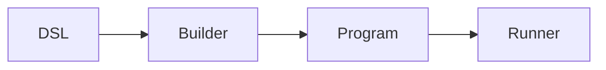
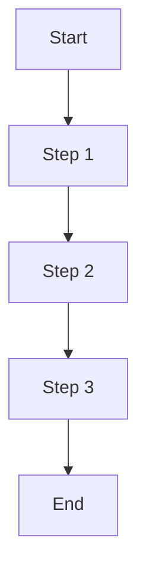
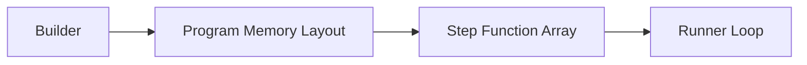
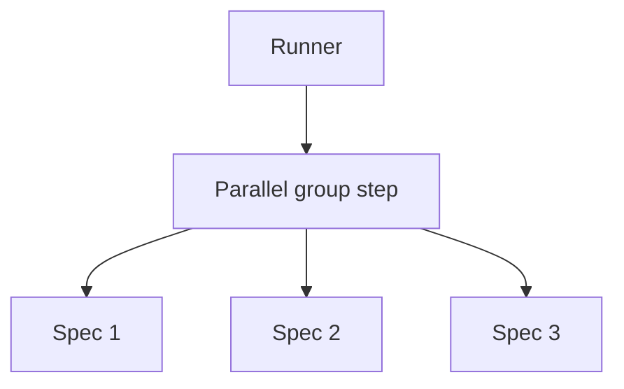

# Execution Model

How go-specs compiles and runs tests: the execution pipeline, program structure, and performance properties.

## Execution pipeline

The end-to-end flow is:

**DSL → Builder → Program → Runner**



1. **DSL** — User defines suites with `Describe`, `BeforeEach`, `AfterEach`, `It` (and optionally the Builder API with `ItParallel`).
2. **Builder** — Compiler (or Builder) flattens scope and hooks into a linear plan. No tree is kept at run time.
3. **Program** — The plan is either a flat slice of instructions with per-spec bounds (ExecutionPlan) or a slice of groups, each with before/specs/after steps (Program).
4. **Runner** — Iterates over the plan and invokes each step with a shared Context.

## Execution plan

The compiled artifact is conceptually a list of steps. Each step is a function:

```go
step func(*Context)
```

The runner does not branch on step type for the hot path; it just calls the function. Hooks and spec bodies are all steps; the compiler has already laid them out in the correct order (before hooks, body, after hooks per spec, or grouped for the Program model).

**Execution loop (conceptual):**

```go
ctx := contextPool.Get().(*Context)
ctx.Reset(backend)
for i := 0; i < len(steps); i++ {
    steps[i](ctx)
}
ctx.Reset(nil)
contextPool.Put(ctx)
```

For the ExecutionPlan path, the loop is over instructions within each spec’s slice; for the Program path, it is over groups and then over before/specs/after within each group. In both cases there is a single, flat iteration—no recursion or map lookups.

## Performance properties

- **Zero allocations** — Context (and expectation objects) are pooled. The runner reuses one Context per spec (or per group). On the assertion fast path, no heap allocations occur on success.
- **Sequential memory access** — The plan is a contiguous slice (or a small number of slices). The runner walks them in order, which is cache-friendly.
- **No reflection** — Steps are plain function pointers. Assertions use generics and direct comparison where possible; no `reflect.DeepEqual` or type switches on the hot path.
- **Direct function calls** — Each step is invoked as `step(ctx)`. No indirection or dynamic dispatch in the inner loop.

## Runner loop execution

The runner executes compiled steps in a single loop. Conceptually:



The runner does:

```go
for i := 0; i < len(steps); i++ {
    steps[i](ctx)
}
```

There is no branching on step type in the hot path; the compiler has already laid out steps in the correct order (e.g. before hooks, body, after hooks). The runner just executes them in sequence.

**Properties:**

- **Zero allocations** — The loop does not allocate; Context and expectations are pooled.
- **Sequential memory access** — Walking a slice of function pointers is cache-friendly.
- **No reflection** — Steps are plain function pointers; no type switches or reflection in the inner loop.
- **Direct function dispatch** — Each step is invoked as `step(ctx)`; no indirection.

---

## Memory layout concept

The compiled program is a flat slice of function pointers. The builder produces this layout; the runner consumes it in order.



Steps are compiled into a **flat slice of function pointers**. There are no maps, no trees, and no per-step metadata in the hot path. That keeps the inner loop small and cache-friendly and is a key reason the framework is fast.

---

## Parallel execution model

When using `ItParallel`, consecutive parallel specs are grouped into a single execution step. That step runs the specs concurrently; the runner then continues with the next sequential step.



The builder groups parallel specs into one step; the runner executes that step (e.g. by launching goroutines and waiting). So from the runner’s perspective, a parallel group is still just one step in the flat plan.

---

## CI sharding

`RunShard` splits a compiled `Program` across CI shards by hook group, not by individual spec: specs sharing a `BeforeEach`/`AfterEach` are compiled into one group, and whole groups are assigned to shards by `gi % shardCount == shardIndex`. If a suite has many specs under one shared hook, that entire group lands on a single shard.

**Known limitation:** this can produce uneven shard runtimes when hook groups are large or unevenly sized, since balancing happens at the group level rather than the individual-spec level. Balancing by spec count is tracked separately and deferred post-v1.0.0.

---

## Generated candidate identity

A `Paths()` spec does not run once: it runs once per generated candidate. Each executed candidate
is a real Go subtest, and its name identifies which candidate it was.

### Name shape

```
<spec breadcrumb>/case-<n>[-seed<s>][-<k=v,k=v...>]
```

| Part | Meaning |
|------|---------|
| `<spec breadcrumb>` | The owning spec's slash-joined `Describe`/`When`/`It` path. |
| `case-<n>` | The 1-based ordinal of this candidate among the spec's *executed* candidates. |
| `-seed<s>` | The exploration seed. Present only for `Sample`, `Explore`, `ExploreCoverage` and `ExploreSmart` — a Cartesian stream is fully determined by the declared variables, so it carries no seed. |
| `-<k=v,...>` | The candidate's path values, in variable declaration order. Omitted when the candidate has no values. |

Examples:

```
TestCheckout/Checkout/pricing/applies the tier/case-2-tier=pro
TestCheckout/Checkout/pricing/samples the space/case-4-seed7-vip=true,price=8123
TestCheckout/Checkout/pricing/explores the space/case-11-seed42-price=907
```

`go test` output shows these after `testing`'s own rewrite of the spec breadcrumb (spaces become
`_`): `TestCheckout/Checkout/pricing/applies_the_tier/case-2-tier=pro`.

The ordinal alone is unique within a spec, so two candidates that carry byte-identical values still
get distinct names. That is also why bounding the values (below) can never make a name ambiguous.

### Sanitization and bounding

`go test -run` compiles each `/`-separated element of its pattern as a regular expression, so a name
is only useful if it can be pasted back in as a pattern. The candidate part of the name therefore
contains only ASCII letters, digits and `_ - . = , ~`. Every other rune — spaces, `/`, `[`, `]`,
`(`, `)`, `*`, `+`, `?`, `^`, `$`, `\`, `{`, `}`, `|`, control characters and all non-ASCII — is
replaced by `_`, and a run of them collapses into a single `_`.

`.` is the one allowed rune that is also a regexp metacharacter, kept because version- and
float-like values (`v1.2`, `3.5`) stay far more readable with it. As a pattern it still matches
itself, so it can only ever over-match, never fail to match the candidate it came from.

Names are bounded, not a blind serialization of whatever the values happen to be: each value
contributes at most 16 runes and the whole values block at most 64. When anything is cut, the name
ends with `~` plus 8 hex digits of a hash over the full untruncated values, so two long candidates
with a common prefix stay visibly distinct in `-v` output.

Only the candidate part is sanitized. The spec breadcrumb is the framework's own declared name and
is passed through untouched, exactly as for a sequential spec.

### Reproducing one candidate with `-run`

| Strategy | `-run` selection of a single candidate |
|----------|----------------------------------------|
| Cartesian (`Paths(...).It`) | Supported |
| `Sample(n)` | Supported |
| `Explore(n)` / `ExploreCoverage(n)` / `ExploreSmart(n)` | **Not supported** |

For the adaptive strategies, `testing` skips the bodies of the subtests that do not match the
pattern, while the explorer derives each later candidate from the feedback of the earlier ones it
then never receives — so the stream diverges from the one that produced the name.

The protection is that the values are part of the name. A candidate that diverges under the
filtered run simply does not match the pattern and does not run. A `-run` pattern can therefore
under-select, but it can never silently execute a semantically different candidate under the name
you asked for. To reproduce an adaptive failure, re-run the whole spec with the same seed.

### Sensitive values

Path values appear verbatim in test names, and test names travel: CI logs, `test2json`, IDE panes.
A value type controls its own rendering by implementing `fmt.Stringer`, and that is the supported
redaction hook:

```go
type apiKey struct{ raw string }

func (apiKey) String() string { return "REDACTED" }
```

Values whose `%v` would embed a pointer address — pointers, funcs, channels, `uintptr`,
`unsafe.Pointer`, and values containing them — render as a fixed kind word (`ptr`, `func`, `chan`,
`uintptr`, `unsafeptr`) instead, because a name that changed between runs would make `-run` patterns
rot. Maps and slices of ordinary values render normally: `fmt` prints map keys in sorted order, so
their rendering is stable.

### Reporter events

Reported identity is not the subtest name. A reporter sees the framework's own formatting —
`includes tier [tier=pro] #2` — carrying the same ordinal, so a report line and a `go test -v`
subtest can be matched up, while reported names never inherit `testing`'s space rewriting or its
`#01` duplicate suffixes.
