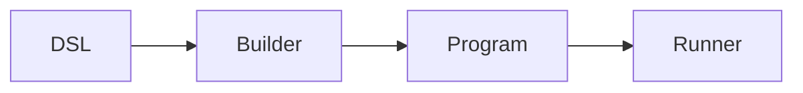
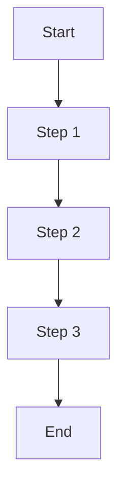
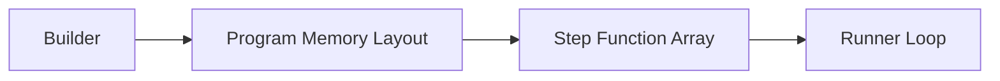
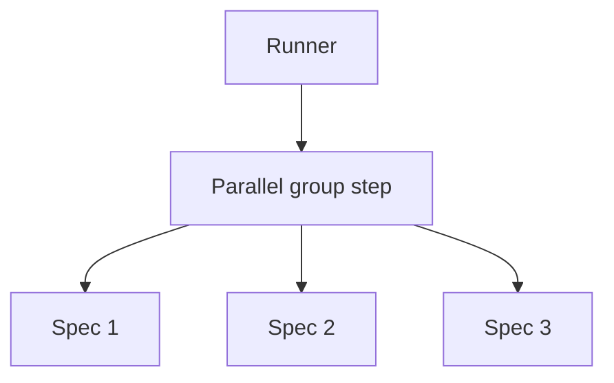

# Execution Model

How go-specs compiles and runs tests: the execution pipeline, program structure, and performance properties.

## Execution pipeline

The end-to-end flow is:

**DSL → Builder → Program → Runner**



1. **DSL** — User defines suites with `Describe`, `BeforeEach`, `AfterEach`, `It` (and optionally the Builder API with `ItParallel`).
2. **Builder** — Compiler (or Builder) flattens scope and hooks into a linear plan. No tree is kept at run time.
3. **Program** — The plan is either a flat slice of instructions with per-spec bounds (ExecutionPlan) or a slice of groups, each with before/specs/after steps (Program).
4. **Runner** — Iterates over the plan and invokes each step with a shared Context.

## Execution plan

The compiled artifact is conceptually a list of steps. Each step is a function:

```go
step func(*Context)
```

The runner does not branch on step type for the hot path; it just calls the function. Hooks and spec bodies are all steps; the compiler has already laid them out in the correct order (before hooks, body, after hooks per spec, or grouped for the Program model).

**Execution loop (conceptual):**

```go
ctx := contextPool.Get().(*Context)
ctx.Reset(backend)
for i := 0; i < len(steps); i++ {
    steps[i](ctx)
}
ctx.Reset(nil)
contextPool.Put(ctx)
```

For the ExecutionPlan path, the loop is over instructions within each spec’s slice; for the Program path, it is over groups and then over before/specs/after within each group. In both cases there is a single, flat iteration—no recursion or map lookups.

## Performance properties

- **Zero allocations** — Context (and expectation objects) are pooled. The runner reuses one Context per spec (or per group). On the assertion fast path, no heap allocations occur on success.
- **Sequential memory access** — The plan is a contiguous slice (or a small number of slices). The runner walks them in order, which is cache-friendly.
- **No reflection** — Steps are plain function pointers. Assertions use generics and direct comparison where possible; no `reflect.DeepEqual` or type switches on the hot path.
- **Direct function calls** — Each step is invoked as `step(ctx)`. No indirection or dynamic dispatch in the inner loop.

## Runner loop execution

The runner executes compiled steps in a single loop. Conceptually:



The runner does:

```go
for i := 0; i < len(steps); i++ {
    steps[i](ctx)
}
```

There is no branching on step type in the hot path; the compiler has already laid out steps in the correct order (e.g. before hooks, body, after hooks). The runner just executes them in sequence.

**Properties:**

- **Zero allocations** — The loop does not allocate; Context and expectations are pooled.
- **Sequential memory access** — Walking a slice of function pointers is cache-friendly.
- **No reflection** — Steps are plain function pointers; no type switches or reflection in the inner loop.
- **Direct function dispatch** — Each step is invoked as `step(ctx)`; no indirection.

---

## Subtest identity

When the backend is a real `*testing.T`, each sequential spec runs in its own subtest — that is what
keeps a `Fatalf` in one spec from unwinding the whole suite. That subtest is named by the spec's
**full `Describe`/`When`/`It` breadcrumb**, joined with `/`, not by the leaf `It` name alone:

```go
Describe(t, "Cart", func(s *specs.Spec) {
    s.When("empty", func(s *specs.Spec) {
        s.It("has no items", func(ctx *specs.Context) { /* ... */ })
    })
})
```

runs as `TestCart/Cart/empty/has_no_items`, so you can select exactly that behaviour:

```bash
go test -run 'TestCart/Cart/empty/has_no_items'
```

Both sequential execution models use this mapping — `Describe`/`Spec`/`ExecutionPlan` and
`Builder`/`Program`/`Runner`. It is an internal detail, not public API: go-specs exports no function
for it, so the mapping stays free to follow whatever `testing` does. The mapping is a plain join; the
`testing` package then applies its own presentation rules on top — call the result the spec's
**normalized** breadcrumb — and the normalized form is what a `-run` pattern must match:

| Declared name | In the `-run` pattern | Why |
|---|---|---|
| `has no items` | `has_no_items` | `testing` rewrites spaces to `_` |
| `a/b` | `a/b` (two elements) | `/` is not escaped; it adds a level |
| `` (empty) | trailing empty element | an empty name does not collapse |
| same normalized breadcrumb twice | `…#01` on the second | `testing`'s usual disambiguation |

The guarantee is therefore stated over the normalized form: **two specs are independently
identifiable whenever their normalized breadcrumbs differ.** Two specs that share only a leaf `It`
name under different `When` scopes satisfy that — they have different breadcrumbs, so they never
collide and are never told apart by an incidental `#01`.

Breadcrumbs that normalize to the *same* string stay ambiguous, and `testing` numbers them with its
usual `#01`. That is accepted and inherited, not a defect waiting on a fix — it is exactly what
`testing.T.Run` does on its own:

```go
s.When("a/b", func(s *specs.Spec) { s.It("does it", ...) })   // suite/a/b/does_it
s.Describe("a", func(s *specs.Spec) {                          // suite/a/b/does_it#01
    s.When("b", func(s *specs.Spec) { s.It("does it", ...) })
})

s.When("when c", func(s *specs.Spec) { s.It("does that", ...) })  // suite/when_c/does_that
s.When("when_c", func(s *specs.Spec) { s.It("does that", ...) })  // suite/when_c/does_that#01
```

The ambiguity is a consequence of a design choice, not a limitation `testing` imposes. go-specs
flattens the declared tree into a single `t.Run` per spec: the compiler emits one linear instruction
stream, coalesces groups by `hookKey`, and flattens each scope's hooks into the spec's own
instruction range. A whole spec is one unit of execution, so there is one subtest to name, and the
breadcrumb has to be encoded into that one name — which is where `/` and ` ` stop being separable
from the segments around them.

The alternative is not escaping, it is **nesting**: emitting a real `t.Run` per `Describe`/`When`
scope, so each segment is its own subtest and `a/b` can never be mistaken for `a` then `b`. That was
not chosen because it would undo the execution model this document describes. Nesting means a live
`*testing.T` per scope, hooks re-resolved per level instead of flattened per spec, a goroutine per
scope rather than per spec, and group coalescing losing its meaning. The flat stream is what makes
the runner allocation-free without a reporter; nesting trades that away to remove a collision only
two specs with deliberately confusable names can hit. Escaping was rejected for a smaller reason: it
would break `go test -run 'TestCart/Cart/empty/has_no_items'`, a pattern you type by reading the
declared names, which is the whole point of the mapping.

Only execution is never ambiguous: both colliding specs still run, and both are still reported.

### Scope

This affects Go subtest identity only. `SpecStartEvent.Name` stays the declared leaf name verbatim,
so `testing`'s rewrite of spaces and its `#01` suffixing never leak into a report.

`SpecStartEvent.Path` carries a weaker guarantee, and it predates this mapping. In the
`Describe`/`Spec` model it is rebuilt by splitting the joined breadcrumb on `/`, so a `/` inside one
declared name is indistinguishable from a scope boundary:

| Declared | Reported `Name` | Reported `Path` |
|---|---|---|
| `It("does a thing")` under `suite`/`when b` | `does a thing` | `["suite" "when b" "does a thing"]` |
| `It("slash/inside")` under `suite`/`when b` | `slash/inside` | `["suite" "when b" "slash" "inside"]` |

Four segments, and the last one is not the `Name`. `Path` is the breadcrumb only for names
containing no separator. The `Builder`/`Runner` model reports no `Path` at all. Both are tracked
separately; neither is changed here.

`DescribeFlat` and `DescribeFast` are covered by all of the above. Their names are about the
compiled plan, not about subtests: "flat" means hooks are flattened into each spec's instruction
range instead of resolved by walking a tree. Against a `*testing.T` they create one subtest per spec
exactly like `Describe` does.

A `*testing.B` backend creates no subtests, which is what keeps benchmarks allocation-free, so
breadcrumbs never reach `testing` there.

Parallel specs have no subtest identity, before this change or after it. `ItParallel` bodies run
under `parallelBackend` on the scheduler's own goroutines and never reach `t.Run` at all; they are
addressable through reporter events, not through a `-run` pattern.

### Hooks: the two models disagree, with or without `-run`

The two sequential models do not run hooks the same way, and the difference is in the hooks, not the
names. `-run` makes it visible; it does not create it.

The plainest form needs no pattern at all. For one scope declaring a `BeforeEach` and three specs:

| Model | `BeforeEach` runs |
|---|---|
| `Describe` / `Spec` | 3 times — once per spec |
| `Builder` / `Runner` | 1 time — once per group |

So `BeforeEach` does not carry per-spec semantics in the `Builder`/`Runner` model. Setup that a spec
mutates is not restored for the next spec in the same group. That is the substance of the
divergence, tracked in #109; everything below is the same placement seen through a filter.

The `Describe`/`Spec` model compiles each scope's `BeforeEach`/`AfterEach` into the selected spec's
own instruction range, and that range runs *inside* the subtest. Discarding the subtest discards the
hooks with it.

The `Builder`/`Runner` model runs a group's `before` hooks and defers its `after` hooks around the
loop that calls `t.Run` — so they sit *outside* the subtest. `testing` can only discard what is
inside a subtest, which means a narrow `-run` pattern narrows which spec bodies execute but not
which group hooks do: the hooks of a scope whose specs were all filtered out still run.

Neither model changed here; the divergence predates breadcrumbs and is tracked separately. It
matters more now only because `-run` has become a documented way to select a single behaviour.

### Reporting of filtered specs

In either model, a spec whose subtest a `-run` pattern discarded is still reported to an attached
reporter as started and finished without failing — it appears as passed although its body never ran.
`t.Run`'s boolean return, which is `false` exactly when the filter discarded the subtest, is not
inspected. This predates breadcrumbs too, and is tracked separately.

### Adaptive strategies: a `-run`-narrowed re-run can silently generate a different candidate

`ExploreCoverage` and `ExploreSmart` drive a candidate through a Propose → Accept → Execute →
AdmitFeedback loop (`proposalController.Run`) that is independent of `testing`: Propose asks the
strategy for the next `PathValues`, Execute runs that candidate in its own generated subtest and
collects its real per-candidate `Coverage`, and AdmitFeedback hands that `Coverage` to the strategy's
`Feedback` method, which grows its corpus only when the candidate actually found unseen coverage
(`Coverage.HasNewCoverage`). `-run` only ever reaches the Execute step, because that is the only step
wrapped in a `t.Run` call — Propose and AdmitFeedback are plain Go calls the loop makes on every
iteration, matched pattern or not.

The failure mode this creates is not a fabricated pass polluting the corpus — a candidate `-run`
discards before `t.Run` invokes it never populates its `Coverage` (see "Reporting of filtered specs"
above), so `Feedback` sees an all-zero `Coverage`, `HasNewCoverage` reports nothing new, and no growth
happens. The corpus simply fails to grow the way it did in the original run. That is still a problem:
narrowing `-run` to the one generated subtest that failed — the natural way to isolate and re-run
it — silently drops every real coverage contribution the *other* candidates made on the original run,
before reaching the one you narrowed to. `CoverageExplorer`/`SmartExplorer.NextInput` draws from that
corpus (mutate a random entry, or fall back to random when it is empty), so by the time Propose is
asked for the target candidate, it can be working from a smaller or different corpus than the run
that produced the failure — and can propose a **different** `PathValues` for that same attempt index,
even with the same seed. The `-run` pattern that looks like it isolates one candidate's execution does
not isolate it from the strategy's state.

What that divergence actually does to the re-run depends on how narrow the `-run` pattern is, because
`generatedCaseName` puts the attempt/seed ordinal *before* the rendered values and content hash
(`case-<ordinal>[-seed<N>]<k=v,...>~<hash>`), and `-run` matches each path segment as an unanchored
regexp — a substring hit anywhere in the name is enough:

- **Ordinal/prefix pattern** (e.g. `-run '.../case-7-seed123'`, matching only the ordinal/seed
  prefix): the regenerated candidate's name still contains that prefix even though its trailing
  values and hash differ, so the pattern still matches — and the **different** `PathValues` this
  candidate now gets executes in place of the one that failed.
- **Exact copied name** (the full subtest name from the original failure, values and hash included):
  the regenerated candidate's values and hash no longer appear in that string, so the pattern no
  longer matches it — and **no candidate executes** for that attempt at all. Like any other
  `-run`-discarded subtest, it is still reported as passed (see "Reporting of filtered specs" above).

Either way, the candidate that actually runs under a narrowed `-run` is not reliably the one that
failed.

`Cartesian` and `Sample` have no feedback-dependent state, so they are not exposed. Plain `Explore`
grows its corpus from `captureSignature()`, a call-site signature captured from the fixed call chain
inside `admitFeedback` itself rather than from anything the candidate's body did — it evaluates the
same way whether or not `-run` let that candidate's body run, so its corpus content does not diverge
under a narrowed `-run`. Only `ExploreCoverage` and `ExploreSmart` key growth on the candidate's real,
per-execution `Coverage`, which is exactly what `-run` prevents from being collected.

There is no fix here — reproducing one candidate under a narrowed `-run` without perturbing
`ExploreCoverage`/`ExploreSmart`'s corpus state would need the strategy to either replay the discarded
candidates' real feedback or know it is running under a filter, and `-run` communicates neither past
the subtest boundary. Tracked in
[#124](https://github.com/getsyntegrity/go-specs/issues/124); a design decision on whether an
isolated-re-run mode for adaptive strategies is worth adding is still open.

---

## Memory layout concept

The compiled program is a flat slice of function pointers. The builder produces this layout; the runner consumes it in order.



Steps are compiled into a **flat slice of function pointers**. There are no maps, no trees, and no per-step metadata in the hot path. That keeps the inner loop small and cache-friendly and is a key reason the framework is fast.

---

## Parallel execution model

When using `ItParallel`, consecutive parallel specs are grouped into a single execution step. That step runs the specs concurrently; the runner then continues with the next sequential step.



The builder groups parallel specs into one step; the runner executes that step (e.g. by launching goroutines and waiting). So from the runner’s perspective, a parallel group is still just one step in the flat plan.

---

## CI sharding

`RunShard` splits a compiled `Program` across CI shards by hook group, not by individual spec: specs sharing a `BeforeEach`/`AfterEach` are compiled into one group, and whole groups are assigned to shards by `gi % shardCount == shardIndex`. If a suite has many specs under one shared hook, that entire group lands on a single shard.

**Known limitation:** this can produce uneven shard runtimes when hook groups are large or unevenly sized, since balancing happens at the group level rather than the individual-spec level. Balancing by spec count is tracked separately and deferred post-v1.0.0.

---

## Generated candidate identity

A `Paths()` spec does not run once: it runs once per generated candidate. Each executed candidate
is a real Go subtest, and its name identifies which candidate it was.

### Name shape

```
<spec breadcrumb>/case-<n>[-seed<s>][-<k=v,k=v...>]
```

| Part | Meaning |
|------|---------|
| `<spec breadcrumb>` | The owning spec's slash-joined `Describe`/`When`/`It` path. |
| `case-<n>` | The 1-based ordinal of this candidate among the spec's *executed* candidates. |
| `-seed<s>` | The exploration seed. Present only for `Sample`, `Explore`, `ExploreCoverage` and `ExploreSmart` — a Cartesian stream is fully determined by the declared variables, so it carries no seed. |
| `-<k=v,...>` | The candidate's path values, in variable declaration order. Omitted when the candidate has no values. |

Examples:

```
TestCheckout/Checkout/pricing/applies the tier/case-2-tier=pro
TestCheckout/Checkout/pricing/samples the space/case-4-seed7-vip=true,price=8123
TestCheckout/Checkout/pricing/explores the space/case-11-seed42-price=907
```

`go test` output shows these after `testing`'s own rewrite of the spec breadcrumb (spaces become
`_`): `TestCheckout/Checkout/pricing/applies_the_tier/case-2-tier=pro`.

The ordinal alone is unique within a spec, so two candidates that carry byte-identical values still
get distinct names. That is also why bounding the values (below) can never make a name ambiguous.

### Sanitization and bounding

`go test -run` compiles each `/`-separated element of its pattern as a regular expression, so a name
is only useful if it can be pasted back in as a pattern. The candidate part of the name therefore
contains only ASCII letters, digits and `_ - . = , ~`. Every other rune — spaces, `/`, `[`, `]`,
`(`, `)`, `*`, `+`, `?`, `^`, `$`, `\`, `{`, `}`, `|`, control characters and all non-ASCII — is
replaced by `_`, and a run of them collapses into a single `_`.

`.` is the one allowed rune that is also a regexp metacharacter, kept because version- and
float-like values (`v1.2`, `3.5`) stay far more readable with it. As a pattern it still matches
itself, so it can only ever over-match, never fail to match the candidate it came from.

Names are bounded, not a blind serialization of whatever the values happen to be: each value
contributes at most 16 runes and the whole values block at most 64. When anything is cut, the name
ends with `~` plus 8 hex digits of a hash over the full untruncated values, so two long candidates
with a common prefix stay visibly distinct in `-v` output.

Only the candidate part is sanitized. The spec breadcrumb is the framework's own declared name and
is passed through untouched, exactly as for a sequential spec.

### Reproducing one candidate with `-run`

| Strategy | `-run` selection of a single candidate |
|----------|----------------------------------------|
| Cartesian (`Paths(...).It`) | Supported |
| `Sample(n)` | Supported |
| `Explore(n)` / `ExploreCoverage(n)` / `ExploreSmart(n)` | **Not supported** |

For the adaptive strategies, `testing` skips the bodies of the subtests that do not match the
pattern, while the explorer derives each later candidate from the feedback of the earlier ones it
then never receives — so the stream diverges from the one that produced the name.

The protection is that the values are part of the name. A candidate that diverges under the
filtered run simply does not match the pattern and does not run. A `-run` pattern can therefore
under-select, but it can never silently execute a semantically different candidate under the name
you asked for. To reproduce an adaptive failure, re-run the whole spec with the same seed.

### Sensitive values

Path values appear verbatim in test names, and test names travel: CI logs, `test2json`, IDE panes.
A value type controls its own rendering by implementing `fmt.Stringer`, and that is the supported
redaction hook:

```go
type apiKey struct{ raw string }

func (apiKey) String() string { return "REDACTED" }
```

Values whose `%v` would embed a pointer address — pointers, funcs, channels, `uintptr`,
`unsafe.Pointer`, and values containing them — render as a fixed kind word (`ptr`, `func`, `chan`,
`uintptr`, `unsafeptr`) instead, because a name that changed between runs would make `-run` patterns
rot. Maps and slices of ordinary values render normally: `fmt` prints map keys in sorted order, so
their rendering is stable.

### Reporter events

Reported identity is not the subtest name. A reporter sees the framework's own formatting —
`includes tier [tier=pro] #2` — carrying the same ordinal, so a report line and a `go test -v`
subtest can be matched up, while reported names never inherit `testing`'s space rewriting or its
`#01` duplicate suffixes.
