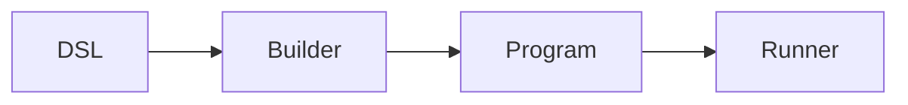
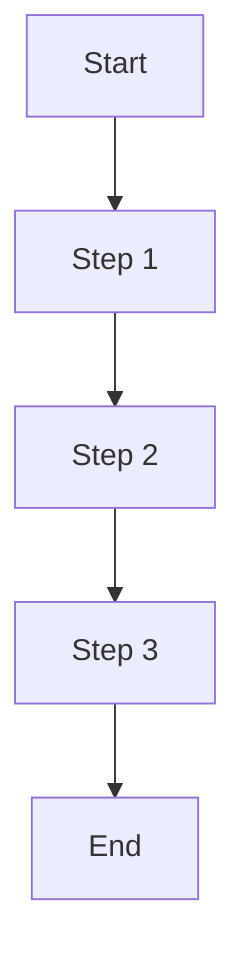
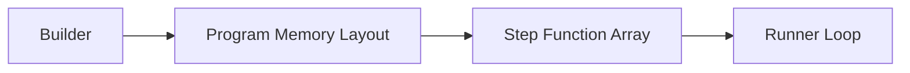
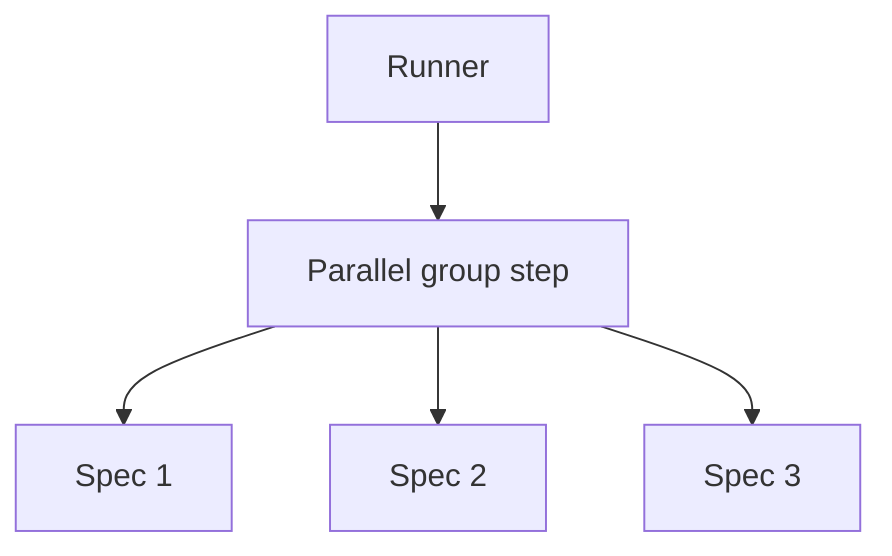

# Execution Model

How go-specs compiles and runs tests: the execution pipeline, program structure, and performance properties.

## Execution pipeline

The end-to-end flow is:

**DSL → Builder → Program → Runner**



1. **DSL** — User defines suites with `Describe`, `BeforeEach`, `AfterEach`, `It` (and optionally the Builder API with `ItParallel`).
2. **Builder** — Compiler (or Builder) flattens scope and hooks into a linear plan. No tree is kept at run time.
3. **Program** — The plan is either a flat slice of instructions with per-spec bounds (ExecutionPlan) or a slice of groups, each with before/specs/after steps (Program).
4. **Runner** — Iterates over the plan and invokes each step with a shared Context.

## Execution plan

The compiled artifact is conceptually a list of steps. Each step is a function:

```go
step func(*Context)
```

The runner does not branch on step type for the hot path; it just calls the function. Hooks and spec bodies are all steps; the compiler has already laid them out in the correct order (before hooks, body, after hooks per spec, or grouped for the Program model).

**Execution loop (conceptual):**

```go
ctx := contextPool.Get().(*Context)
ctx.Reset(backend)
for i := 0; i < len(steps); i++ {
    steps[i](ctx)
}
ctx.Reset(nil)
contextPool.Put(ctx)
```

For the ExecutionPlan path, the loop is over instructions within each spec’s slice; for the Program path, it is over groups and then over before/specs/after within each group. In both cases there is a single, flat iteration—no recursion or map lookups.

## Performance properties

- **Zero allocations** — Context (and expectation objects) are pooled. The runner reuses one Context per spec (or per group). On the assertion fast path, no heap allocations occur on success.
- **Sequential memory access** — The plan is a contiguous slice (or a small number of slices). The runner walks them in order, which is cache-friendly.
- **No reflection** — Steps are plain function pointers. Assertions use generics and direct comparison where possible; no `reflect.DeepEqual` or type switches on the hot path.
- **Direct function calls** — Each step is invoked as `step(ctx)`. No indirection or dynamic dispatch in the inner loop.

## Runner loop execution

The runner executes compiled steps in a single loop. Conceptually:



The runner does:

```go
for i := 0; i < len(steps); i++ {
    steps[i](ctx)
}
```

There is no branching on step type in the hot path; the compiler has already laid out steps in the correct order (e.g. before hooks, body, after hooks). The runner just executes them in sequence.

**Properties:**

- **Zero allocations** — The loop does not allocate; Context and expectations are pooled.
- **Sequential memory access** — Walking a slice of function pointers is cache-friendly.
- **No reflection** — Steps are plain function pointers; no type switches or reflection in the inner loop.
- **Direct function dispatch** — Each step is invoked as `step(ctx)`; no indirection.

---

## Subtest identity

When the backend is a real `*testing.T`, each sequential spec runs in its own subtest — that is what
keeps a `Fatalf` in one spec from unwinding the whole suite. That subtest is named by the spec's
**full `Describe`/`When`/`It` breadcrumb**, joined with `/`, not by the leaf `It` name alone:

```go
Describe(t, "Cart", func(s *specs.Spec) {
    s.When("empty", func(s *specs.Spec) {
        s.It("has no items", func(ctx *specs.Context) { /* ... */ })
    })
})
```

runs as `TestCart/Cart/empty/has_no_items`, so you can select exactly that behaviour:

```bash
go test -run 'TestCart/Cart/empty/has_no_items'
```

Both sequential execution models use this mapping — `Describe`/`Spec`/`ExecutionPlan` and
`Builder`/`Program`/`Runner`. It is an internal detail, not public API: go-specs exports no function
for it, so the mapping stays free to follow whatever `testing` does. The mapping is a plain join; the
`testing` package then applies its own presentation rules on top — call the result the spec's
**normalized** breadcrumb — and the normalized form is what a `-run` pattern must match:

| Declared name | In the `-run` pattern | Why |
|---|---|---|
| `has no items` | `has_no_items` | `testing` rewrites spaces to `_` |
| `a/b` | `a/b` (two elements) | `/` is not escaped; it adds a level |
| `` (empty) | trailing empty element | an empty name does not collapse |
| same normalized breadcrumb twice | `…#01` on the second | `testing`'s usual disambiguation |

The guarantee is therefore stated over the normalized form: **two specs are independently
identifiable whenever their normalized breadcrumbs differ.** Two specs that share only a leaf `It`
name under different `When` scopes satisfy that — they have different breadcrumbs, so they never
collide and are never told apart by an incidental `#01`.

Breadcrumbs that normalize to the *same* string stay ambiguous, and `testing` numbers them with its
usual `#01`. That is accepted and inherited, not a defect waiting on a fix — it is exactly what
`testing.T.Run` does on its own:

```go
s.When("a/b", func(s *specs.Spec) { s.It("does it", ...) })   // suite/a/b/does_it
s.Describe("a", func(s *specs.Spec) {                          // suite/a/b/does_it#01
    s.When("b", func(s *specs.Spec) { s.It("does it", ...) })
})

s.When("when c", func(s *specs.Spec) { s.It("does that", ...) })  // suite/when_c/does_that
s.When("when_c", func(s *specs.Spec) { s.It("does that", ...) })  // suite/when_c/does_that#01
```

The ambiguity is a consequence of a design choice, not a limitation `testing` imposes. go-specs
flattens the declared tree into a single `t.Run` per spec: the compiler emits one linear instruction
stream, coalesces groups by `hookKey`, and flattens each scope's hooks into the spec's own
instruction range. A whole spec is one unit of execution, so there is one subtest to name, and the
breadcrumb has to be encoded into that one name — which is where `/` and ` ` stop being separable
from the segments around them.

The alternative is not escaping, it is **nesting**: emitting a real `t.Run` per `Describe`/`When`
scope, so each segment is its own subtest and `a/b` can never be mistaken for `a` then `b`. That was
not chosen because it would undo the execution model this document describes. Nesting means a live
`*testing.T` per scope, hooks re-resolved per level instead of flattened per spec, a goroutine per
scope rather than per spec, and group coalescing losing its meaning. The flat stream is what makes
the runner allocation-free without a reporter; nesting trades that away to remove a collision only
two specs with deliberately confusable names can hit. Escaping was rejected for a smaller reason: it
would break `go test -run 'TestCart/Cart/empty/has_no_items'`, a pattern you type by reading the
declared names, which is the whole point of the mapping.

Only execution is never ambiguous: both colliding specs still run, and both are still reported.

### Scope

This affects Go subtest identity only. Reporter events keep the framework's own values —
`SpecStartEvent.Name` is the unsanitized leaf name and, in the `Describe`/`Spec` model, `Path` is the
unsanitized breadcrumb — so nothing `testing` does here leaks into a report.

`DescribeFlat` and `DescribeFast` are covered by all of the above. Their names are about the
compiled plan, not about subtests: "flat" means hooks are flattened into each spec's instruction
range instead of resolved by walking a tree. Against a `*testing.T` they create one subtest per spec
exactly like `Describe` does.

A `*testing.B` backend creates no subtests, which is what keeps benchmarks allocation-free, so
breadcrumbs never reach `testing` there.

Parallel specs have no subtest identity, before this change or after it. `ItParallel` bodies run
under `parallelBackend` on the scheduler's own goroutines and never reach `t.Run` at all; they are
addressable through reporter events, not through a `-run` pattern.

### Hooks under a narrow `-run` pattern

The two sequential models do not behave identically when `-run` discards a spec, and the difference
is in the hooks, not the names.

The `Describe`/`Spec` model compiles each scope's `BeforeEach`/`AfterEach` into the selected spec's
own instruction range, and that range runs *inside* the subtest. Discarding the subtest discards the
hooks with it.

The `Builder`/`Runner` model runs a group's `before` hooks and defers its `after` hooks around the
loop that calls `t.Run` — so they sit *outside* the subtest. `testing` can only discard what is
inside a subtest, which means a narrow `-run` pattern narrows which spec bodies execute but not
which group hooks do: the hooks of a scope whose specs were all filtered out still run.

Neither model changed here; the divergence predates breadcrumbs and is tracked separately. It
matters more now only because `-run` has become a documented way to select a single behaviour.

### Reporting of filtered specs

In either model, a spec whose subtest a `-run` pattern discarded is still reported to an attached
reporter as started and finished without failing — it appears as passed although its body never ran.
`t.Run`'s boolean return, which is `false` exactly when the filter discarded the subtest, is not
inspected. This predates breadcrumbs too, and is tracked separately.

---

## Memory layout concept

The compiled program is a flat slice of function pointers. The builder produces this layout; the runner consumes it in order.



Steps are compiled into a **flat slice of function pointers**. There are no maps, no trees, and no per-step metadata in the hot path. That keeps the inner loop small and cache-friendly and is a key reason the framework is fast.

---

## Parallel execution model

When using `ItParallel`, consecutive parallel specs are grouped into a single execution step. That step runs the specs concurrently; the runner then continues with the next sequential step.



The builder groups parallel specs into one step; the runner executes that step (e.g. by launching goroutines and waiting). So from the runner’s perspective, a parallel group is still just one step in the flat plan.

---

## CI sharding

`RunShard` splits a compiled `Program` across CI shards by hook group, not by individual spec: specs sharing a `BeforeEach`/`AfterEach` are compiled into one group, and whole groups are assigned to shards by `gi % shardCount == shardIndex`. If a suite has many specs under one shared hook, that entire group lands on a single shard.

**Known limitation:** this can produce uneven shard runtimes when hook groups are large or unevenly sized, since balancing happens at the group level rather than the individual-spec level. Balancing by spec count is tracked separately and deferred post-v1.0.0.
