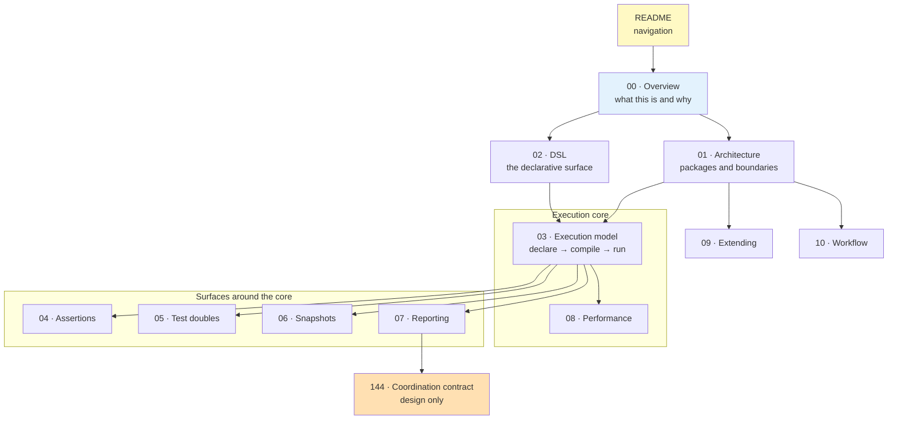
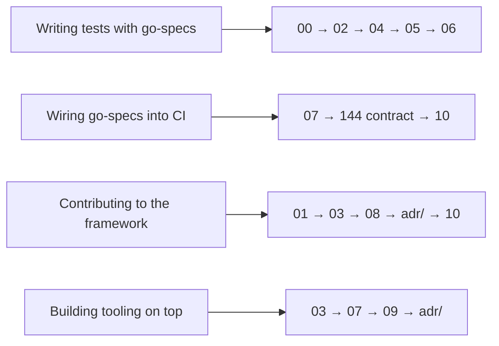

# go-specs — Documentation Suite

> **Module:** `github.com/getsyntegrity/go-specs` · **Status:** pre-1.0 · **Last regenerated:** 2026-09-18

This suite documents what the code **does**, verified against the tree at the commit it was
regenerated from. Where a behaviour is deliberate rather than incidental, the reasoning lives in an
[Architecture Decision Record](adr/README.md) and the prose here links to it instead of restating it.

Nothing in this directory is aspirational. A capability that exists but is not wired into the public
DSL, or a gate that exists as tooling but is not enforced in CI, is documented as exactly that.

---

## Reading order

### Start here

| # | Document | For | Read |
| --- | --- | --- | --- |
| 00 | [Overview](00-OVERVIEW.md) | Everyone | 8 min |
| 01 | [Architecture](01-ARCHITECTURE.md) | Architects, contributors | 12 min |
| 02 | [The DSL](02-DSL.md) | Users of the framework | 15 min |

### Core mechanics

| # | Document | For | Read |
| --- | --- | --- | --- |
| 03 | [Execution model](03-EXECUTION-MODEL.md) | Contributors, advanced users | 20 min |
| 04 | [Assertions and matchers](04-ASSERTIONS.md) | Users | 10 min |
| 05 | [Test doubles](05-TEST-DOUBLES.md) | Users | 6 min |
| 06 | [Snapshots](06-SNAPSHOTS.md) | Users | 8 min |
| 07 | [Reporting](07-REPORTING.md) | CI owners, tooling authors | 12 min |

### Engineering the framework itself

| # | Document | For | Read |
| --- | --- | --- | --- |
| 08 | [Performance](08-PERFORMANCE.md) | Contributors, performance engineers | 12 min |
| 09 | [Extending go-specs](09-EXTENDING.md) | Tooling authors | 10 min |
| 10 | [Engineering workflow](10-WORKFLOW.md) | Contributors | 10 min |

### Records and contracts

| Document | What it is |
| --- | --- |
| [adr/](adr/README.md) | Architecture Decision Records — the binding decisions and their costs |
| [144-report-coordination-contract.md](144-report-coordination-contract.md) | Normative, versioned design contract for module-wide reporting. Design of record, **not yet implemented** |
| [appendix/legacy-parity.md](appendix/legacy-parity.md) | Historical parity audit of the pre-rewrite subpackage API |

Repository-level documents that stay at the root because tooling and GitHub expect them there:
[`CONTRIBUTING.md`](../CONTRIBUTING.md) (the binding contribution contract),
[`SECURITY.md`](../SECURITY.md), [`CHANGELOG.md`](../CHANGELOG.md), [`RULES.md`](../RULES.md),
[`AGENTS.md`](../AGENTS.md).

---

## Map of the suite

## Routes by role

---

## How to keep this suite honest

1. A behavioural change lands with its documentation in the same work unit, not in a follow-up.
2. A decision that constrains future work gets an ADR. A decision that merely implements an existing
   ADR does not.
3. If a document and the code disagree, the code wins and the document is a bug. Report it as one.
