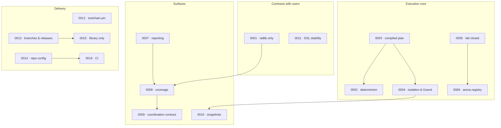

# Architecture Decision Records

This directory records the architecture decisions that shape go-specs. Each ADR follows
[`0000-template.md`](0000-template.md). A decision is binding once its status is `Accepted`; nothing
that contradicts an accepted ADR should merge without a superseding ADR.

An ADR records a decision that **constrains future work**. A change that merely implements an
existing ADR does not get one.

| ID | Title | Status | Date |
| --- | --- | --- | --- |
| [0000](0000-template.md) | ADR template | — | — |
| [0001](0001-standard-library-only-core.md) | Standard-library-only core, third-party confined to benchmarks | Accepted | 2026-09-18 |
| [0002](0002-deterministic-execution.md) | Deterministic execution overrides convenience | Accepted | 2026-09-18 |
| [0003](0003-compiled-execution-plan.md) | Declare, compile, run — an immutable flat execution plan | Accepted | 2026-09-18 |
| [0004](0004-subtest-isolation-and-goexit-safe-hooks.md) | Per-spec subtest isolation and Goexit-safe after-hooks | Accepted | 2026-09-18 |
| [0005](0005-fail-closed-dsl-registration.md) | A DSL surface with nowhere to register fails closed | Accepted (breaking) | 2026-09-18 |
| [0006](0006-arena-registry-as-the-only-tree-surface.md) | The arena registry is the only structural surface | Accepted (breaking) | 2026-09-18 |
| [0007](0007-observational-constructor-injected-reporting.md) | Reporting is observational and constructor-injected | Accepted | 2026-09-16 |
| [0008](0008-coverage-aggregates-statements.md) | Coverage aggregates statement counts, never averages percentages | Accepted (one known gap) | 2026-09-16 |
| [0009](0009-contract-first-report-coordination.md) | Module-wide report coordination is specified before it is built | Accepted (design gate; unimplemented) | 2026-09-16 |
| [0010](0010-snapshot-durability-and-semantics.md) | Snapshots compare semantically, write atomically, fail observably | Accepted | 2026-09-18 |
| [0011](0011-public-dsl-stability-contract.md) | The public DSL stability contract | Accepted (corrects a published error) | 2026-09-18 |
| [0012](0012-two-file-go-toolchain-pin.md) | Two-file Go toolchain pin, gated against drift | Accepted | 2026-09-18 |
| [0013](0013-two-branch-model-manual-releases.md) | Two long-lived branches, merge-not-squash, manual releases | Accepted | 2026-09-15 |
| [0014](0014-repository-configuration-as-code.md) | Repository configuration as code, branch protection deliberately excluded | Accepted | 2026-09-18 |
| [0015](0015-library-only-release-artifact.md) | go-specs ships a library, not a binary | Accepted | 2026-09-15 |
| [0016](0016-native-ci-single-toolchain.md) | Native CI on a single toolchain; Shipwright disabled pending stability | Accepted (provisional) | 2026-09-18 |

## Reading by theme

## Cross-cutting threads

Several records are the same principle applied in different places. Reading them together is more
useful than reading them in order:

| Thread | Records |
| --- | --- |
| **Fail closed rather than report success you cannot back up** | [0005](0005-fail-closed-dsl-registration.md), [0010](0010-snapshot-durability-and-semantics.md), [0012](0012-two-file-go-toolchain-pin.md), [0015](0015-library-only-release-artifact.md) |
| **`runtime.Goexit` cannot be recovered, so arrange it beforehand** | [0004](0004-subtest-isolation-and-goexit-safe-hooks.md), [0010](0010-snapshot-durability-and-semantics.md) |
| **Decide once, at the earliest point you can** | [0003](0003-compiled-execution-plan.md), [0009](0009-contract-first-report-coordination.md), [0015](0015-library-only-release-artifact.md) |
| **Remove dead API rather than deprecate it** | [0002](0002-deterministic-execution.md), [0006](0006-arena-registry-as-the-only-tree-surface.md) |
| **State the gap instead of implying the gate** | [0008](0008-coverage-aggregates-statements.md), [0009](0009-contract-first-report-coordination.md), [0016](0016-native-ci-single-toolchain.md) |

## Writing a new ADR

1. Copy [`0000-template.md`](0000-template.md) to the next free number.
2. Fill **every** section. "Deferred" and "Open hypotheses" exist so a future reader cannot mistake
   silence for a decision — an empty one is a signal you have not finished thinking.
3. Name the cost. Every decision has one; a record that lists only benefits is advocacy, not a
   record.
4. Write the rejected alternatives with the reason, so nobody has to re-litigate them.
5. Add the row to the table above.
6. If the ADR contradicts an accepted one, say so in **both** — the new record's `Status`, and the
   old one's.
